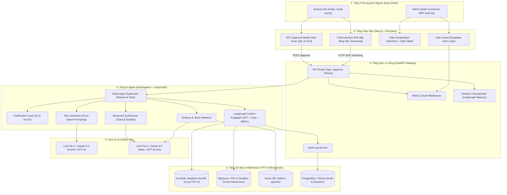
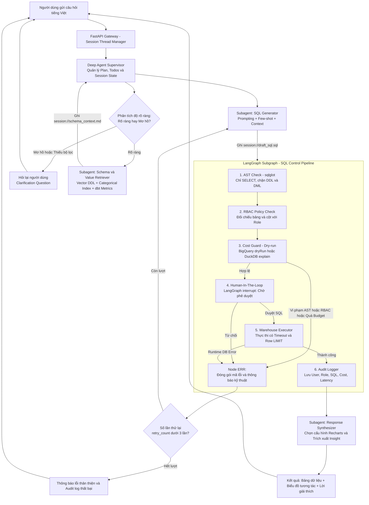
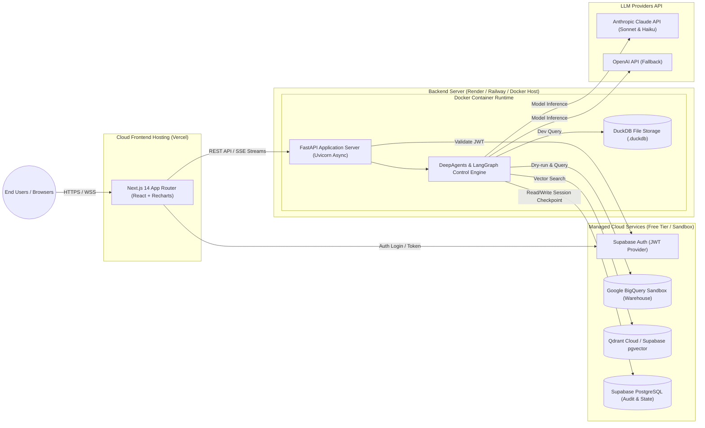

# ARCHITECTURE.md — System Architecture & Design Specification

> **Dự án**: AI Agent Text-to-SQL Self-Service Analytics cho dữ liệu doanh nghiệp  
> **Phiên bản**: 2.0 (Three-Tier Architecture + Hybrid Agentic Governance)  
> **Trọng tâm tài liệu**: Trả lời câu hỏi *"Hệ thống này được tổ chức như thế nào, các thành phần giao tiếp ra sao, và dữ liệu chảy theo luồng nào?"*

---

## 1. TỔNG QUAN KIẾN TRÚC HỆ THỐNG (SYSTEM OVERVIEW)

Hệ thống được thiết kế theo mô hình **Kiến trúc 3 tầng (Three-Tier Architecture)** kết hợp với **Mô hình Hybrid Agent (DeepAgents + LangGraph)** nhằm phân tách ranh giới rõ ràng giữa Tương tác người dùng (Frontend), Nghiệp vụ kết nối (Backend Gateway) và Bộ não suy luận kiểm duyệt (AI Agent Governance).

### Ba nguyên tắc thiết kế cốt lõi:
1. **Separation of Concerns (Tách biệt trách nhiệm)**: Frontend chỉ lo hiển thị & tương tác; Backend lo xác thực, phân quyền và phiên làm việc; Agent lo suy luận và kiểm soát truy vấn.
2. **Hybrid Reasoning & Control**: Dùng LLM cho các bước đòi hỏi tư duy linh hoạt (hiểu tiếng Việt, tra cứu ngữ nghĩa, soạn SQL) nhưng bắt buộc dùng **Code tất định (Deterministic Code)** cho các khâu an toàn dữ liệu (AST check, RBAC, Dry-run cost, Audit log).
3. **Multi-tenant Session Isolation**: Mọi trạng thái trung gian (`schema_context.md`, `draft_sql.sql`) được cô lập nghiêm ngặt theo `thread_id` trong Virtual Filesystem.

---

## 2. BA SƠ ĐỒ KIẾN TRÚC BẮT BUỘC (THE 3 CORE DIAGRAMS)

---

### Diagram 1: System Overview Diagram (Bức tranh toàn cảnh hệ thống)
Sơ đồ thể hiện toàn bộ các tầng ứng dụng, các module nội bộ và các kết nối với dịch vụ bên ngoài:



---

### Diagram 2: Agent Flow Diagram (Luồng xử lý chi tiết bên trong Agent)
Sơ đồ thể hiện chu trình nhận thức, rẽ nhánh điều kiện, chốt chặn HITL và vòng lặp tự sửa lỗi (Bounded Self-Correction Loop):



---

### Diagram 3: Deployment Diagram (Mô hình triển khai hạ tầng)
Sơ đồ thể hiện cách đóng gói ứng dụng, container, networking, và môi trường triển khai thực tế:



---

## 3. CHI TIẾT CÁC THÀNH PHẦN (COMPONENTS BREAKDOWN)

### 3.1. Tầng Giao diện (Frontend - Next.js & Recharts)
- **Chat Interface**:
  - *Trách nhiệm*: Nhận câu hỏi tiếng Việt, hiển thị streaming câu trả lời qua Server-Sent Events (SSE).
  - *Công nghệ*: Next.js 14 (App Router), Tailwind CSS, Lucide Icons.
- **HITL Approval Modal**:
  - *Trách nhiệm*: Nhận payload ngắt phiên từ LangGraph (`interrupt`), hiển thị câu SQL dự kiến, lời giải thích, và số bytes ước tính; gửi tín hiệu `approve` hoặc `reject` về backend.
- **Dynamic Visualizer**:
  - *Trách nhiệm*: Nhận cấu hình JSON từ Agent để render biểu đồ động (Bar, Line, Area, Pie) bằng thư viện **Recharts** kèm bảng số liệu có hỗ trợ tải file CSV.

### 3.2. Tầng Cổng dịch vụ (Backend Gateway - FastAPI)
- **API Router**:
  - `POST /api/v1/ask`: Tiếp nhận câu hỏi, khởi tạo hoặc nối tiếp phiên hội thoại (`thread_id`).
  - `POST /api/v1/approve`: Gửi quyết định của người dùng để đánh thức (resume) node HITL đang bị tạm dừng.
  - `GET /api/v1/history/{thread_id}`: Lấy lịch sử hội thoại và biểu đồ đã sinh.
  - `GET /api/v1/audit/logs`: API dành riêng cho Admin tra cứu nhật ký truy vấn và chi phí.
- **Auth & RBAC Middleware**:
  - Giải mã JWT token từ Supabase Auth, trích xuất `user_id` và `role` (`Analyst` hoặc `Admin`) gắn vào request state.

### 3.3. Tầng Trí tuệ nhân tạo (AI Agent - DeepAgents & LangGraph)
- **Deep Agent Supervisor**:
  - *Trách nhiệm*: Quản lý danh sách công việc (`write_todos`), ghi/đọc artifacts vào Virtual Filesystem theo phiên (`session://{thread_id}/`), điều phối các subagents chuyên trách.
- **Clarification Loop**:
  - *Trách nhiệm*: Đánh giá xem câu hỏi có thiếu entity (khu vực địa lý `r_name`, phân khúc khách hàng `c_mktsegment`, mốc năm đơn hàng) hay không. Nếu thiếu → hỏi lại ngay, không cho chạy tiếp.
- **Schema & Value Retriever**:
  - *Trách nhiệm*: Vector search DDL 8 bảng TPC-H + Categorical value indexing (`r_name`, `c_mktsegment`, `p_type`, `l_shipmode`) + dbt semantic metric formulas (Doanh thu thuần, tỷ lệ trễ hạn, giá trị tồn kho) → ghi vào `schema_context.md`.
- **SQL Generator**:
  - *Trách nhiệm*: Đọc context và sinh câu SQL chuẩn xác theo dialect của warehouse (DuckDB / BigQuery). Nhận thông tin lỗi phản hồi từ node `ERR` để tự sửa lại câu truy vấn.
- **LangGraph Control Pipeline (CompiledSubAgent)**:
  - *Trách nhiệm*: Thực hiện 6 bước kiểm duyệt bất biến:
    1. *AST Sanitizer (`sqlglot`)*: Chặn đứng lệnh ghi, bắt buộc SELECT.
    2. *RBAC Policy*: Chặn truy cập bảng cấm hoặc cột PII (`c_phone`, `c_acctbal`, `s_phone`, `s_acctbal`).
    3. *Cost Guard*: Dry-run tính bytes scanned trên bảng `lineitem`, đối chiếu hạn mức.
    4. *HITL Interrupt*: Tạm dừng phiên đợi duyệt.
    5. *Warehouse Executor*: Thực thi an toàn (Timeout 30s + LIMIT 1000).
    6. *Audit Logger*: Luôn luôn ghi log dù thành công hay thất bại.
- **Response Synthesizer**:
  - *Trách nhiệm*: Phân tích cấu trúc dữ liệu trả về, sinh schema JSON cho Recharts và soạn thảo đoạn văn phân tích insight ngắn gọn.

---

## 4. GIAO TIẾP VÀ DỮ LIỆU TRẠNG THÁI (STATE & COMMUNICATION)

### 4.1. LangGraph State Schema (`AgentState`)
Toàn bộ dữ liệu truyền giữa các node trong đồ thị được chuẩn hóa qua schema Pydantic/TypedDict:

```python
from typing import Annotated, Any, Literal
from typing_extensions import TypedDict
import operator


class AgentState(TypedDict):
    # Định danh phiên & Người dùng
    thread_id: str
    user_id: str
    user_role: Literal["Analyst", "Admin"]

    # Hội thoại & Đầu vào
    messages: Annotated[list[dict[str, Any]], operator.add]
    current_question: str

    # Trạng thái Clarification
    is_ambiguous: bool
    clarification_prompt: str | None

    # Ngữ cảnh Schema & Value
    schema_context_path: str  # Đường dẫn virtual file session://...

    # Trạng thái SQL & Kiểm duyệt
    draft_sql: str | None
    sql_explanation: str | None
    ast_valid: bool
    rbac_passed: bool
    estimated_bytes: int
    is_cost_exceeded: bool

    # Trạng thái Duyệt HITL
    hitl_approved: bool | None

    # Thực thi & Sửa lỗi
    query_result: list[dict[str, Any]] | None
    execution_error: str | None
    retry_count: int

    # Kết quả cuối cùng
    chart_config: dict[str, Any] | None
    insight_narrative: str | None
```

### 4.2. Giao thức Virtual Filesystem giữa các Subagents
Để tránh việc nhét toàn bộ schema khổng lồ vào LLM context window gây chậm và tốn phí token, các subagent giao tiếp qua các tệp ảo được cô lập theo session:
- `session://{thread_id}/schema_context.md`: Chứa thông tin DDL bảng, cột và các distinct values liên quan câu hỏi.
- `session://{thread_id}/draft_sql.sql`: Chứa mã nguồn câu SQL do SQL Generator soạn thảo.
- `session://{thread_id}/validation_report.json`: Chứa kết quả kiểm định AST, phân quyền RBAC và dung lượng bytes scanned từ Dry-run.

---

## 5. BẢN GHI QUYẾT ĐỊNH KIẾN TRÚC (ARCHITECTURE DECISION RECORDS - ADR)

### ADR 01: Lựa chọn Mô hình Hybrid (DeepAgents + LangGraph) thay vì chỉ dùng một Framework
- **Bối cảnh**: Hệ thống cần vừa thông minh trong việc hiểu ngôn ngữ tự nhiên tiếng Việt, vừa phải tuân thủ nghiêm ngặt các quy tắc an ninh dữ liệu doanh nghiệp.
- **Quyết định**: Sử dụng DeepAgents làm tầng suy luận linh hoạt bên ngoài (Outer Harness), và đóng gói pipeline kiểm duyệt bên trong bằng một Subgraph LangGraph tất định (`CompiledSubAgent`).
- **Hệ quả**: Đảm bảo 100% các bước kiểm tra AST, RBAC, Dry-run cost và Audit log được thực thi bằng code thuần mà không phụ thuộc vào việc LLM có "nhớ" gọi tool hay không.

### ADR 02: Phân tầng Model (Model Tiering) để tối ưu chi phí vận hành
- **Bối cảnh**: Gọi LLM cao cấp (Claude 3.5 Sonnet / GPT-4o) cho tất cả các bước là lãng phí và chậm.
- **Quyết định**:
  - **Tier 1 (Sonnet / GPT-4o)**: Dành riêng cho SQL Generator (bước then chốt quyết định Execution Accuracy).
  - **Tier 2 (Haiku / GPT-4o-mini)**: Dành cho Schema Retriever, Clarification Check và Response Synthesizer.
  - **Zero LLM Token**: Dành cho toàn bộ LangGraph Control Pipeline (chạy bằng AST parser và API database).

### ADR 03: Dual-Warehouse Strategy với TPC-H Benchmark Schema
- **Bối cảnh**: Cần bộ dữ liệu chuẩn doanh nghiệp (bán hàng, tồn kho, nhà cung cấp) có sẵn các câu benchmark phức tạp (TPC-H Q1-Q22) để đo lường độ chính xác thực thi (Execution Accuracy).
- **Quyết định**: Hỗ trợ đồng thời 2 dialect qua adapter:
  - **DuckDB**: Sinh dữ liệu tự động bằng extension `CALL dbgen(sf=0.1)` (khoảng 100MB) hoặc `sf=1` (1GB) lưu tại `data/tpch.duckdb` để chạy Unit Test, CI/CD và dev hàng ngày (chi phí 0 VNĐ).
  - **Google BigQuery Sandbox**: Sử dụng dataset TPC-H mẫu hoặc nạp file Parquet từ DuckDB, tận dụng tính năng `dryRun` đo bytes scanned chuẩn xác trên bảng lớn `lineitem` cho buổi Demo Day và Benchmark Eval.
