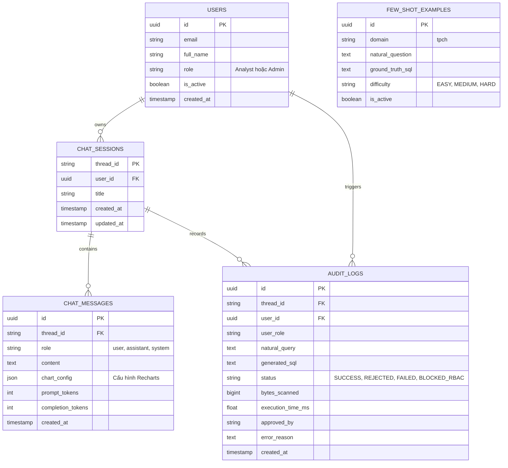
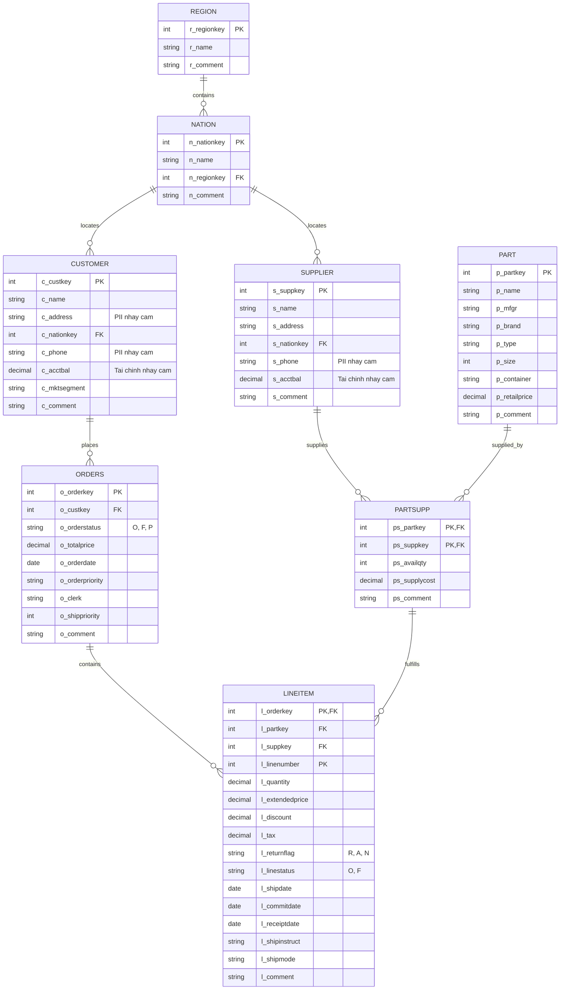

# DATABASE_SCHEMA.md — Database Architecture & Data Dictionary

> **Dự án**: AI Agent Text-to-SQL Self-Service Analytics cho dữ liệu doanh nghiệp  
> **Phiên bản**: 2.0 (Chuẩn hóa theo TPC-H Benchmark Schema)  
> **Phạm vi**: 
> 1. **Application & Governance Database**: Quản lý người dùng, phiên hội thoại, phân quyền và Audit Log.
> 2. **Business Analytics Warehouse (TPC-H Benchmark)**: Kho dữ liệu bán buôn, chuỗi cung ứng và thương mại chuẩn quốc tế (8 bảng) phục vụ AI Agent chuyển đổi Text-to-SQL.

---

## 1. TỔNG QUAN HAI LỚP CƠ SỞ DỮ LIỆU

Hệ thống phân định rạch ròi giữa 2 lớp cơ sở dữ liệu:
- **Lớp 1: Operational & Governance Database (PostgreSQL / SQLite)**: Phục vụ Backend FastAPI, quản lý Session, Checkpointer LangGraph, lưu trữ vết kiểm định Audit Log và các Few-shot Examples.
- **Lớp 2: Enterprise Analytics Warehouse (DuckDB / BigQuery Sandbox - TPC-H Schema)**: Kho dữ liệu kinh doanh chuẩn công nghiệp mô phỏng hoạt động phân phối, cung ứng hàng hóa toàn cầu. Nơi AI Agent thực thi các câu lệnh `SELECT` để trả số liệu cho người dùng.

---

## 2. LỚP 1: APPLICATION & GOVERNANCE DATABASE

Lớp này quản lý người dùng, trạng thái hội thoại và vết an toàn.

### 2.1. Sơ đồ thực thể ERD (Application Layer)



### 2.2. Chi tiết các bảng (Application & Governance)

#### Bảng `users`
| Cột | Kiểu | Nullable | Khóa | Mô tả |
|---|---|---|---|---|
| `id` | UUID | No | PK | Định danh người dùng (đồng bộ từ Supabase Auth) |
| `email` | VARCHAR(255) | No | Unique | Email đăng nhập của nhân viên |
| `full_name` | VARCHAR(255) | No | | Họ và tên nhân viên |
| `role` | VARCHAR(50) | No | | Vai trò: `Analyst` (chỉ đọc nghiệp vụ) hoặc `Admin` (toàn quyền) |
| `is_active` | BOOLEAN | No | | Trạng thái tài khoản (mặc định: `TRUE`) |
| `created_at` | TIMESTAMP | No | | Thời điểm tạo tài khoản |

#### Bảng `chat_sessions`
| Cột | Kiểu | Nullable | Khóa | Mô tả |
|---|---|---|---|---|
| `thread_id` | VARCHAR(100) | No | PK | ID phiên hội thoại (gắn với LangGraph thread) |
| `user_id` | UUID | No | FK | Khóa ngoại tham chiếu tới `users(id)` |
| `title` | VARCHAR(255) | Yes | | Tiêu đề tóm tắt chủ đề trò chuyện |
| `created_at` | TIMESTAMP | No | | Thời gian bắt đầu phiên |
| `updated_at` | TIMESTAMP | No | | Thời gian tin nhắn cuối cùng |

#### Bảng `chat_messages`
| Cột | Kiểu | Nullable | Khóa | Mô tả |
|---|---|---|---|---|
| `id` | UUID | No | PK | Định danh tin nhắn |
| `thread_id` | VARCHAR(100) | No | FK | Khóa ngoại tham chiếu tới `chat_sessions(thread_id)` |
| `role` | VARCHAR(20) | No | | Vai trò: `user` hoặc `assistant` |
| `content` | TEXT | No | | Nội dung câu hỏi hoặc lời diễn giải insight |
| `chart_config` | JSONB / TEXT | Yes | | Cấu hình biểu đồ Recharts (nếu có) |
| `prompt_tokens`| INT | Yes | | Số lượng token input LLM |
| `completion_tokens` | INT | Yes | | Số lượng token output LLM |
| `created_at` | TIMESTAMP | No | | Thời gian gửi tin |

#### Bảng `audit_logs` (Chốt chặn thanh tra & chi phí)
| Cột | Kiểu | Nullable | Khóa | Mô tả |
|---|---|---|---|---|
| `id` | UUID | No | PK | Mã định danh bản ghi audit |
| `thread_id` | VARCHAR(100) | No | FK | Phiên trò chuyện phát sinh truy vấn |
| `user_id` | UUID | No | FK | Người yêu cầu chạy truy vấn |
| `user_role` | VARCHAR(50) | No | | Vai trò người dùng tại thời điểm chạy |
| `natural_query`| TEXT | No | | Câu hỏi tiếng Việt ban đầu |
| `generated_sql`| TEXT | No | | Câu lệnh SQL được sinh ra |
| `status` | VARCHAR(50) | No | | `SUCCESS`, `BLOCKED_AST`, `BLOCKED_RBAC`, `OVER_BUDGET`, `USER_REJECTED`, `RUNTIME_ERROR` |
| `bytes_scanned`| BIGINT | Yes | | Dung lượng dữ liệu đã quét trên warehouse |
| `execution_time_ms` | FLOAT | Yes | | Thời gian truy vấn warehouse thực tế |
| `approved_by` | VARCHAR(100)| Yes | | Tên/ID người xác nhận HITL (hoặc `AUTO`) |
| `error_reason` | TEXT | Yes | | Chi tiết nguyên nhân nếu truy vấn bị từ chối/thất bại |
| `created_at` | TIMESTAMP | No | | Thời điểm ghi nhận |

#### Bảng `few_shot_examples` (Vector Retrieval Data Source)
| Cột | Kiểu | Nullable | Khóa | Mô tả |
|---|---|---|---|---|
| `id` | UUID | No | PK | Mã ví dụ mẫu |
| `domain` | VARCHAR(50) | No | | Ngành nghiệp vụ (`tpch`) |
| `natural_question` | TEXT | No | | Câu hỏi mẫu tiếng Việt |
| `ground_truth_sql` | TEXT | No | | Câu lệnh SQL chuẩn (trích từ TPC-H 22 queries hoặc custom) |
| `difficulty` | VARCHAR(20) | No | | Độ khó: `EASY`, `MEDIUM`, `HARD` |
| `is_active` | BOOLEAN | No | | Cờ kích hoạt sử dụng trong bộ few-shot |

---

## 3. LỚP 2: ENTERPRISE ANALYTICS WAREHOUSE (CHUẨN TPC-H)

Mô hình TPC-H gồm **8 bảng quan hệ** phản ánh toàn diện hoạt động chuỗi cung ứng, quản lý tồn kho, khách hàng và phân tích doanh thu bán hàng quốc tế.

### 3.1. Sơ đồ thực thể ERD (TPC-H Schema)



---

### 3.2. Chi tiết 8 bảng trong TPC-H

#### 1. Bảng `region` (Khu vực địa lý)
| Cột | Kiểu | Nullable | Khóa | Mô tả & Giá trị mẫu |
|---|---|---|---|---|
| `r_regionkey` | INTEGER | No | PK | Mã khu vực: `0, 1, 2, 3, 4` |
| `r_name` | CHAR(25) | No | | Tên khu vực: `'AFRICA'`, `'AMERICA'`, `'ASIA'`, `'EUROPE'`, `'MIDDLE EAST'` |
| `r_comment` | VARCHAR(152) | Yes | | Ghi chú mô tả khu vực |

#### 2. Bảng `nation` (Quốc gia)
| Cột | Kiểu | Nullable | Khóa | Mô tả & Giá trị mẫu |
|---|---|---|---|---|
| `n_nationkey` | INTEGER | No | PK | Mã quốc gia: `0` đến `24` (25 quốc gia chuẩn) |
| `n_name` | CHAR(25) | No | | Tên quốc gia: `'VIETNAM'`, `'JAPAN'`, `'UNITED STATES'`, `'GERMANY'` |
| `n_regionkey` | INTEGER | No | FK | Khóa ngoại tham chiếu `region(r_regionkey)` |
| `n_comment` | VARCHAR(152) | Yes | | Ghi chú thông tin quốc gia |

#### 3. Bảng `supplier` (Nhà cung cấp hàng hóa)
| Cột | Kiểu | Nullable | Khóa | Quyền truy cập RBAC |
|---|---|---|---|---|
| `s_suppkey` | INTEGER | No | PK | Tất cả roles |
| `s_name` | CHAR(25) | No | | Tên nhà cung cấp: `'Supplier#000000001'` |
| `s_address` | VARCHAR(40) | No | | Địa chỉ kho/trụ sở |
| `s_nationkey` | INTEGER | No | FK | Khóa ngoại tham chiếu `nation(n_nationkey)` |
| `s_phone` | CHAR(15) | No | | **CẤM role Analyst (PII nhạy cảm)** |
| `s_acctbal` | DECIMAL(15,2)| No | | **CẤM role Analyst (Dữ liệu tài chính đối tác)** |
| `s_comment` | VARCHAR(101) | Yes | | Nhận xét hoặc đánh giá khiếu nại |

#### 4. Bảng `customer` (Khách hàng)
| Cột | Kiểu | Nullable | Khóa | Quyền truy cập RBAC |
|---|---|---|---|---|
| `c_custkey` | INTEGER | No | PK | Tất cả roles |
| `c_name` | VARCHAR(25) | No | | Tên khách hàng: `'Customer#000000001'` |
| `c_address` | VARCHAR(40) | No | | **CẤM role Analyst (PII địa chỉ cá nhân)** |
| `c_nationkey` | INTEGER | No | FK | Khóa ngoại tham chiếu `nation(n_nationkey)` |
| `c_phone` | CHAR(15) | No | | **CẤM role Analyst (PII SĐT)** |
| `c_acctbal` | DECIMAL(15,2)| No | | **CẤM role Analyst (Số dư tài khoản cá nhân)** |
| `c_mktsegment`| CHAR(10) | No | | Phân khúc thị trường: `'AUTOMOBILE'`, `'BUILDING'`, `'FURNITURE'`, `'HOUSEHOLD'`, `'MACHINERY'` |
| `c_comment` | VARCHAR(117) | Yes | | Ghi chú khách hàng |

#### 5. Bảng `part` (Danh mục mặt hàng / linh kiện)
| Cột | Kiểu | Nullable | Khóa | Mô tả & Giá trị mẫu |
|---|---|---|---|---|
| `p_partkey` | INTEGER | No | PK | Mã mặt hàng: `1, 2, 3...` |
| `p_name` | VARCHAR(55) | No | | Tên mặt hàng: `'goldenrod lavender spring...''` |
| `p_mfgr` | CHAR(25) | No | | Nhà sản xuất: `'Manufacturer#1'`, `'Manufacturer#2'` |
| `p_brand` | CHAR(10) | No | | Thương hiệu: `'Brand#11'`, `'Brand#23'` |
| `p_type` | VARCHAR(25) | No | | Loại sản phẩm: `'ECONOMY ANODIZED STEEL'`, `'PROMO POLISHED BRASS'` |
| `p_size` | INTEGER | No | | Kích thước sản phẩm: `1` đến `50` |
| `p_container` | CHAR(10) | No | | Quy cách đóng gói: `'SM CASE'`, `'JUMBO BOX'`, `'MED BAG'` |
| `p_retailprice`| DECIMAL(15,2)| No | | Giá bán lẻ niêm yết (USD) |
| `p_comment` | VARCHAR(23) | Yes | | Mô tả chi tiết |

#### 6. Bảng `partsupp` (Mối quan hệ Cung ứng - Tồn kho)
| Cột | Kiểu | Nullable | Khóa | Mô tả & Giá trị mẫu |
|---|---|---|---|---|
| `ps_partkey` | INTEGER | No | PK, FK| Khóa ngoại tham chiếu `part(p_partkey)` |
| `ps_suppkey` | INTEGER | No | PK, FK| Khóa ngoại tham chiếu `supplier(s_suppkey)` |
| `ps_availqty` | INTEGER | No | | Số lượng tồn kho sẵn sàng cung cấp |
| `ps_supplycost`| DECIMAL(15,2)| No | | Đơn giá chi phí nhập hàng từ nhà cung cấp |
| `ps_comment` | VARCHAR(199) | Yes | | Ghi chú tồn kho |

#### 7. Bảng `orders` (Đơn đặt hàng)
| Cột | Kiểu | Nullable | Khóa | Mô tả & Giá trị mẫu |
|---|---|---|---|---|
| `o_orderkey` | INTEGER | No | PK | Mã đơn hàng: `1, 2, 3...` |
| `o_custkey` | INTEGER | No | FK | Khóa ngoại tham chiếu `customer(c_custkey)` |
| `o_orderstatus`| CHAR(1) | No | | Trạng thái: `'O'` (Open/Đang xử lý), `'F'` (Fulfilled/Hoàn tất), `'P'` (Pending/Chờ duyệt) |
| `o_totalprice` | DECIMAL(15,2)| No | | Tổng giá trị đơn hàng |
| `o_orderdate` | DATE | No | | Ngày đặt hàng (VD: `1995-03-15`) |
| `o_orderpriority`| CHAR(15) | No | | Mức ưu tiên: `'1-URGENT'`, `'2-HIGH'`, `'3-MEDIUM'`, `'4-NOT SPECIFIED'`, `'5-LOW'` |
| `o_clerk` | CHAR(15) | No | | Nhân viên phụ trách đơn hàng: `'Clerk#000000001'` |
| `o_shippriority`| INTEGER | No | | Thứ tự ưu tiên vận chuyển |
| `o_comment` | VARCHAR(79) | Yes | | Ghi chú đơn hàng |

#### 8. Bảng `lineitem` (Chi tiết dòng hàng - Bảng sự kiện lớn nhất)
| Cột | Kiểu | Nullable | Khóa | Mô tả & Giá trị mẫu |
|---|---|---|---|---|
| `l_orderkey` | INTEGER | No | PK, FK| Khóa ngoại tham chiếu `orders(o_orderkey)` |
| `l_linenumber` | INTEGER | No | PK | Số thứ tự dòng hàng trong đơn |
| `l_partkey` | INTEGER | No | FK | Mặt hàng được mua |
| `l_suppkey` | INTEGER | No | FK | Nhà cung cấp xuất hàng |
| `l_quantity` | DECIMAL(15,2)| No | | Số lượng đặt mua |
| `l_extendedprice`| DECIMAL(15,2)| No | | Giá gốc = `quantity * retailprice` |
| `l_discount` | DECIMAL(15,2)| No | | Tỷ lệ chiết khấu (từ `0.00` đến `0.10`, tức 0% - 10%) |
| `l_tax` | DECIMAL(15,2)| No | | Thuế suất (từ `0.00` đến `0.08`, tức 0% - 8%) |
| `l_returnflag` | CHAR(1) | No | | Cờ hoàn hàng: `'R'` (Returned), `'A'` (Accepted), `'N'` (None) |
| `l_linestatus` | CHAR(1) | No | | Trạng thái dòng hàng: `'O'` (Open), `'F'` (Finished) |
| `l_shipdate` | DATE | No | | Ngày xuất kho vận chuyển |
| `l_commitdate` | DATE | No | | Ngày cam kết giao |
| `l_receiptdate`| DATE | No | | Ngày khách nhận hàng thực tế |
| `l_shipinstruct`| CHAR(25) | No | | Chỉ dẫn giao: `'DELIVER IN PERSON'`, `'TAKE BACK RETURN'`, `'NONE'` |
| `l_shipmode` | CHAR(10) | No | | Phương thức vận chuyển: `'AIR'`, `'FOB'`, `'MAIL'`, `'RAIL'`, `'REG AIR'`, `'SHIP'`, `'TRUCK'` |
| `l_comment` | VARCHAR(44) | Yes | | Ghi chú dòng hàng |

---

## 4. DBT SEMANTIC METRICS LAYER (TỪ ĐIỂN CÔNG THỨC KINH DOANH TPC-H)

Khi người dùng hỏi số liệu, Agent phải sinh SQL tuân thủ đúng các công thức chuẩn doanh nghiệp sau:

| Tên chỉ số nghiệp vụ | Công thức SQL chuẩn hóa | Giải thích nghiệp vụ |
|---|---|---|
| **Doanh thu gộp (Gross Revenue)** | `SUM(l_extendedprice)` | Tổng giá trị hàng hóa chưa trừ chiết khấu và thuế |
| **Doanh thu thuần (Discounted Net Revenue)** | `SUM(l_extendedprice * (1 - l_discount))` | Doanh thu thực thu sau chiết khấu (Chuẩn TPC-H Q1/Q6) |
| **Tổng tiền thanh toán (Total Charge)** | `SUM(l_extendedprice * (1 - l_discount) * (1 + l_tax))` | Doanh thu sau chiết khấu cộng thêm thuế |
| **Tỷ lệ hoàn hàng (Return Rate)** | `COUNT(CASE WHEN l_returnflag = 'R' THEN 1 END) * 100.0 / COUNT(*)` | Tỷ lệ đơn hàng bị trả lại so với tổng dòng hàng |
| **Tỷ lệ giao hàng trễ (Late Ship Rate)** | `COUNT(CASE WHEN l_receiptdate > l_commitdate THEN 1 END) * 100.0 / COUNT(*)` | Tỷ lệ đơn hàng nhận sau ngày cam kết |
| **Giá trị tồn kho chi phí (Supply Value)** | `SUM(ps_availqty * ps_supplycost)` | Tổng vốn tồn đọng trong kho theo giá nhập nhà cung cấp |

---

## 5. MA TRẬN PHÂN QUYỀN TRUY CẬP DỮ LIỆU (RBAC MATRIX CHO TPC-H)

LangGraph AST Node sẽ kiểm tra câu SQL của người dùng dựa trên ma trận cứng này:

| Bảng / Cột | Vai trò `Analyst` | Vai trò `Admin` |
|---|---|---|
| Bảng `region`, `nation`, `part`, `partsupp` | ✅ Cho phép toàn bộ | ✅ Toàn quyền |
| Bảng `orders`, `lineitem` | ✅ Cho phép toàn bộ | ✅ Toàn quyền |
| Cột `customer.c_name`, `customer.c_mktsegment` | ✅ Cho phép xem | ✅ Toàn quyền |
| Cột `customer.c_phone` | ❌ **CẤM (PII nhạy cảm)** | ✅ Cho phép xem |
| Cột `customer.c_address` | ❌ **CẤM (PII địa chỉ)** | ✅ Cho phép xem |
| Cột `customer.c_acctbal` | ❌ **CẤM (Tài chính nhạy cảm)** | ✅ Cho phép xem |
| Cột `supplier.s_phone` | ❌ **CẤM (PII đối tác)** | ✅ Cho phép xem |
| Cột `supplier.s_acctbal` | ❌ **CẤM (Tài chính đối tác)** | ✅ Cho phép xem |
| Bảng nội bộ `audit_logs` | ❌ **CẤM (Chỉ Admin thanh tra)** | ✅ Toàn quyền xem và query |

---

## 6. MẪU DDL TẠO BẢNG CHẠY THỰC TẾ (DUCKDB & BIGQUERY)

### 6.1. Khởi tạo trực tiếp qua DuckDB Extension (Khuyên dùng - Nhanh nhất)
Như đã thiết lập trong `scripts/install_data.py`:
```python
import duckdb

con = duckdb.connect("data/tpch.duckdb")
con.execute("INSTALL tpch; LOAD tpch;")
con.execute("CALL dbgen(sf = 0.1);")  # sf=0.1 (~100MB) hoặc sf=1 (~1GB)
```

### 6.2. DDL chuẩn tạo schema thủ công (BigQuery / DuckDB Standard SQL)
```sql
CREATE TABLE IF NOT EXISTS region (
    r_regionkey INTEGER PRIMARY KEY,
    r_name CHAR(25) NOT NULL,
    r_comment VARCHAR(152)
);

CREATE TABLE IF NOT EXISTS nation (
    n_nationkey INTEGER PRIMARY KEY,
    n_name CHAR(25) NOT NULL,
    n_regionkey INTEGER REFERENCES region(r_regionkey),
    n_comment VARCHAR(152)
);

CREATE TABLE IF NOT EXISTS supplier (
    s_suppkey INTEGER PRIMARY KEY,
    s_name CHAR(25) NOT NULL,
    s_address VARCHAR(40) NOT NULL,
    s_nationkey INTEGER REFERENCES nation(n_nationkey),
    s_phone CHAR(15) NOT NULL,
    s_acctbal DECIMAL(15, 2) NOT NULL,
    s_comment VARCHAR(101)
);

CREATE TABLE IF NOT EXISTS customer (
    c_custkey INTEGER PRIMARY KEY,
    c_name VARCHAR(25) NOT NULL,
    c_address VARCHAR(40) NOT NULL,
    c_nationkey INTEGER REFERENCES nation(n_nationkey),
    c_phone CHAR(15) NOT NULL,
    c_acctbal DECIMAL(15, 2) NOT NULL,
    c_mktsegment CHAR(10) NOT NULL,
    c_comment VARCHAR(117)
);

CREATE TABLE IF NOT EXISTS part (
    p_partkey INTEGER PRIMARY KEY,
    p_name VARCHAR(55) NOT NULL,
    p_mfgr CHAR(25) NOT NULL,
    p_brand CHAR(10) NOT NULL,
    p_type VARCHAR(25) NOT NULL,
    p_size INTEGER NOT NULL,
    p_container CHAR(10) NOT NULL,
    p_retailprice DECIMAL(15, 2) NOT NULL,
    p_comment VARCHAR(23)
);

CREATE TABLE IF NOT EXISTS partsupp (
    ps_partkey INTEGER REFERENCES part(p_partkey),
    ps_suppkey INTEGER REFERENCES supplier(s_suppkey),
    ps_availqty INTEGER NOT NULL,
    ps_supplycost DECIMAL(15, 2) NOT NULL,
    ps_comment VARCHAR(199),
    PRIMARY KEY (ps_partkey, ps_suppkey)
);

CREATE TABLE IF NOT EXISTS orders (
    o_orderkey INTEGER PRIMARY KEY,
    o_custkey INTEGER REFERENCES customer(c_custkey),
    o_orderstatus CHAR(1) NOT NULL,
    o_totalprice DECIMAL(15, 2) NOT NULL,
    o_orderdate DATE NOT NULL,
    o_orderpriority CHAR(15) NOT NULL,
    o_clerk CHAR(15) NOT NULL,
    o_shippriority INTEGER NOT NULL,
    o_comment VARCHAR(79)
);

CREATE TABLE IF NOT EXISTS lineitem (
    l_orderkey INTEGER REFERENCES orders(o_orderkey),
    l_linenumber INTEGER NOT NULL,
    l_partkey INTEGER REFERENCES part(p_partkey),
    l_suppkey INTEGER REFERENCES supplier(s_suppkey),
    l_quantity DECIMAL(15, 2) NOT NULL,
    l_extendedprice DECIMAL(15, 2) NOT NULL,
    l_discount DECIMAL(15, 2) NOT NULL,
    l_tax DECIMAL(15, 2) NOT NULL,
    l_returnflag CHAR(1) NOT NULL,
    l_linestatus CHAR(1) NOT NULL,
    l_shipdate DATE NOT NULL,
    l_commitdate DATE NOT NULL,
    l_receiptdate DATE NOT NULL,
    l_shipinstruct CHAR(25) NOT NULL,
    l_shipmode CHAR(10) NOT NULL,
    l_comment VARCHAR(44),
    PRIMARY KEY (l_orderkey, l_linenumber)
);
```
