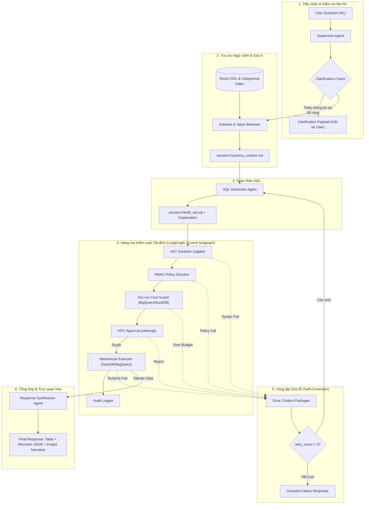

# DATA_FLOW.md — End-to-End Data Flow & State Specification

> **Dự án**: AI Agent Text-to-SQL Self-Service Analytics (TPC-H Benchmark)  
> **Phiên bản**: 1.0  
> **Mục đích**: Đặc tả chi tiết vòng đời dữ liệu từ lúc người dùng đặt câu hỏi tự nhiên đến khi nhận về biểu đồ và giải thích; quy định rõ ràng: **Agent nào gọi Agent nào, Input, Output, Transformation, Trạng thái State, và Định dạng dữ liệu (Data Format)** tại từng mắt xích.

---

## 1. SƠ ĐỒ DÒNG CHẢY DỮ LIỆU TỔNG THỂ (DATA PIPELINE MAP)



---

## 2. CHI TIẾT TỪNG BƯỚC CHUYỂN HÓA DỮ LIỆU (STEP-BY-STEP DATA TRANSFORMATION)

---

### Giai đoạn 1: Tiếp nhận & Kiểm tra mơ hồ (Question Ingestion & Clarification)

| Thuộc tính | Chi tiết |
|---|---|
| **Agent gọi** | Client / FastAPI Gateway $\rightarrow$ **Deep Agent Supervisor** |
| **Input Data** | HTTP Request JSON từ người dùng |
| **Input Format** | `{"question": "Cho tôi xem doanh thu năm 1995 theo khu vực", "thread_id": "thr_001", "user_role": "Analyst"}` |
| **Xử lý (Transformation)** | 1. Supervisor nạp lịch sử hội thoại từ Checkpointer theo `thread_id`.<br/>2. LLM phân tích ngữ nghĩa câu hỏi: xác định xem câu hỏi đã có đủ thực thể và điều kiện lọc bắt buộc (thời gian, khu vực) hay chưa. |
| **Rẽ nhánh** | - **Nếu mơ hồ**: Tạo câu hỏi làm rõ kèm danh sách gợi ý A, B, C.<br/>- **Nếu rõ ràng**: Ghi nhận `is_ambiguous = False`, chuyển việc cho Schema Retriever. |
| **Output Data** | - *Nhánh mơ hồ*: Trả về SSE Event `event: clarification` cho Client.<br/>- *Nhánh rõ ràng*: Cập nhật `current_question` vào LangGraph State. |
| **Cập nhật State** | `AgentState.is_ambiguous`, `AgentState.clarification_prompt` |

---

### Giai đoạn 2: Tra cứu Schema & Giá trị Danh mục (Schema & Value Retrieval)

| Thuộc tính | Chi tiết |
|---|---|
| **Agent gọi** | **Deep Agent Supervisor** $\rightarrow$ **Subagent: Schema & Value Retriever** |
| **Input Data** | `current_question` + Database Metadata Index (Vector Store) |
| **Input Format** | `question: str`, `top_k: int = 5` |
| **Xử lý (Transformation)** | 1. **Vector DDL Search**: Match ngữ nghĩa câu hỏi với embedding mô tả của 8 bảng TPC-H để lấy top bảng liên quan (VD: `orders`, `lineitem`, `customer`, `nation`, `region`).<br/>2. **Categorical Value Search**: Quét từ khóa trong câu hỏi với chỉ mục giá trị rời rạc trong DB (VD: phát hiện từ *"thép"* $\rightarrow$ map với `p_type = 'ECONOMY ANODIZED STEEL'`; từ *"Châu Á"* $\rightarrow$ map với `r_name = 'ASIA'`).<br/>3. **Semantic Metric Injection**: Gắn công thức dbt tương ứng (Doanh thu thuần: `l_extendedprice * (1 - l_discount)`). |
| **Output Data** | File Markdown ảo: `session://{thread_id}/schema_context.md` |
| **Output Format** | Markdown text chứa DDL trích lọc + Mẫu giá trị phân loại + Công thức tính |
| **Cập nhật State** | `AgentState.schema_context_path = "session://{thread_id}/schema_context.md"` |

#### Cấu trúc file mẫu `schema_context.md`:
```markdown
### Relevant Tables:
- lineitem (l_orderkey, l_extendedprice, l_discount, l_shipdate, l_returnflag)
- orders (o_orderkey, o_custkey, o_orderdate)
- customer (c_custkey, c_nationkey)
- nation (n_nationkey, n_regionkey, n_name)
- region (r_regionkey, r_name)

### Categorical Mappings:
- r_name = 'ASIA'
- o_orderdate BETWEEN '1995-01-01' AND '1995-12-31'

### Business Metrics:
- Net Revenue = SUM(l_extendedprice * (1 - l_discount))
```

---

### Giai đoạn 3: Soạn thảo SQL (SQL Generation)

| Thuộc tính | Chi tiết |
|---|---|
| **Agent gọi** | **Deep Agent Supervisor** $\rightarrow$ **Subagent: SQL Generator** |
| **Input Data** | `schema_context.md` + `current_question` + `user_role` + `error_context` (nếu có từ retry) |
| **Input Format** | Markdown Context + Prompt instructions |
| **Xử lý (Transformation)** | 1. Áp dụng kỹ thuật Chain-of-Thought suy luận logic JOIN giữa các bảng TPC-H.<br/>2. Sinh câu lệnh SQL tuân thủ đúng dialect DuckDB / BigQuery Standard SQL.<br/>3. Tạo một đoạn giải thích ngắn gọn bằng tiếng Việt về mục đích của câu SQL. |
| **Output Data** | File ảo: `session://{thread_id}/draft_sql.sql` + chuỗi `sql_explanation` |
| **Output Format** | Mã nguồn SQL thuần: `SELECT ... FROM ... GROUP BY ...` |
| **Cập nhật State** | `AgentState.draft_sql`, `AgentState.sql_explanation` |

---

### Giai đoạn 4: Hàng rào Kiểm duyệt Tất định (Deterministic Control Pipeline)

Đây là Subgraph LangGraph chạy hoàn toàn bằng **code logic Python thuần (0 token LLM)**:

```
[draft_sql.sql]
      ↓
[1. AST Check (sqlglot)]
   → Fail: Chặn DDL/DML, cú pháp sai → ném lỗi ERR_AST
   → Pass: Tự động chèn LIMIT 1000 nếu thiếu
      ↓
[2. RBAC Policy Check]
   → Fail: SELECT cột PII (c_phone, c_acctbal...) với vai trò Analyst → ném lỗi ERR_RBAC
   → Pass: Hợp lệ theo vai trò
      ↓
[3. Cost Guard (Dry-run)]
   → Chạy EXPLAIN (DuckDB) hoặc dryRun (BigQuery)
   → Tính bytes_scanned
   → Vượt budget (> 1GB) → ném lỗi ERR_COST
      ↓
[4. HITL Approval (interrupt)]
   → Tạm dừng StateGraph, gửi payload về UI chờ User bấm Duyệt / Từ chối
   → Từ chối → ném lỗi ERR_HITL_REJECT
      ↓
[5. Warehouse Executor]
   → Thực thi trên DuckDB/BigQuery với Timeout = 30s
   → Database Error → ném lỗi ERR_RUNTIME
   → Thành công → Nhận kết quả dạng danh sách bản ghi
      ↓
[6. Audit Logger]
   → Ghi vào bảng audit_logs: thread_id, role, SQL, bytes_scanned, latency_ms, status
```

| Output từng Node trong Subgraph | Kiểu dữ liệu / Format |
|---|---|
| `AST Sanitizer` | `ast_valid: bool`, `sanitized_sql: str` (đã gắn LIMIT 1000) |
| `RBAC Checker` | `rbac_passed: bool`, `forbidden_columns: list[str]` |
| `Cost Guard` | `estimated_bytes: int`, `is_cost_exceeded: bool` |
| `HITL Interrupt` | Payload gửi ra: `{"sql": str, "explanation": str, "cost_bytes": int}` |
| `Warehouse Executor`| `query_result: list[dict[str, Any]]` (bảng kết quả dạng JSON) |
| `Audit Logger` | Ghi bản ghi vào DB lưu trữ lâu dài |

---

### Giai đoạn 5: Vòng lặp Sửa lỗi Tự động (Self-Correction Loop)

```
       [Bất kỳ Node Kiểm duyệt hoặc Runtime bị Lỗi]
                            ↓
                    [Node ERR đóng gói]
                            ↓
             Kiểm tra: retry_count < 3 ?
             /                         \
       (Còn lượt: < 3)           (Hết lượt: = 3)
            ↓                           ↓
   Tăng retry_count + 1        Dừng khẩn cấp (Graceful Fail)
   Tạo error_context           Log Audit trạng thái FAILED
   Gọi lại SQL Generator       Trả thông báo giải thích cho User
```

#### Cấu trúc dữ liệu của `error_context`:
```json
{
  "failing_sql": "SELECT n_name, SUM(c_acctbal) FROM customer JOIN nation ...",
  "error_type": "RBAC_VIOLATION",
  "error_message": "Cột 'c_acctbal' là thông tin tài chính nhạy cảm, bị cấm truy cập đối với vai trò Analyst. Vui lòng không SELECT cột này.",
  "suggestion": "Chỉ tính toán dựa trên khối lượng giao dịch hoặc số lượng đơn hàng thay vì số dư tài khoản."
}
```

---

### Giai đoạn 6: Tổng hợp & Trực quan hóa (Response Synthesis)

| Thuộc tính | Chi tiết |
|---|---|
| **Agent gọi** | **Deep Agent Supervisor** $\rightarrow$ **Subagent: Response Synthesizer** |
| **Input Data** | `query_result: list[dict]` + `current_question` |
| **Input Format** | Danh sách các dòng dữ liệu JSON |
| **Xử lý (Transformation)** | 1. **Data Shape Analysis**: Nhận diện số lượng dòng, số cột số (metrics), số cột phân loại (dimensions).<br/>2. **Recharts Config Generation**: Lựa chọn loại biểu đồ tối ưu (Bar, Line, Area, Pie) và sinh cấu hình JSON khớp với props của thư viện Recharts.<br/>3. **Insight Generation**: Sinh 2-3 câu bình luận phân tích kinh doanh bằng tiếng Việt (nhấn mạnh con số dẫn đầu, biến động lớn nhất). |
| **Output Data** | Payload hoàn chỉnh trả về cho Frontend qua API |
| **Output Format** | JSON Payload chuẩn hóa |

---

## 3. ĐẶC TẢ ĐỊNH DẠNG DỮ LIỆU (DATA FORMAT CONTRACTS)

### 3.1. Contract API Request (`POST /api/v1/ask`)
```json
{
  "thread_id": "sess_20260908_001",
  "message": "Doanh thu xuất khẩu năm 1995 của khu vực Châu Á là bao nhiêu?",
  "user_id": "usr_98a72b",
  "user_role": "Analyst"
}
```

### 3.2. Contract Payload Ngắt phiên HITL (`interrupt` payload)
```json
{
  "type": "HITL_APPROVAL_REQUIRED",
  "thread_id": "sess_20260908_001",
  "draft_sql": "SELECT n.n_name, SUM(l.l_extendedprice * (1 - l.l_discount)) AS net_revenue FROM lineitem l JOIN orders o ON l.l_orderkey = o.o_orderkey JOIN customer c ON o.o_custkey = c.c_custkey JOIN nation n ON c.c_nationkey = n.n_nationkey JOIN region r ON n.n_regionkey = r.r_regionkey WHERE r.r_name = 'ASIA' AND o.o_orderdate BETWEEN '1995-01-01' AND '1995-12-31' GROUP BY n.n_name ORDER BY net_revenue DESC LIMIT 1000;",
  "explanation": "Truy vấn tính tổng doanh thu thuần (sau chiết khấu) của các khách hàng thuộc khu vực Châu Á trong cả năm 1995, nhóm theo từng quốc gia.",
  "estimated_bytes_scanned": 24500000,
  "cost_warning": false
}
```

### 3.3. Contract API Response Hoàn chỉnh (`ChatResponse`)
```json
{
  "thread_id": "sess_20260908_001",
  "status": "SUCCESS",
  "executed_sql": "SELECT n.n_name, SUM(l.l_extendedprice * (1 - l.l_discount)) AS net_revenue ...",
  "table_data": {
    "columns": ["n_name", "net_revenue"],
    "rows": [
      {"n_name": "CHINA", "net_revenue": 54203102.50},
      {"n_name": "VIETNAM", "net_revenue": 48109220.10},
      {"n_name": "JAPAN", "net_revenue": 41908330.80},
      {"n_name": "INDIA", "net_revenue": 39500110.20},
      {"n_name": "INDONESIA", "net_revenue": 32104500.00}
    ],
    "total_rows": 5
  },
  "chart_config": {
    "chart_type": "bar",
    "x_axis_key": "n_name",
    "y_axis_keys": [
      {
        "key": "net_revenue",
        "name": "Doanh thu thuần (USD)",
        "color": "#3b82f6"
      }
    ],
    "title": "Top Quốc Gia Châu Á Có Doanh Thu Thuần Cao Nhất Năm 1995"
  },
  "insight_narrative": "Trong năm 1995, thị trường Châu Á đạt tổng doanh thu thuần ấn tượng, trong đó Trung Quốc dẫn đầu với 54.2 triệu USD, theo sát là Việt Nam với 48.1 triệu USD. Hai thị trường này đóng góp gần 50% tổng doanh thu của toàn khu vực.",
  "metrics": {
    "bytes_scanned": 24500000,
    "execution_time_ms": 142.5,
    "retry_count": 0
  }
}
```

---

## 4. QUẢN LÝ TRẠNG THÁI STATE (LANGGRAPH AGENT STATE)

Toàn bộ dữ liệu được quản lý tập trung trong một State duy nhất có cơ chế Checkpointing bền vững:

```python
from typing import Annotated, Any, Literal
from typing_extensions import TypedDict
import operator


class AgentState(TypedDict):
    """LangGraph Shared State Schema."""

    # 1. Metadata phiên & Phân quyền
    thread_id: str
    user_id: str
    user_role: Literal["Analyst", "Admin"]

    # 2. Lịch sử & Câu hỏi
    messages: Annotated[list[dict[str, Any]], operator.add]
    current_question: str

    # 3. Clarification
    is_ambiguous: bool
    clarification_prompt: str | None

    # 4. Context Bus (Virtual Filesystem)
    schema_context_path: str  # session://{thread_id}/schema_context.md

    # 5. Soạn thảo SQL & Giải trình
    draft_sql: str | None
    sql_explanation: str | None

    # 6. Kiểm định an toàn (Governance Results)
    ast_valid: bool
    rbac_passed: bool
    estimated_bytes: int
    is_cost_exceeded: bool

    # 7. Tương tác con người
    hitl_approved: bool | None

    # 8. Thực thi & Tự sửa lỗi
    query_result: list[dict[str, Any]] | None
    error_context: dict[str, Any] | None
    retry_count: int

    # 9. Trực quan hóa & Insight
    chart_config: dict[str, Any] | None
    insight_narrative: str | None
```

---

## 5. TỔNG KẾT BẢNG GIAO TIẾP AGENT-TO-AGENT

| Bước | Agent khởi tạo | Agent đích | Kênh giao tiếp | Dữ liệu bàn giao |
|---|---|---|---|---|
| **1** | Client (UI) | Deep Agent Supervisor | HTTP POST `/ask` | Câu hỏi tiếng Việt + Token Auth |
| **2** | Supervisor | Clarifier | Internal Function Call | Intent & Filter Check |
| **3** | Supervisor | Schema Retriever | Subagent Invocation | Question $\rightarrow$ `schema_context.md` |
| **4** | Supervisor | SQL Generator | Subagent Invocation | `schema_context.md` $\rightarrow$ `draft_sql.sql` |
| **5** | Supervisor | Control Pipeline | CompiledSubAgent Graph | `draft_sql.sql` $\rightarrow$ AST, RBAC, Cost |
| **6** | Control Pipeline | Client (UI) | LangGraph `interrupt` | Payload Duyệt SQL + Cost estimate |
| **7** | Client (UI) | Control Pipeline | HTTP POST `/approve` | Tín hiệu `approve = True/False` |
| **8** | Control Pipeline | DuckDB / BigQuery | Database Driver | SQL $\rightarrow$ Result Set |
| **9** | Control Pipeline | Supervisor | Subgraph Return | `query_result` hoặc `error_context` |
| **10**| Supervisor | SQL Generator (Retry) | Subagent Retry Call | `error_context` (nếu có lỗi, $\le 3$ lần) |
| **11**| Supervisor | Response Synthesizer | Subagent Invocation | `query_result` $\rightarrow$ Chart JSON + Insight |
| **12**| Supervisor | Client (UI) | HTTP SSE Stream | Final Table + Recharts + Insight |
