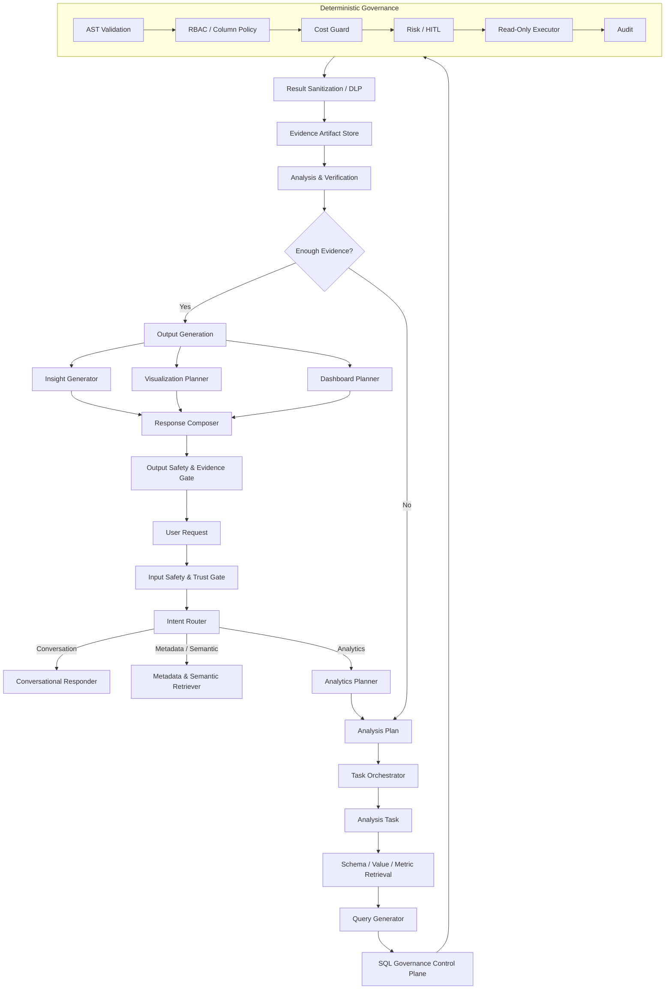

# Text2SQL AI Analytics Agent — Architecture v4.0

## 1. Architectural Vision

The system is not designed merely to convert natural-language questions into SQL.

Its primary responsibility is to transform a user's analytical request into a **verified analysis plan**, acquire the necessary evidence from the data warehouse, perform analytical reasoning over that evidence, and produce one or more presentation artifacts such as business insights, visualizations, dashboards, or reports.

The central abstraction is therefore:

```text
User Request
      ↓
Analysis Plan
      ↓
Analysis Tasks
      ↓
Evidence Artifacts
      ↓
Analysis
      ↓
Insight / Visualization / Dashboard / Report
```

SQL is an implementation mechanism used by analytical tasks, not the fundamental unit of the entire agent.

---

## 2. High-Level Architecture



---

## 3. Input and Routing Layer

### 3.1 Input Safety & Trust Gate

Responsibilities:

* Resolve authenticated user identity.
* Resolve trusted role and permissions.
* Validate tenant/session boundaries.
* Detect malicious or policy-violating requests.
* Detect prompt-injection attempts targeting tools or system instructions.
* Apply request rate and budget limits.
* Normalize user input.

The client must not be able to directly assign its own authorization role.

```text
Trusted Identity
      ↓
UserContext
      ↓
Agent
```

---

### 3.2 Intent Router

The Router produces one of three primary intents:

```text
CONVERSATION
METADATA
ANALYTICS
```

Examples:

```text
"What is a primary key?"
        → CONVERSATION

"What does l_discount represent?"
        → METADATA

"Show revenue by region in 1996."
        → ANALYTICS
```

This provides an inexpensive fast path for requests that do not require database access.

---

# 4. Analytics Planning Layer

The Planner converts a user request into an explicit `AnalysisPlan`.

Example:

```text
User:
"Why did revenue decrease in Europe in 1996?"

AnalysisPlan:

T1:
  Calculate Europe revenue in 1995 and 1996

T2:
  Decompose revenue change by country

T3:
  Decompose revenue change by customer segment

T4:
  Identify products responsible for the largest decline

Dependencies:
  T1 → none
  T2 → T1
  T3 → T1
  T4 → T2

Execution:
  T2 and T3 may run in parallel
```

The planner therefore reasons about **what needs to be known**, rather than immediately reasoning about SQL syntax.

---

## 5. Analysis Task Model

Each analytical task has its own lifecycle:

```text
PLANNED
   ↓
RETRIEVING_CONTEXT
   ↓
GENERATING_QUERY
   ↓
VALIDATING
   ↓
EXECUTING
   ↓
VERIFYING_RESULT
   ↓
COMPLETED
```

A task may fail and enter a bounded repair loop:

```text
Generate SQL
     ↓
Control Plane
     ↓
Failure?
  /       \
No        Yes
 |         |
Done    Diagnose
           ↓
       Regenerate
```

The retry limit is global and per task.

---

# 6. Query Execution Strategy

A single user request may produce:

```text
0 queries
1 query
2 queries
10 queries
...
```

depending on the Analysis Plan.

The Query Planner may choose to:

```text
Task A + Task B
      ↓
Can be safely fused?
   /           \
 YES            NO
  ↓              ↓
1 SQL           2 SQL
```

Independent tasks may execute concurrently.

Dependent tasks execute sequentially.

A global execution budget must control:

```text
max_tasks
max_queries
max_parallel_queries
max_total_cost
max_total_runtime
```

Therefore:

> Multiple queries are allowed, but unbounded querying is not.

---

# 7. SQL Governance Control Plane

The existing deterministic control pipeline should remain.

Its responsibilities are:

```text
AST Validation
      ↓
RBAC
      ↓
Cost Guard
      ↓
Risk / HITL
      ↓
Read-Only Execution
      ↓
Audit
```

LLM agents must never be responsible for deciding whether a query is authorized or safe.

The Error Diagnostic Agent remains useful here as a repair assistant.

---

# 8. Evidence Artifact Layer

Every successful query produces a typed artifact rather than a textual ToolMessage.

Example:

```python
QueryArtifact(
    query_id="q_001",
    task_id="task_02",
    sql="SELECT ...",
    tables_used=["orders", "lineitem"],
    columns_used=["o_orderdate", "l_extendedprice"],
    row_count=10,
    data_ref="artifact://q_001/result",
    estimated_cost_bytes=123456,
    execution_time_ms=82.5,
)
```

The artifact becomes the canonical evidence source for downstream components.

The API must not reconstruct this information using regex over LLM-generated messages.

---

# 9. Result Sanitization

After query execution:

```text
Raw Result
    ↓
Result DLP
    ↓
Allowed / Minimized Dataset
```

The sanitization layer may:

* Mask PII.
* Remove sensitive identifiers.
* Limit raw row exposure.
* Remove unnecessary columns.
* Apply role-specific output policies.

The Insight Agent should receive the sanitized result, not unrestricted raw database output.

---

# 10. Analysis & Verification Layer

This is the most important new capability.

The agent should support operations such as:

```text
Descriptive Analysis
Comparison
Trend Analysis
Contribution Analysis
Drill-down
Root-cause Analysis
Anomaly Detection
Segmentation
Cohort Analysis
Data-quality Analysis
Reconciliation
```

This layer may request additional evidence.

Example:

```text
Evidence:
Europe revenue ↓ 12%

          ↓

Need explanation

          ↓

Request:
Revenue by country

          ↓

Germany + France explain 80% of decline

          ↓

Need deeper explanation

          ↓

Request:
Revenue by segment

          ↓

Automobile segment explains most decline
```

This creates the main agentic loop:

```text
PLAN
  ↓
OBSERVE
  ↓
ANALYZE
  ↓
NEED MORE EVIDENCE?
  ↓
PLAN AGAIN
```

---

# 11. Presentation Layer

Presentation should be separated into independent specialists.

### Insight Generator

Produces:

```text
Key Findings
Supporting Metrics
Comparisons
Trends
Caveats
```

### Visualization Planner

Produces:

```text
Chart type
Dataset
Dimensions
Measures
Axis mappings
Titles
Formatting
```

### Dashboard Planner

Produces:

```text
KPI cards
Charts
Tables
Filters
Layout
Ordering
```

These three components consume the same verified Evidence Artifacts.

---

# 12. Output Safety & Evidence Gate

Before the result reaches the user:

```text
Generated Response
      ↓
PII / Sensitive Data Check
      ↓
Unsupported Claim Check
      ↓
Numeric Evidence Check
      ↓
Final Response
```

Every important numerical statement should be traceable to an Evidence Artifact.

For example:

```text
Claim:
"Revenue decreased by 14.2%."

Evidence:
artifact_03.revenue_change = -14.2%
```

The system should not generate causal claims unless the evidence supports them.

---

# 13. Final Response Contract

Instead of returning:

```text
sql
data
columns
recharts_config
final_answer
```

the API should evolve toward something like:

```json
{
  "status": "COMPLETED",

  "answer": {
    "summary": "...",
    "insights": []
  },

  "tasks": [
    {
      "task_id": "task_01",
      "status": "COMPLETED"
    },
    {
      "task_id": "task_02",
      "status": "COMPLETED"
    }
  ],

  "artifacts": [
    {
      "artifact_id": "artifact_01",
      "type": "query_result"
    }
  ],

  "visualizations": [],

  "dashboard": {},

  "evidence": [],

  "metadata": {
    "query_count": 2,
    "execution_time_ms": 420
  }
}
```

The frontend can then render different blocks dynamically:

```text
Insight Card
KPI Card
Chart
Table
SQL
Evidence
Dashboard
```

---

# 14. Recommended Agent / Component Responsibilities

```text
1. Input Guard
2. Intent Router
3. Analytics Planner
4. Schema / Semantic Retriever
5. Query Generator
6. SQL Control Plane
7. Query Repair / Diagnostic Agent
8. Result Sanitizer
9. Analysis Worker
10. Evidence Verifier
11. Insight Generator
12. Visualization Planner
13. Dashboard Planner
14. Response Composer
15. Output Guard
```

These do not all need to be separate LLM agents.

A good rule is:

```text
LLM:
  Planning
  Semantic interpretation
  Reasoning
  Analysis
  Explanation

Deterministic code:
  Authorization
  AST validation
  Cost control
  Execution
  DLP
  Numeric validation
  Audit
```

That keeps the system agentic without turning security-critical decisions into probabilistic behavior.
