# BẢN TÓM TẮT ĐỀ TÀI ĐỒ ÁN TỐT NGHIỆP / NGHIÊN CỨU

**Tên đề tài**: **Xây dựng AI Agent Text-to-SQL Self-Service Analytics cho Dữ liệu Doanh nghiệp (Chuẩn TPC-H Benchmark)**  
**Lĩnh vực**: Trí tuệ nhân tạo ứng dụng (Applied AI), Hệ thống thông tin doanh nghiệp (Enterprise BI/Data Analytics)  
**Học viên / Sinh viên thực hiện**: [Họ và tên] — MSSV: [Mã số SV]  
**Giảng viên hướng dẫn**: [Học hàm, học vị, Họ và tên GVHD]  

---

### 1. TÍNH CẤP THIẾT & ĐẶT VẤN ĐỀ
- **Thực trạng**: Tại các doanh nghiệp phân phối & thương mại, nhân viên nghiệp vụ (Kinh doanh, Mua hàng, Kho vận) thường xuyên cần số liệu phân tích nhưng phụ thuộc hoàn toàn vào đội ngũ Data Analyst/IT để viết truy vấn SQL. Thời gian chờ nhận kết quả thường kéo dài 2–5 ngày, làm chậm trễ các quyết định vận hành.
- **Giải pháp**: Xây dựng hệ thống **AI Agent Text-to-SQL** cho phép người dùng hỏi đáp trực tiếp bằng ngôn ngữ tự nhiên (tiếng Việt), hệ thống tự động suy luận, lập kế hoạch, truy vấn cơ sở dữ liệu và trực quan hóa kết quả tức thì.

---

### 2. MỤC TIÊU VÀ PHẠM VI ĐỀ TÀI
- **Mục tiêu tổng quát**: Xây dựng nền tảng Self-Service Analytics tự động hóa luồng chuyển đổi từ câu hỏi tiếng Việt sang truy vấn SQL an toàn, chính xác và có thể tự giải thích dữ liệu.
- **Mục tiêu cụ thể**:
  1. *Độ chính xác truy vấn*: Đạt tỷ lệ Valid SQL Rate (VSR) > 90% và Execution Accuracy (EX) > 75% trên tập benchmark kiểm thử chuẩn TPC-H.
  2. *An toàn & Kiểm soát dữ liệu*: Ngăn chặn 100% rủi ro SQL Injection / DDL / DML phá hoại; hỗ trợ phân quyền người dùng (RBAC) và ước tính chi phí quét dữ liệu (Cost Guard).
  3. *Tương tác thông minh (HITL & Clarification)*: Cơ chế Human-In-The-Loop cho phép người dùng xem trước và duyệt câu lệnh trước khi chạy; tự động hỏi lại khi câu hỏi mơ hồ.
- **Phạm vi nghiên cứu & thử nghiệm**:
  - *Dữ liệu*: Bộ dữ liệu chuẩn quốc tế **TPC-H Benchmark** (8 bảng quan hệ: phân phối, nhà cung cấp, khách hàng, đơn hàng, mặt hàng).
  - *Hạ tầng lưu trữ*: DuckDB (phân tích cục bộ/in-process tốc độ cao) và Google BigQuery (kho dữ liệu đám mây quy mô lớn).
  - *Đối tượng phục vụ*: Người dùng nghiệp vụ (Business Analyst) và Quản trị viên (Admin).

---

### 3. ĐỊNH HƯỚNG GIẢI PHÁP & KIẾN TRÚC AGENT
Hệ thống áp dụng kiến trúc **Hybrid Agentic Governance** — kết hợp linh hoạt giữa **Mô hình ngôn ngữ lớn (LLM)** cho phần tư duy ngôn ngữ và **Code tất định (Deterministic Code)** cho phần bảo mật, kiểm soát:

```mermaid
flowchart LR
    A["1. Người dùng<br/>(Hỏi tiếng Việt)"] --> B{"2. Làm rõ ý định<br/>(Clarification?)"}
    B -- "Thiếu thông tin" --> A
    B -- "Đầy đủ" --> C["3. Truy xuất ngữ cảnh<br/>(Schema & Values)"]
    C --> D["4. Sinh câu lệnh SQL<br/>(LLM Generator)"]
    D --> E["5. Kiểm soát an toàn<br/>(AST / RBAC / Cost)"]
    E --> F{"6. Duyệt thực thi<br/>(HITL Approval)"}
    F -- "Từ chối" --> D
    F -- "Đồng ý" --> G[("7. Kho dữ liệu<br/>(DuckDB / BigQuery)")]
    G --> H["8. Tổng hợp & Trực quan<br/>(Biểu đồ + Insight)"]
    H --> I["9. Trả kết quả<br/>cho người dùng"]

    style A fill:#e1f5fe,stroke:#0288d1,stroke-width:1.5px
    style E fill:#fff3e0,stroke:#f57c00,stroke-width:1.5px
    style F fill:#fce4ec,stroke:#c2185b,stroke-width:1.5px
    style G fill:#e8f5e9,stroke:#388e3c,stroke-width:1.5px
    style H fill:#f3e5f5,stroke:#7b1fa2,stroke-width:1.5px
```

**Các trụ cột kỹ thuật chính**:
- **Tầng suy luận**: Phân tích ngữ cảnh, tra cứu Vector Semantic Layer và sửa lỗi truy vấn tự động (Self-Correction tối đa 3 lần).
- **Tầng bảo mật cứng**: Phân tích cú pháp cây trừu tượng (AST với `sqlglot`) chỉ cho phép `SELECT`, ngăn chặn triệt để sửa đổi cấu trúc dữ liệu.
- **Tầng kiểm soát chi phí & HITL**: Ước tính trước lượng dữ liệu quét (bytes scanned); dừng chờ người dùng xác nhận nếu truy vấn tác động bảng dữ liệu lớn.

---

### 4. BỐ CỤC DỰ KIẾN CỦA ĐỀ TÀI (5 CHƯƠNG)
- **Chương 1: Mở đầu** — Giới thiệu bối cảnh, lý do chọn đề tài, tính cấp thiết, mục tiêu và phạm vi nghiên cứu.
- **Chương 2: Cơ sở lý thuyết và Công nghệ nền tảng** — Tổng quan về Text-to-SQL, LLMs & AI Agents (LangGraph/ReAct), Vector Search, cơ chế AST Parser và chuẩn dữ liệu TPC-H.
- **Chương 3: Phân tích yêu cầu và Thiết kế hệ thống** — Thiết kế kiến trúc Hybrid 3 tầng, quy trình kiểm soát truy vấn an toàn (Guardrails), phân quyền RBAC và thiết kế trải nghiệm người dùng (UI/UX).
- **Chương 4: Hiện thực hóa và Thực nghiệm hệ thống** — Chi tiết cài đặt backend FastAPI, frontend Next.js/Recharts, kết nối kho dữ liệu và đánh giá định lượng (Execution Accuracy, độ trễ, khả năng tự sửa lỗi).
- **Chương 5: Kết luận và Hướng phát triển** — Đánh giá kết quả đạt được so với mục tiêu đề ra, các mặt hạn chế và hướng mở rộng (mở rộng sang các hệ ERP thực tế, hỗ trợ multi-turn complex reasoning).
