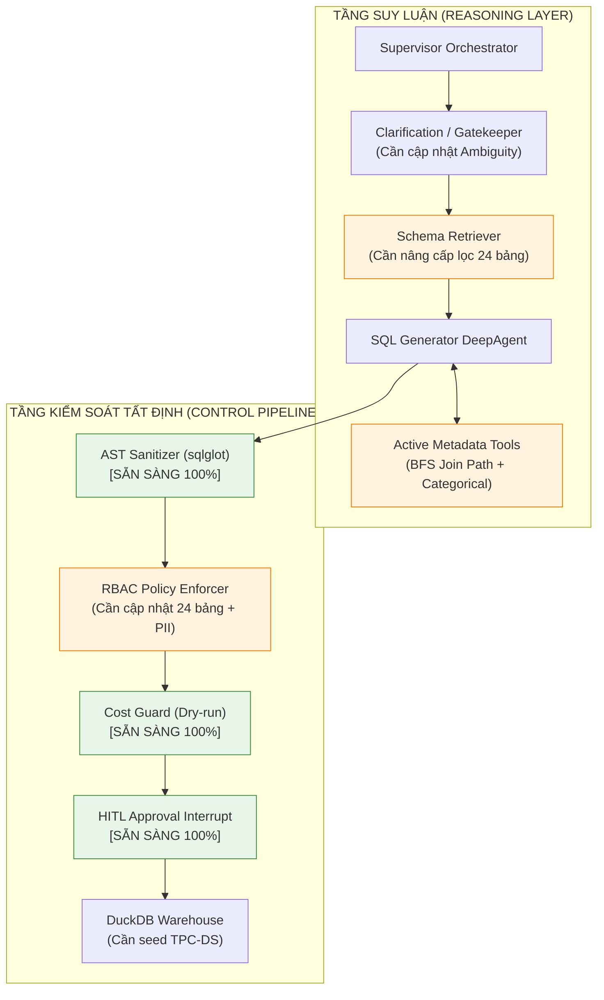

# KẾ HOẠCH CHUYỂN ĐỔI TOÀN DIỆN: TPC-H SANG TPC-DS (24 BẢNG)
## Comprehensive Migration Blueprint: From TPC-H to TPC-DS Benchmark

> **Tài liệu**: Kế hoạch kỹ thuật & Bản đồ thay đổi chi tiết codebase (Technical Migration Plan)  
> **Dự án**: AI Agent Text-to-SQL Self-Service Analytics cho Dữ liệu Doanh nghiệp  
> **Trạng thái**: Bản thảo đặc tả (Draft Specification)  
> **Ngày lập**: 2026-09-26  

---

## 1. TỔNG QUAN & BỐI CẢNH CHUYỂN ĐỔI

### 1.1. Lý do chuyển đổi
Hệ thống AI Agent Text-to-SQL ban đầu được thiết kế trên bộ dữ liệu chuẩn **TPC-H Benchmark (8 bảng)** — mô phỏng chuỗi cung ứng bán buôn (B2B). Mặc dù TPC-H đã chứng minh được tính đúng đắn của kiến trúc Hybrid Agent, việc nâng cấp lên **TPC-DS Benchmark (24 bảng)** sẽ đưa hệ thống lên đẳng cấp của một giải pháp Enterprise Data Warehouse (EDW) thực thụ:
- **Mô hình bán lẻ đa kênh (Omnichannel Retail)**: Kết hợp bán lẻ tại quầy (`store`), trên website (`web`) và qua danh mục (`catalog`).
- **Mô hình dữ liệu hiện đại (Snowflake / Star Schema)**: Sử dụng các bảng Fact lớn và Dimension đa tầng kèm Surrogate Keys, phản ánh chính xác cấu trúc dữ liệu của các doanh nghiệp lớn.
- **Giá trị học thuật & thực tiễn vượt trội**: Chứng minh năng lực vượt trội của Agent trong việc giải quyết bài toán phức tạp (Schema Pruning trên 24 bảng, giải quyết nhập nhằng đa kênh, điều hướng bảng ngày tháng `date_dim`).

---

## 2. SO SÁNH BẢN CHẤT KIẾN TRÚC: TPC-H VS TPC-DS

| Tiêu chí | TPC-H (Hiện tại) | TPC-DS (Mục tiêu chuyển đổi) | Thách thức kỹ thuật đối với AI Agent |
| :--- | :--- | :--- | :--- |
| **Quy mô lược đồ** | **8 bảng**, ~61 cột | **24 bảng**, **429 cột** | Không thể nhồi toàn bộ DDL vào Prompt; bắt buộc phải lọc bảng động (Schema Pruning). |
| **Kiểu mô hình** | Chuẩn hóa 3NF kinh điển | **Snowflake / Star Schema** | Nhiều bảng Fact và Dimension liên kết bắc cầu qua nhiều tầng. |
| **Bảng thời gian** | Lưu trực tiếp (`o_orderdate DATE`) | Dùng khóa thay thế (`ss_sold_date_sk INT`) qua bảng **`date_dim`** | **Bẫy lớn nhất**: LLM phải biết tự động JOIN với `date_dim` để lọc năm/tháng/quý. |
| **Kênh bán hàng** | 1 kênh duy nhất (`orders`, `lineitem`) | **3 kênh song song**: Store, Web, Catalog | Cần cơ chế làm rõ ý định (Clarification) khi người dùng hỏi "doanh thu" chung chung. |
| **Quản lý đổi trả** | Cờ trạng thái (`l_returnflag`) | 3 bảng đổi trả riêng: `store_returns`, `web_returns`, `catalog_returns` | Cần biết liên kết bảng Fact bán hàng và bảng Fact đổi trả tương ứng. |
| **Hỗ trợ DuckDB** | Extension `tpch` (`CALL dbgen()`) | Extension `tpcds` (`CALL dsdgen()`) | DuckDB hỗ trợ sẵn cả hai, thời gian sinh dữ liệu sf=0.01 chỉ ~3.5 giây. |

---

## 3. ĐÁNH GIÁ KHẢ NĂNG ĐÁP ỨNG CỦA KIẾN TRÚC HIỆN TẠI



- **Điểm mạnh đã sẵn sàng (Ready out-of-the-box)**:
  1. *Kiến trúc Active Metadata Tools*: SQL Generator không nhận schema tĩnh mà chủ động gọi tool (`search_tables_and_columns`, `find_join_path`, `get_column_samples_and_values`). Đây là chuẩn thiết kế tối ưu cho TPC-DS.
  2. *Hệ thống dò đường khóa ngoại BFS*: Thuật toán BFS trong [`src/agents/tools/metadata_tools.py`](file:///d:/Text2SQL-AI-Agent/src/agents/tools/metadata_tools.py) có khả năng tự động tìm đường nối ngắn nhất trong đồ thị Snowflake Schema.
  3. *Control Pipeline tất định*: AST Sanitizer chỉ cho phép `SELECT`, Cost Guard đo dung lượng quét trước khi chạy và cơ chế HITL xác nhận an toàn hoạt động độc lập với schema.

- **4 Điểm nghẽn cần khắc phục**:
  1. *Quy tắc bảng `date_dim`*: Dạy LLM thông qua Domain Skill và Few-shot để luôn JOIN `date_dim` khi có điều kiện thời gian.
  2. *Bộ lọc Schema Retriever*: Nâng cấp từ điển từ khóa tiếng Việt từ 8 bảng lên 24 bảng; tăng `top_k` để tránh sót bảng Dimension cần thiết.
  3. *Làm rõ nghiệp vụ đa kênh*: Preflight Gatekeeper phải nhận biết các câu hỏi mơ hồ về kênh bán để hỏi lại người dùng.
  4. *Cập nhật Metadata tĩnh*: DDL, từ điển giá trị phân loại (Categorical Values), danh bạ quyền RBAC đang lưu dữ liệu của TPC-H.

---

## 4. BẢN ĐỒ CHI TIẾT CÁC TỆP TIN CẦN THAY ĐỔI (FULL CODEBASE INVENTORY)

Dưới đây là danh mục toàn bộ các tệp tin trong repository cần được cập nhật hoặc tạo mới:

### 4.1. Tầng 1: Kho Dữ Liệu & Khởi Tạo Database (Database & Seeding Layer)
| STT | Tệp tin | Hành động | Nội dung thay đổi |
| :---: | :--- | :---: | :--- |
| 1 | `src/utils/tpcds_seeder.py` | **Tạo mới** | Thay thế [`tpch_seeder.py`](file:///d:/Text2SQL-AI-Agent/src/utils/tpch_seeder.py). Chạy `INSTALL tpcds; LOAD tpcds; CALL dsdgen(sf=0.01);`. Định nghĩa hằng số `TPCDS_TABLES` gồm 24 bảng và hàm đếm dòng `get_table_row_counts`. |
| 2 | [`scripts/init_db.py`](file:///d:/Text2SQL-AI-Agent/scripts/init_db.py) | **Sửa đổi** | Chuyển import và gọi sang `seed_tpcds_data()`. |
| 3 | [`scripts/install_data.py`](file:///d:/Text2SQL-AI-Agent/scripts/install_data.py) | **Sửa đổi** | Cập nhật lệnh DuckDB sang `tpcds` và sinh file dữ liệu kiểm thử. |
| 4 | [`src/api/main.py`](file:///d:/Text2SQL-AI-Agent/src/api/main.py) | **Sửa đổi** | Cập nhật hàm Lifespan startup warmup: tự động seed TPC-DS vào DuckDB khi server khởi động. |
| 5 | [`src/api/dependencies.py`](file:///d:/Text2SQL-AI-Agent/src/api/dependencies.py) | **Sửa đổi** | Cập nhật dependency `get_duckdb_connector()` để seed TPC-DS nếu DB chưa tồn tại. |

### 4.2. Tầng 2: Ngữ Nghĩa & Lược Đồ Dữ Liệu (Semantic & Schema Context Layer)
| STT | Tệp tin | Hành động | Nội dung thay đổi |
| :---: | :--- | :---: | :--- |
| 6 | [`src/utils/schema_context.py`](file:///d:/Text2SQL-AI-Agent/src/utils/schema_context.py) | **Sửa đổi lớn** | - Khai báo DDL chi tiết 24 bảng TPC-DS (`TPCDS_TABLE_SCHEMAS`) có chú thích tiếng Việt.<br/>- Xây dựng đồ thị khóa ngoại chuẩn 24 bảng (`TPCDS_JOIN_RELATIONSHIPS`) cho BFS.<br/>- Định nghĩa các chỉ số nghiệp vụ bán lẻ chuẩn (`TPCDS_SEMANTIC_METRICS`): Net Sales, Gross Sales, Returns Amount, Net Profit, Inventory Level. |
| 7 | [`src/utils/categorical_search.py`](file:///d:/Text2SQL-AI-Agent/src/utils/categorical_search.py) | **Sửa đổi lớn** | Xây dựng lại `CATEGORICAL_REGISTRY` cho TPC-DS: danh mục hàng hóa (`item.i_category`, `item.i_class`), giới tính (`customer_demographics.cd_gender`), tình trạng hôn nhân (`cd_marital_status`), tiểu bang (`customer_address.ca_state`), phương thức vận chuyển (`ship_mode.sm_type`). |
| 8 | [`src/utils/table_keywords.py`](file:///d:/Text2SQL-AI-Agent/src/utils/table_keywords.py) | **Sửa đổi lớn** | Mở rộng `TABLE_KEYWORD_MAP` từ 8 bảng lên 24 bảng TPC-DS với từ đồng nghĩa tiếng Việt (vd: "tại quầy" $\rightarrow$ `store_sales`, "trên mạng" $\rightarrow$ `web_sales`, "khuyến mãi" $\rightarrow$ `promotion`...). |

### 4.3. Tầng 3: Kỹ Năng Nghiệp Vụ & Chỉ Dẫn Hệ Thống (Domain Skills & Prompts)
| STT | Tệp tin | Hành động | Nội dung thay đổi |
| :---: | :--- | :---: | :--- |
| 9 | `skills/tpcds-analytics/SKILL.md` | **Tạo mới** | Thay thế [`skills/tpch-analytics/SKILL.md`](file:///d:/Text2SQL-AI-Agent/skills/tpch-analytics/SKILL.md). Cung cấp kiến thức về mô hình đa kênh (Omnichannel), quan hệ khóa ngoại Snowflake, và **Quy tắc vàng bắt buộc JOIN với bảng `date_dim`**. |
| 10 | [`src/agents/prompts/sql_generator_prompt.py`](file:///d:/Text2SQL-AI-Agent/src/agents/prompts/sql_generator_prompt.py) | **Sửa đổi** | Đổi phạm vi sang TPC-DS 24 bảng. Thêm các mẫu Few-shot SQL điển hình cho DuckDB (JOIN `date_dim`, `item`, kết hợp Store và Web). |
| 11 | [`src/agents/prompts/supervisor_prompt.py`](file:///d:/Text2SQL-AI-Agent/src/agents/prompts/supervisor_prompt.py) | **Sửa đổi** | Cập nhật vai trò điều phối trong miền bán lẻ đa kênh TPC-DS. |
| 12 | [`src/agents/prompts/schema_retriever_prompt.py`](file:///d:/Text2SQL-AI-Agent/src/agents/prompts/schema_retriever_prompt.py) | **Sửa đổi** | Cập nhật hướng dẫn trích xuất bảng và quan hệ trong không gian 24 bảng. |
| 13 | [`src/agents/prompts/preflight_prompt.py`](file:///d:/Text2SQL-AI-Agent/src/agents/prompts/preflight_prompt.py) | **Sửa đổi** | Cập nhật quy tắc an toàn ngoài miền (out-of-domain) và danh sách phương án gợi ý A, B, C theo chủ đề bán lẻ. |
| 14 | [`src/agents/prompts/clarification_prompt.py`](file:///d:/Text2SQL-AI-Agent/src/agents/prompts/clarification_prompt.py) | **Sửa đổi** | Thêm tiêu chí nhận diện câu hỏi mơ hồ về kênh bán hàng (Store vs Web vs Catalog). |
| 15 | [`src/agents/prompts/consultation_prompt.py`](file:///d:/Text2SQL-AI-Agent/src/agents/prompts/consultation_prompt.py) | **Sửa đổi** | Cập nhật hướng dẫn giải đáp từ điển dữ liệu 24 bảng TPC-DS cho người dùng. |
| 16 | [`src/agents/prompts/evidence_analyzer_prompt.py`](file:///d:/Text2SQL-AI-Agent/src/agents/prompts/evidence_analyzer_prompt.py) & [`synthesizer_prompt.py`](file:///d:/Text2SQL-AI-Agent/src/agents/prompts/synthesizer_prompt.py) | **Sửa đổi** | Cập nhật domain context sang bán lẻ & chuỗi cửa hàng TPC-DS. |

### 4.4. Tầng 4: Metadata Tools & Logic Schema Retriever
| STT | Tệp tin | Hành động | Nội dung thay đổi |
| :---: | :--- | :---: | :--- |
| 17 | [`src/agents/tools/metadata_tools.py`](file:///d:/Text2SQL-AI-Agent/src/agents/tools/metadata_tools.py) | **Sửa đổi lớn** | - Khai báo `TPCDS_CATEGORICAL_CATALOG`.<br/>- Nạp đồ thị 24 bảng vào hàm BFS [`find_join_path`](file:///d:/Text2SQL-AI-Agent/src/agents/tools/metadata_tools.py#L231).<br/>- Cập nhật hàm tra cứu công thức chỉ số `search_business_definition`. |
| 18 | [`src/agents/schema_retriever.py`](file:///d:/Text2SQL-AI-Agent/src/agents/schema_retriever.py) | **Sửa đổi** | Cải tiến thuật toán ranking trong `search_tables_and_columns`. Tăng `top_k` từ 5 lên 7-8 bảng. Thêm rule heuristic: nếu câu hỏi chứa yếu tố thời gian (năm, tháng, quý) $\rightarrow$ tự động gắn kèm bảng `date_dim`. |
| 19 | [`src/agents/supervisor.py`](file:///d:/Text2SQL-AI-Agent/src/agents/supervisor.py) | **Sửa đổi** | Đổi kỹ năng nạp mặc định `skills/tpch-analytics` thành `skills/tpcds-analytics`. |
| 20 | [`src/agents/clarification.py`](file:///d:/Text2SQL-AI-Agent/src/agents/clarification.py) | **Sửa đổi** | Cập nhật `DEFAULT_CLARIFICATION_OPTIONS_POOL` với các câu hỏi bán lẻ TPC-DS. |

### 4.5. Tầng 5: Phân Quyền RBAC & An Toàn Dữ Liệu
| STT | Tệp tin | Hành động | Nội dung thay đổi |
| :---: | :--- | :---: | :--- |
| 21 | [`src/models/rbac.py`](file:///d:/Text2SQL-AI-Agent/src/models/rbac.py) | **Sửa đổi** | - `DEFAULT_ALLOWED_TABLES`: Khai báo đủ 24 bảng TPC-DS.<br/>- `DEFAULT_DENIED_COLUMNS`: Đổi danh mục cột nhạy cảm/PII sang TPC-DS (`c_email_address`, `c_birth_day`, `c_birth_month`, `c_birth_year`, `ca_street_number`, `ca_street_name`, `ib_lower_bound`, `ib_upper_bound`). |
| 22 | [`src/utils/rbac_enforcer.py`](file:///d:/Text2SQL-AI-Agent/src/utils/rbac_enforcer.py) | **Sửa đổi** | Đổi import từ `TPCH_TABLE_COLUMNS` sang `TPCDS_TABLE_COLUMNS` để hỗ trợ kiểm tra wildcard `SELECT *`. |
| 23 | [`src/agents/preflight_gatekeeper.py`](file:///d:/Text2SQL-AI-Agent/src/agents/preflight_gatekeeper.py) | **Sửa đổi** | Cập nhật thông báo từ chối `TIER2_REFUSAL_MESSAGES` và pool gợi ý phương án. |

### 4.6. Tầng 6: Giao Diện Người Dùng (Frontend Next.js)
| STT | Tệp tin | Hành động | Nội dung thay đổi |
| :---: | :--- | :---: | :--- |
| 24 | `src/frontend/data/tpcdsSchema.ts` | **Tạo mới** | Thay thế [`tpchSchema.ts`](file:///d:/Text2SQL-AI-Agent/src/frontend/data/tpchSchema.ts). Khai báo metadata chi tiết 24 bảng, danh sách cột, kiểu dữ liệu, khóa chính/ngoại và mô tả tiếng Việt. |
| 25 | [`src/frontend/components/layout/SchemaDrawer.tsx`](file:///d:/Text2SQL-AI-Agent/src/frontend/components/layout/SchemaDrawer.tsx) | **Sửa đổi** | Nạp `TPCDS_TABLES`. Bổ sung bộ lọc phân loại: **Bảng Fact (Bán hàng & Đổi trả)** và **Bảng Dimension (Danh mục & Khách hàng)** giúp người dùng dễ tra cứu giữa 24 bảng. |
| 26 | [`src/frontend/components/chat/PromptPresets.tsx`](file:///d:/Text2SQL-AI-Agent/src/frontend/components/chat/PromptPresets.tsx) | **Sửa đổi** | Cập nhật 4 prompt mẫu gợi ý nhanh theo nghiệp vụ TPC-DS (vd: "So sánh doanh số tại cửa hàng và online năm 2001", "Top 5 nhóm hàng bán chạy nhất"). |
| 27 | [`src/frontend/components/layout/DesktopWindowChrome.tsx`](file:///d:/Text2SQL-AI-Agent/src/frontend/components/layout/DesktopWindowChrome.tsx) | **Sửa đổi** | Đổi nhãn tab `"TPC-H Schema"` thành `"TPC-DS Schema"`. |

### 4.7. Tầng 7: Đánh Giá Thực Nghiệm & Kiểm Thử (Evals & Testing)
| STT | Tệp tin | Hành động | Nội dung thay đổi |
| :---: | :--- | :---: | :--- |
| 28 | [`evals/datasets/benchmark_vi.json`](file:///d:/Text2SQL-AI-Agent/evals/datasets/benchmark_vi.json) | **Sửa đổi lớn** | Viết lại **toàn bộ 50 câu hỏi tiếng Việt** và câu lệnh Ground-truth SQL tương ứng trên TPC-DS (phân bổ đủ 4 mức: Dễ, Trung bình, Khó, Cực khó). |
| 29 | [`tests/conftest.py`](file:///d:/Text2SQL-AI-Agent/tests/conftest.py) | **Sửa đổi** | Đổi fixture kết nối từ `shared_tpch_connector` sang `shared_tpcds_connector`. |
| 30 | `tests/utils/test_tpcds_seeder.py` | **Tạo mới** | Thay thế [`test_tpch_seeder.py`](file:///d:/Text2SQL-AI-Agent/tests/utils/test_tpch_seeder.py): Kiểm tra việc nạp và tồn tại đầy đủ 24 bảng TPC-DS. |
| 31 | [`tests/utils/test_schema_context.py`](file:///d:/Text2SQL-AI-Agent/tests/utils/test_schema_context.py) | **Sửa đổi** | Cập nhật assertion kiểm tra 24 bảng và danh mục quan hệ khóa ngoại mới. |
| 32 | [`tests/agents/test_control_pipeline.py`](file:///d:/Text2SQL-AI-Agent/tests/agents/test_control_pipeline.py) & [`test_self_correction.py`](file:///d:/Text2SQL-AI-Agent/tests/agents/test_self_correction.py) | **Sửa đổi** | Cập nhật các câu SQL test hợp lệ sang bảng của TPC-DS (vd: `store_sales`, `customer`, `item`). |

### 4.8. Tầng 8: Tài Liệu Dự Án (Project Documentation)
| STT | Tệp tin | Hành động | Nội dung thay đổi |
| :---: | :--- | :---: | :--- |
| 33 | [`AGENTS.md`](file:///d:/Text2SQL-AI-Agent/AGENTS.md) | **Sửa đổi** | Cập nhật định hướng kỹ thuật cố định cho AI: chuyển toàn bộ quy ước từ TPC-H sang TPC-DS. |
| 34 | [`docs/DATABASE_SCHEMA.md`](file:///d:/Text2SQL-AI-Agent/docs/DATABASE_SCHEMA.md) | **Sửa đổi lớn** | Biên soạn lại toàn bộ Từ điển dữ liệu cho 24 bảng TPC-DS. |
| 35 | [`docs/PRD.md`](file:///d:/Text2SQL-AI-Agent/docs/PRD.md) & [`docs/TOM_TAT_DO_AN.md`](file:///d:/Text2SQL-AI-Agent/docs/TOM_TAT_DO_AN.md) | **Sửa đổi** | Cập nhật phạm vi nghiên cứu, tên đề tài và tiêu chí đánh giá. |

---

## 5. LỘ TRÌNH THỰC HIỆN TỪNG BƯỚC (4-PHASE EXECUTION ROADMAP)

Để đảm bảo hệ thống không bị gián đoạn và có thể kiểm thử liên tục ở từng mốc, việc chuyển đổi cần tuân thủ 4 giai đoạn:

```
[Giai đoạn 1: Nền móng Dữ liệu]
├── Tạo tpcds_seeder.py & khởi tạo DuckDB 24 bảng
├── Cập nhật scripts/init_db.py, main.py lifespan, conftest.py
└── Chạy test_tpcds_seeder.py xác minh dữ liệu đã sẵn sàng

[Giai đoạn 2: Lược đồ Ngữ nghĩa & Đồ thị Khóa ngoại]
├── Biên soạn schema_context.py (DDL 24 bảng, TPCDS_JOIN_RELATIONSHIPS)
├── Cập nhật categorical_search.py (chỉ mục danh mục TPC-DS)
├── Cập nhật table_keywords.py (từ điển 24 bảng tiếng Việt)
└── Kiểm thử thuật toán BFS find_join_path trên đồ thị TPC-DS mới

[Giai đoạn 3: Kỹ năng DeepAgent & Prompt Engineering]
├── Tạo skills/tpcds-analytics/SKILL.md (chú trọng bảng date_dim)
├── Nâng cấp 11 files prompts (sql_generator, supervisor, preflight...)
├── Cập nhật metadata_tools.py & schema_retriever.py (top_k=8, date_dim heuristic)
└── Cập nhật RBAC Policy (24 bảng, danh mục PII mới)

[Giai đoạn 4: Giao diện, Bộ Đánh Giá & Kiểm Thử Toàn Diện]
├── Frontend: Tạo tpcdsSchema.ts, cập nhật SchemaDrawer.tsx (Fact/Dimension)
├── Evals: Soạn bộ 50 câu hỏi tiếng Việt chuẩn TPC-DS + Ground-truth SQL
├── Chạy toàn bộ Unit Tests (pytest tests/ -v)
└── Chạy Benchmark Runner đo đạc VSR và Execution Accuracy (EX)
```

---

## 6. QUY TẮC VÀNG SINH SQL TRÊN TPC-DS (GOLDEN SQL RULES)

Khi cấu hình cho SQL Generator Subagent trên TPC-DS, **3 quy tắc cốt lõi sau bắt buộc phải được đưa vào Prompt**:

1. **Quy tắc Bảng Thời Gian (`date_dim`)**:
   - Bảng Fact không chứa cột `DATE`. Cột ngày tháng là integer key (vd: `ss_sold_date_sk`).
   - Mọi câu hỏi có lọc thời gian (năm, quý, tháng) **bắt buộc phải JOIN với `date_dim`**:
     ```sql
     -- ĐÚNG:
     SELECT i.i_item_desc, SUM(ss.ss_ext_sales_price) AS total_sales
     FROM store_sales ss
     JOIN date_dim d ON ss.ss_sold_date_sk = d.d_date_sk
     JOIN item i ON ss.ss_item_sk = i.i_item_sk
     WHERE d.d_year = 2001 AND d.d_moy = 3
     GROUP BY i.i_item_desc;

     -- SAI (Lập tức gây lỗi cột không tồn tại):
     SELECT ... FROM store_sales WHERE ss_sold_date >= '2001-03-01';
     ```

2. **Quy tắc Điều Hướng Đa Kênh (Channel Routing)**:
   - "Doanh số tại cửa hàng / bán lẻ / tại quầy" $\rightarrow$ bảng `store_sales`.
   - "Doanh số trực tuyến / trên website / online" $\rightarrow$ bảng `web_sales`.
   - "Doanh số qua danh mục / qua bưu điện / catalog" $\rightarrow$ bảng `catalog_sales`.
   - Nếu hỏi "Tổng doanh thu công ty" không chỉ định kênh $\rightarrow$ thực hiện `UNION ALL` kết hợp cả 3 kênh bán hoặc kích hoạt Clarification để hỏi lại người dùng.

3. **Quy tắc Bảng Khách Hàng & Địa Chỉ (Snowflake Hierarchy)**:
   - Thông tin địa chỉ (bang, thành phố) của khách hàng không nằm trực tiếp trong `customer` mà nằm ở `customer_address`:
     ```sql
     FROM customer c
     JOIN customer_address ca ON c.c_current_addr_sk = ca.ca_address_sk
     WHERE ca.ca_state = 'CA'
     ```

---

## 7. BẢNG KIỂM TIẾN ĐỘ THỰC HIỆN (ACTION CHECKLIST)

- [x] **Giai đoạn 1: Database & Seeding**
  - [x] Tạo `src/utils/tpcds_seeder.py`
  - [x] Cập nhật `scripts/init_db.py` & `scripts/install_data.py`
  - [x] Cập nhật startup lifespan trong `src/api/main.py`
  - [x] Cập nhật fixture trong `tests/conftest.py`
  - [x] Viết test `tests/utils/test_tpcds_seeder.py` và chạy pass 100%

- [x] **Giai đoạn 2: Semantic Schema Layer**
  - [x] Cập nhật DDL 24 bảng trong `src/utils/schema_context.py`
  - [x] Khai báo quan hệ Foreign Keys cho BFS trong `schema_context.py`
  - [x] Cập nhật từ điển `src/utils/categorical_search.py`
  - [x] Cập nhật từ khóa tiếng Việt trong `src/utils/table_keywords.py`

- [x] **Giai đoạn 3: Skills, Prompts & Tools**
  - [x] Tạo `skills/tpcds-analytics/SKILL.md`
  - [x] Cập nhật `sql_generator_prompt.py` (quy tắc `date_dim` & Few-shots)
  - [x] Cập nhật `supervisor_prompt.py`, `preflight_prompt.py`, `clarification_prompt.py`
  - [x] Cập nhật `src/agents/tools/metadata_tools.py` và `src/agents/schema_retriever.py`
  - [x] Cập nhật RBAC matrix trong `src/models/rbac.py`

- [ ] **Giai đoạn 4: Frontend, Evals & Tài liệu**
  - [ ] Tạo `src/frontend/data/tpcdsSchema.ts` (24 bảng)
  - [ ] Cập nhật `SchemaDrawer.tsx` (phân nhóm Fact / Dimension)
  - [ ] Cập nhật `PromptPresets.tsx` & `DesktopWindowChrome.tsx`
  - [ ] Soạn 50 câu hỏi benchmark tiếng Việt mới trong `evals/datasets/benchmark_vi.json`
  - [ ] Chạy lại toàn bộ `pytest tests/` và benchmark runner
  - [ ] Cập nhật `AGENTS.md` và `docs/DATABASE_SCHEMA.md`
