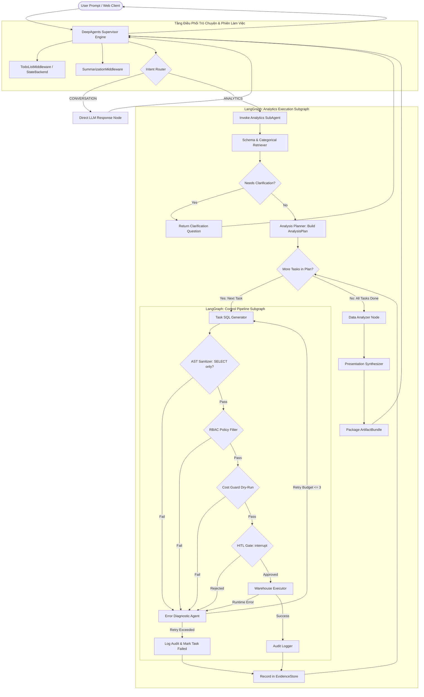

# KIẾN TRÚC HỆ THỐNG V4.0: AGENTIC SELF-SERVICE ANALYTICS ENGINE

> **Phiên bản**: 4.0  
> **Trạng thái**: Approved for Build Phase  
> **Ngày phê duyệt**: 2026-09-24  
> **Kế thừa & Thay thế**: `agent-architecture-v3.md` (v3.0 - Single-Shot Text2SQL)  
> **Tài liệu tham chiếu**: [PRD.md](file:///d:/Text2SQL-AI-Agent/docs/PRD.md), [ADR-0003](file:///d:/Text2SQL-AI-Agent/docs/decisions/0003-agentic-analytics-architecture-v4.md), [IMPLEMENTATION_BLUEPRINT.md](file:///d:/Text2SQL-AI-Agent/docs/IMPLEMENTATION_BLUEPRINT.md)

---

## 1. TỔNG QUAN & BỐI CẢNH NÂNG CẤP TỪ V3 LÊN V4

### 1.1. Tại sao kiến trúc v3.0 trở nên lỗi thời?
Kiến trúc v3.0 được thiết kế quanh mô hình cổ điển **"1 câu hỏi $\to$ 1 câu SQL $\to$ 1 kết quả biểu đồ"**. Trong môi trường phân tích doanh nghiệp thực tế (TPC-H Supply Chain & Wholesale), mô hình này bộc lộ 3 điểm nghẽn nghiêm trọng:

1. **Điểm nghẽn năng lực phân tích (The Single-Query Analytical Bottleneck)**:
   - Một câu hỏi kinh doanh thực tế như *"Tại sao doanh thu khu vực Châu Á giảm quý 3/1995 và do nhà cung cấp nào?"* không thể giải quyết bằng một câu SELECT duy nhất mà không biến câu lệnh thành một con quái vật SQL dài 100 dòng chứa nhiều subquery/CTE phức tạp, vượt quá khả năng suy luận tin cậy của LLM và khó debug.
   - Một Data Analyst thực thụ luôn làm việc theo quy trình: Đặt câu hỏi $\to$ Chia nhỏ thành các giả thuyết $\to$ Chạy chuỗi truy vấn thăm dò (xu hướng doanh thu, top sản phẩm sụt giảm, giao hàng trễ) $\to$ Tổng hợp bằng chứng $\to$ Đưa ra kết luận.
2. **Sự nhập nhằng giữa Phân tích Dữ liệu và Trình diễn (Presentation Coupling)**:
   - Ở v3.0, node `Synthesizer` vừa phải làm nhiệm vụ diễn giải dữ liệu, vừa tự bịa cấu hình Recharts JSON, vừa phát biểu insight, dẫn đến prompt quá tải và chất lượng biểu đồ không ổn định.
3. **Sự mong manh của giao thức truyền thông (Regex Parsing Anti-pattern)**:
   - API layer (`src/api/routes/query.py`) phải dùng Regular Expression để cào chuỗi Markdown tiếng Việt từ `ToolMessage` nhằm bóc tách SQL, Data Table và Recharts config. Chỉ cần LLM thay đổi 1 từ trong văn phong tiếng Việt, toàn bộ Web UI sẽ crash.

### 1.2. Mục tiêu cốt lõi của Kiến trúc v4.0
Kiến trúc v4.0 chuyển đổi toàn diện từ **"Text-to-SQL Tool"** sang **"Agentic Self-Service Analytics Engine"**:
- **Lập kế hoạch phân tích (AnalysisPlan)**: Tự động phân rã câu hỏi lớn thành $N$ nhiệm vụ truy vấn có mục đích rõ ràng.
- **Vòng lặp thu thập bằng chứng tuần tự (Sequential Evidence Collection Loop)**: Thực thi từng câu truy vấn qua Control Pipeline an toàn tuyệt đối, thu thập kết quả vào `EvidenceStore`.
- **Tách biệt rành mạch Phân tích & Trình diễn (Analysis vs Presentation Separation)**: `DataAnalyzer` chuyên tính toán và rút ra phát hiện số liệu; `PresentationSynthesizer` chuyên sinh biểu đồ Recharts và bảng dữ liệu chuẩn chỉ.
- **Hợp đồng dữ liệu định kiểu mạnh (Typed Artifact Contract)**: Toàn bộ kết quả trung gian và đầu ra đóng gói trong Pydantic V2 Models, triệt tiêu hoàn toàn regex scraping.

---

## 2. KIẾN TRÚC TỔNG THỂ (SYSTEM ARCHITECTURE VISUALS)

Theo quy chuẩn tài liệu của dự án (sử dụng [documd-visuals](file:///d:/Text2SQL-AI-Agent/.agents/skills/documd-visuals/SKILL.md)), kiến trúc v4.0 được thể hiện qua mô hình pipeline đa tầng trực quan kết hợp biểu đồ trạng thái.

### 2.1. Mô hình Luồng Xử Lý Đa Tầng (End-to-End Pipeline Stages)

<div style="max-width: 1120px; box-sizing: border-box; position: relative; margin: 24px 0;">
  <style scoped>
    .arch-pipe { background: #f8fafc; padding: 24px; font-family: -apple-system, BlinkMacSystemFont, 'Segoe UI', Roboto, sans-serif; color: #1e293b; border-radius: 8px; border: 1px solid #cbd5e1; }
    .arch-pipe-title { margin: 0 0 6px; text-align: center; font-size: 22px; font-weight: 700; color: #0f172a; }
    .arch-pipe-sub { margin: 0 0 20px; text-align: center; font-size: 13px; color: #64748b; }
    .arch-pipe-io { display: grid; grid-template-columns: repeat(4, 1fr); gap: 10px; margin-bottom: 16px; }
    .arch-pipe-source { padding: 8px 10px; text-align: center; font-size: 12px; font-weight: 600; background: #ffffff; border: 1px dashed #94a3b8; border-radius: 6px; }
    .arch-pipe-row { display: flex; align-items: stretch; gap: 0; }
    .arch-pipe-stage { flex: 1; padding: 14px 10px; border-radius: 6px; background: #f1f5f9; border: 1px solid #94a3b8; }
    .arch-pipe-stage.route { background: #eff6ff; border-color: #3b82f6; }
    .arch-pipe-stage.plan { background: #f0fdf4; border-color: #22c55e; }
    .arch-pipe-stage.exec { background: #fefce8; border-color: #eab308; }
    .arch-pipe-stage.synth { background: #faf5ff; border-color: #a855f7; }
    .arch-pipe-num { display: inline-flex; align-items: center; justify-content: center; width: 22px; height: 22px; border-radius: 50%; background: #0f172a; color: #ffffff; font-size: 11px; font-weight: 700; margin-right: 6px; }
    .arch-pipe-head { font-size: 11px; font-weight: 700; letter-spacing: 0.08em; text-transform: uppercase; color: #0f172a; margin-bottom: 10px; }
    .arch-pipe-item { padding: 6px 8px; margin-bottom: 6px; background: #ffffff; border: 1px solid #cbd5e1; border-radius: 4px; font-size: 11px; line-height: 1.3; }
    .arch-pipe-item:last-child { margin-bottom: 0; }
    .arch-pipe-item small { display: block; font-size: 10px; color: #64748b; margin-top: 2px; }
    .arch-pipe-item.governance { border-left: 3px solid #ef4444; background: #fff5f5; }
    .arch-pipe-arrow { display: flex; align-items: center; justify-content: center; width: 28px; flex-shrink: 0; font-size: 18px; color: #94a3b8; font-weight: bold; }
    .arch-pipe-sla { display: grid; grid-template-columns: repeat(4, 1fr); gap: 10px; margin-top: 16px; }
    .arch-pipe-kpi { padding: 10px; text-align: center; background: #ffffff; border: 1px solid #cbd5e1; border-radius: 6px; }
    .arch-pipe-kpi b { display: block; font-size: 18px; font-weight: 700; color: #0f172a; }
    .arch-pipe-kpi span { font-size: 10px; color: #64748b; text-transform: uppercase; letter-spacing: 0.06em; }
    .arch-pipe-kpi.success b { color: #16a34a; }
  </style>
  <section class="arch-pipe">
    <h1 class="arch-pipe-title">Kiến Trúc Điều Phối & Phân Tích Dữ Liệu v4.0</h1>
    <p class="arch-pipe-sub">Từ Câu Hỏi Tự Nhiên đến Kế Hoạch Đa Truy Vấn, Kiểm Duyệt Tất Định và Báo Cáo Phân Tích Hoàn Chỉnh</p>
    <div class="arch-pipe-io">
      <div class="arch-pipe-source">Natural Language Query</div>
      <div class="arch-pipe-source">User Context & Role</div>
      <div class="arch-pipe-source">TPC-H 8 Tables Schema</div>
      <div class="arch-pipe-source">Categorical Index (ChromaDB)</div>
    </div>
    <div class="arch-pipe-row">
      <div class="arch-pipe-stage route">
        <div class="arch-pipe-head"><span class="arch-pipe-num">1</span>Route & Context</div>
        <div class="arch-pipe-item">Intent Router<small>Conversation vs Analytics</small></div>
        <div class="arch-pipe-item">Schema & Value Retriever<small>Vector Search + Fuzzy Index</small></div>
        <div class="arch-pipe-item">Clarification Check<small>Active loop if ambiguous</small></div>
      </div>
      <div class="arch-pipe-arrow">→</div>
      <div class="arch-pipe-stage plan">
        <div class="arch-pipe-head"><span class="arch-pipe-num">2</span>Analysis Planner</div>
        <div class="arch-pipe-item">Goal Formulation<small>Clarified analytical objective</small></div>
        <div class="arch-pipe-item">Hypothesis Definition<small>E.g. Supplier vs Region</small></div>
        <div class="arch-pipe-item">Sequential Task DAG<small>Tasks 1..N (Bounded <= 3)</small></div>
      </div>
      <div class="arch-pipe-arrow">→</div>
      <div class="arch-pipe-stage exec">
        <div class="arch-pipe-head"><span class="arch-pipe-num">3</span>Control & Exec Loop</div>
        <div class="arch-pipe-item">Task Query Generator<small>Single focused SQL with context</small></div>
        <div class="arch-pipe-item governance">Deterministic Gate<small>AST + RBAC + Cost + HITL</small></div>
        <div class="arch-pipe-item">Warehouse Executor<small>DuckDB / BigQuery / Supabase</small></div>
        <div class="arch-pipe-item">Diagnostic Agent<small>Actionable feedback if error</small></div>
        <div class="arch-pipe-item">Evidence Store<small>Structured accumulation</small></div>
      </div>
      <div class="arch-pipe-arrow">→</div>
      <div class="arch-pipe-stage synth">
        <div class="arch-pipe-head"><span class="arch-pipe-num">4</span>Synthesize & Output</div>
        <div class="arch-pipe-item">Data Analyzer<small>Trend, Outlier, Growth math</small></div>
        <div class="arch-pipe-item">Presentation Synthesizer<small>Recharts & Markdown tables</small></div>
        <div class="arch-pipe-item">Artifact Bundle<small>Pydantic typed delivery</small></div>
      </div>
    </div>
    <div class="arch-pipe-sla">
      <div class="arch-pipe-kpi success"><b>100%</b><span>AST Read-Only Guarantee</span></div>
      <div class="arch-pipe-kpi"><b>&le; 3 Tasks</b><span>Analysis Plan Budget</span></div>
      <div class="arch-pipe-kpi"><b>&le; 3 Retries</b><span>Per-Query Error Budget</span></div>
      <div class="arch-pipe-kpi success"><b>0 Regex</b><span>Typed Pydantic Contracts</span></div>
    </div>
  </section>
</div>

---

## 3. TÔ PÔ TÍCH HỢP: OPTION B (DEEPAGENTS + COMPILED LANGGRAPH SUBAGENT)

Một quyết định kiến trúc then chốt trong v4.0 ([ADR-0003](file:///d:/Text2SQL-AI-Agent/docs/decisions/0003-agentic-analytics-architecture-v4.md)) là giải bài toán: *Làm sao tích hợp quy trình phân tích nhiều bước vào hệ thống DeepAgents đang có sẵn mà không phá vỡ `TodoListMiddleware` và `StateBackend`?*

**Giải pháp lựa chọn: Option B (Compiled LangGraph SubAgent)**
- `supervisor.py` của DeepAgents tiếp tục giữ vai trò Front Controller, quản lý bộ nhớ đệm hội thoại, middleware tóm tắt và danh sách việc cần làm (TodoList).
- Toàn bộ pipeline phân tích đa truy vấn mới được đóng gói thành một **LangGraph Subgraph khép kín (`analytics_subgraph`)** và đăng ký dưới dạng `CompiledSubAgent` (hoặc Callable Tool có cấu trúc) của Supervisor.
- Control Pipeline v3.0 tiếp tục được lồng bên trong Subgraph phân tích này như một lớp kiểm duyệt tất định cấp thấp (Nested Subgraph).



---

## 4. CHI TIẾT TỪNG THÀNH PHẦN (COMPONENT BREAKDOWN)

### 4.1. Intent Router (`src/agents/router.py`)
- **Mục tiêu**: Phân loại request ngay từ cửa vào để tiết kiệm token và thời gian phản hồi.
- **Phân loại**:
  - `CONVERSATION`: Lời chào hỏi, câu hỏi xã giao, giải thích thuật ngữ, hướng dẫn cách sử dụng $\to$ Phản hồi ngay không kích hoạt kho dữ liệu.
  - `ANALYTICS`: Mọi câu hỏi cần tra cứu số liệu, thăm dò cấu trúc bảng, so sánh chỉ số $\to$ Chuyển tiếp vào `Analytics SubAgent`.
- **Đặc tả I/O**:
  - Input: `user_prompt: str`, `chat_history: list[BaseMessage]`
  - Output: `RouteDecision(route=RouteType.ANALYTICS | RouteType.CONVERSATION, confidence=float, reasoning=str)`

### 4.2. Schema & Categorical Value Retriever (`src/agents/schema_retriever.py`)
- **Schema Linking**: Đối chiếu ngữ nghĩa câu hỏi với DDL và chú thích nghiệp vụ của 8 bảng TPC-H (`region`, `nation`, `supplier`, `customer`, `part`, `partsupp`, `orders`, `lineitem`) qua ChromaDB Vector Index.
- **Categorical Indexing**: Trích xuất các giá trị danh mục đặc trưng trong TPC-H (ví dụ: `r_name = 'ASIA'`, `c_mktsegment = 'BUILDING'`, `l_shipmode = 'AIR'`) để gán chính xác literal vào context, tránh tình trạng LLM tự đoán sai case chữ hoa/thường.

### 4.3. Question Clarifier (`src/agents/clarification.py`)
- **Mục tiêu**: Phát hiện câu hỏi mơ hồ, thiếu phạm vi lọc trọng yếu (ví dụ: "Doanh số gần đây thế nào?" mà không rõ thời gian, sản phẩm).
- **Hành vi**: Nếu phát hiện mơ hồ nghiêm trọng, trả về cấu trúc câu hỏi làm rõ cùng danh sách gợi ý. State được lưu trong checkpointer để người dùng trả lời ở lượt tiếp theo.

### 4.4. Analysis Planner (`src/agents/analysis_planner.py`)
- **Trái tim của kiến trúc v4**: Chuyển đổi câu hỏi nghiệp vụ thành kế hoạch giải quyết bài toán.
- **Cấu trúc kế hoạch (`AnalysisPlan`)**:
  - `goal`: Mục tiêu phân tích cốt lõi (ví dụ: "Đánh giá xu hướng giảm doanh thu tại ASIA năm 1995 và xác định nguyên nhân").
  - `hypotheses`: Danh sách giả thuyết cần kiểm chứng (ví dụ: $H_1$: Doanh số giảm ở nhóm khách hàng BUILDING; $H_2$: Do nhà cung cấp tại Nhật Bản giao hàng trễ).
  - `tasks`: Danh sách nhiệm vụ thực thi tuần tự ($N \le 3$):
    - Task 1: "Lấy tổng doanh thu ASIA theo từng quý năm 1994-1995 để xác định thời điểm bắt đầu giảm."
    - Task 2: "Phân rã doanh thu quý 3/1995 theo từng phân khúc khách hàng (`c_mktsegment`)."
    - Task 3: "Kiểm tra top 5 nhà cung cấp có giá trị đơn hàng bị hủy hoặc giao trễ cao nhất."

### 4.5. Task Query Generator (`src/agents/task_sql_generator.py`)
- Sinh câu lệnh SQL cho **duy nhất một task hiện tại** dựa trên:
  - Context lược đồ 8 bảng TPC-H.
  - Mục tiêu của task hiện tại.
  - Kết quả tóm tắt từ các task trước đã lưu trong `EvidenceStore` (để kế thừa điều kiện lọc hoặc mốc thời gian phát hiện được).
- Hạn chế tối đa việc sinh các câu SQL quá phức tạp; ưu tiên các truy vấn tường minh, dễ kiểm duyệt.

### 4.6. Hàng Rào Kiểm Duyệt Tất Định (Deterministic Control Pipeline)
Thừa hưởng trọn vẹn kiến trúc an ninh vững chắc từ v3.0 ([ADR-0002](file:///d:/Text2SQL-AI-Agent/docs/decisions/0002-error-diagnostic-agent-and-modular-control-pipeline.md)):
1. **AST Sanitizer (`sqlglot`)**: Chỉ cho phép root expression là `SELECT`. Chặn đứng 100% `INSERT`, `UPDATE`, `DELETE`, `DROP`, `ALTER`, `TRUNCATE`, CTE độc hại hoặc batch queries.
2. **RBAC Policy Enforcer**: Áp dụng ma trận phân quyền (Role: `Analyst` vs `Admin`). Tự động chặn truy vấn cột nhạy cảm (`c_phone`, `c_acctbal`, `s_phone`, `s_acctbal`).
3. **Cost Guard**: Dry-run kiểm tra lượng dữ liệu ước tính sẽ quét trên `lineitem`. Cảnh báo/chặn nếu vượt quota.
4. **HITL Gate (`interrupt()`)**: Tạm dừng quy trình, yêu cầu người dùng xác nhận câu SQL trước khi thực thi trên kho dữ liệu thật.
5. **Warehouse Executor**: Thực thi với cơ chế ngắt cứng (`timeout = 30s`) và bắt buộc tự động chèn `LIMIT 1000`.
6. **Error Diagnostic Agent**: Khi xảy ra lỗi (AST, RBAC, DB runtime), phân tích nguyên nhân kỹ thuật và đưa ra chỉ dẫn sửa lỗi cụ thể cho Generator.
7. **Audit Logger**: Ghi nhật ký có cấu trúc vào bảng `audit_logs`.

### 4.7. Data Analyzer (`src/agents/data_analyzer.py`)
- **Tách biệt hoàn toàn khỏi việc vẽ đồ thị**: Tập trung thuần túy vào phân tích số liệu:
  - Tính toán tỷ lệ tăng trưởng ($\Delta\%$), tỷ trọng đóng góp (share of total).
  - Nhận diện ngoại lệ (outliers), giá trị cao nhất / thấp nhất.
  - Xác nhận hoặc bác bỏ các giả thuyết trong `AnalysisPlan`.
- Đầu ra là `AnalysisFindings` có cấu trúc: các luận điểm kèm số liệu chứng minh cụ thể.

### 4.8. Presentation Synthesizer (`src/agents/presentation_synthesizer.py`)
- Chịu trách nhiệm về tầng giao diện người dùng:
  - **Recharts Spec**: Khuyến nghị đúng loại biểu đồ (Line, Bar, Area, Composed) với trục X, chuỗi Y, màu sắc và tooltip tối ưu.
  - **Data Table**: Bảng dữ liệu định dạng chuẩn (định dạng tiền tệ, số nguyên, phần trăm).
  - **Executive Summary**: Tóm tắt ngắn gọn dành cho lãnh đạo bằng tiếng Việt tự nhiên chuẩn mực.

---

## 5. HỢP ĐỒNG DỮ LIỆU ĐỊNH KIỂU (TYPED DATA CONTRACTS)

Mọi trạng thái và kết quả trao đổi giữa các thành phần đều được chuẩn hóa bằng Pydantic V2 (`src/models/state.py` và `src/models/artifacts.py`), loại bỏ hoàn toàn regex.

### 5.1. Mô Hình Kế Hoạch & Bằng Chứng (Plan & Evidence Models)
```python
from pydantic import BaseModel, Field
from typing import Optional, List, Any, Dict
from enum import Enum

class TaskStatus(str, Enum):
    PENDING = "pending"
    IN_PROGRESS = "in_progress"
    COMPLETED = "completed"
    FAILED = "failed"
    SKIPPED = "skipped"

class QueryTask(BaseModel):
    task_id: str = Field(description="Định danh duy nhất: task_1, task_2,...")
    description: str = Field(description="Mô tả mục tiêu của truy vấn này")
    target_hypothesis: Optional[str] = Field(None, description="Giả thuyết cần kiểm chứng")
    generated_sql: Optional[str] = None
    status: TaskStatus = TaskStatus.PENDING
    retry_count: int = 0
    error_message: Optional[str] = None

class AnalysisPlan(BaseModel):
    goal: str = Field(description="Mục tiêu tổng quát của bài toán phân tích")
    hypotheses: List[str] = Field(default_factory=list, description="Các giả thuyết đặt ra")
    tasks: List[QueryTask] = Field(description="Tối đa 3 nhiệm vụ truy vấn tuần tự")
    current_task_index: int = 0

class QueryEvidence(BaseModel):
    task_id: str
    sql: str
    columns: List[str]
    row_count: int
    data_sample: List[Dict[str, Any]] = Field(description="Tối đa 20 dòng mẫu để LLM phân tích")
    summary_statistics: Dict[str, Any] = Field(default_factory=dict)
    execution_time_ms: float
    bytes_scanned: Optional[int] = None

class EvidenceStore(BaseModel):
    evidences: List[QueryEvidence] = Field(default_factory=list)
    accumulated_findings: List[str] = Field(default_factory=list)
```

### 5.2. Mô Hình Kết Quả Xuất Xưởng (Artifact Bundle)
```python
class ChartSpec(BaseModel):
    chart_type: str = Field(description="bar | line | area | composed | pie")
    title: str
    x_axis_key: str
    y_axis_keys: List[str]
    series_names: List[str]
    color_palette: List[str]

class TableSpec(BaseModel):
    title: str
    columns: List[str]
    column_formats: Dict[str, str] = Field(description="Ví dụ: {'revenue': 'currency', 'share': 'percentage'}")
    rows: List[Dict[str, Any]]

class ArtifactBundle(BaseModel):
    thread_id: str
    analysis_goal: str
    executive_summary: str
    key_findings: List[str]
    recommended_actions: List[str]
    charts: List[ChartSpec] = Field(default_factory=list)
    tables: List[TableSpec] = Field(default_factory=list)
    executed_queries: List[Dict[str, str]] = Field(description="Danh sách task_id và câu SQL đã chạy")
    total_execution_time_ms: float
```

---

## 6. HÀNG RÀO QUẢN TRỊ & NGÂN SÁCH ĐÔI (DUAL-BUDGET GUARDRAILS)

Để đảm bảo Agent hoạt động an toàn, không rơi vào vòng lặp vô tận và không gây bùng nổ chi phí tính toán:

| Loại ngân sách | Ngưỡng giới hạn | Mục đích kiểm soát | Hành vi khi chạm ngưỡng |
|---|---|---|---|
| **Analysis Loop Budget** | Tối đa **3 Tasks** / Request | Khống chế số lượng truy vấn tuần tự của 1 câu hỏi | Dừng lập thêm task mới; chuyển ngay số liệu hiện có sang `DataAnalyzer` |
| **Per-Query Retry Budget** | Tối đa **3 Lần Retry** / Task | Khống chế vòng lặp sửa lỗi câu SQL của 1 task | Đánh dấu task thất bại (`FAILED`); ghi nhận lỗi vào `EvidenceStore` và tiếp tục task sau hoặc graceful degradation |
| **Warehouse Execution Timeout**| Tối đa **30 Giây** / Truy vấn | Ngăn ngừa truy vấn chạy ngầm gây treo warehouse | Ngắt kết nối (`self._conn.interrupt()`); kích hoạt `DiagnosticAgent` |
| **Row Limit Enforcement** | Tối đa **1000 Dòng** / Kết quả | Phòng chống tràn RAM và lag trình duyệt | Tự động chèn/ghi đè `LIMIT 1000` tại tầng AST parser |
| **RBAC Security Filter** | 100% Tuân thủ Ma trận quyền | Chống lộ thông tin định danh cá nhân (PII) | Chặn tại AST trước khi đến warehouse; từ chối hiển thị cột nhạy cảm |

---

## 7. CHIẾN LƯỢC KHO DỮ LIỆU & DEPLOYMENT

Hệ thống hỗ trợ cơ chế chuyển đổi linh hoạt qua abstraction `WarehouseClient` (`src/utils/warehouse_client.py`):

1. **Môi trường Phát triển & Kiểm thử Cục bộ (Local Dev / CI)**:
   - **DuckDB**: Đọc trực tiếp từ file `data/tpch.duckdb` hoặc in-memory.
   - Ưu điểm: Tốc độ thực thi micro-second, hỗ trợ cú pháp SQL chuẩn xác, tự sinh dữ liệu qua extension `tpch`.
2. **Môi trường Triển khai Thực tế & Demo Đồ Án (Production Demo)**:
   - **Google BigQuery Sandbox** hoặc **Supabase Managed PostgreSQL**:
   - Thể hiện năng lực kết nối kho dữ liệu doanh nghiệp thực thụ qua Cloud API.
   - Áp dụng đầy đủ cơ chế đo đạc chi phí quét dữ liệu thực tế (`totalBytesBilled` / `bytes_scanned`).

---

## 8. LỘ TRÌNH CHUYỂN ĐỔI (IMPLEMENTATION BLUEPRINT MAPPING)

Chi tiết thực thi mã nguồn được tổ chức theo 4 giai đoạn chuẩn hóa trong [IMPLEMENTATION_BLUEPRINT.md](file:///d:/Text2SQL-AI-Agent/docs/IMPLEMENTATION_BLUEPRINT.md):
- **Phase 1: Foundation & Contracts**: Xóa bỏ regex; bổ sung Pydantic models `AnalysisPlan`, `EvidenceStore`, `ArtifactBundle`.
- **Phase 2: Core Analysis Engine**: Xây dựng `AnalysisPlanner`, `DataAnalyzer`, `PresentationSynthesizer`.
- **Phase 3: Subgraph Assembly & Option B Mounting**: Tích hợp các node mới vào LangGraph Subgraph và gắn kết với DeepAgents Supervisor.
- **Phase 4: Verification, Evaluation & Demo Delivery**: Chạy benchmark bộ 50 câu hỏi TPC-H tiếng Việt, đo lường độ chính xác EX, VSR và hoàn thiện Web UI.
