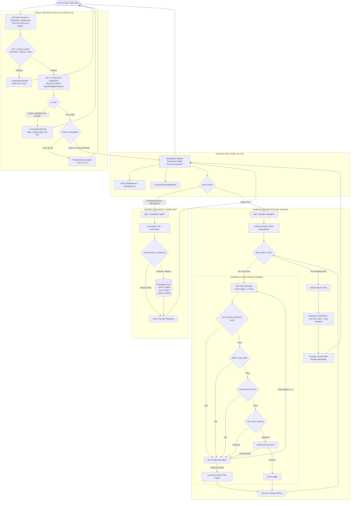

# KIẾN TRÚC HỆ THỐNG V4.0: AGENTIC SELF-SERVICE ANALYTICS ENGINE

> **Phiên bản**: 4.0  
> **Trạng thái**: Approved for Build Phase  
> **Ngày phê duyệt**: 2026-09-24  
> **Kế thừa & Thay thế**: `agent-architecture-v3.md` (v3.0 - Single-Shot Text2SQL)  
> **Tài liệu tham chiếu**: [PRD.md](file:///d:/Text2SQL-AI-Agent/docs/PRD.md), [ADR-0003](file:///d:/Text2SQL-AI-Agent/docs/decisions/0003-agentic-analytics-architecture-v4.md), [IMPLEMENTATION_BLUEPRINT.md](file:///d:/Text2SQL-AI-Agent/docs/IMPLEMENTATION_BLUEPRINT.md)

---

## 1. TỔNG QUAN & BỐI CẢNH NÂNG CẤP TỪ V3 LÊN V4

### 1.1. Tại sao kiến trúc v3.0 trở nên lỗi thời?
Kiến trúc v3.0 được thiết kế quanh mô hình cổ điển **"1 câu hỏi $\to$ 1 câu SQL $\to$ 1 kết quả biểu đồ"**. Trong môi trường phân tích doanh nghiệp thực tế (TPC-H Supply Chain & Wholesale), mô hình này bộc lộ 3 điểm nghẽn nghiêm trọng:

1. **Điểm nghẽn năng lực phân tích (The Single-Query Analytical Bottleneck)**:
   - Một câu hỏi kinh doanh thực tế như *"Tại sao doanh thu khu vực Châu Á giảm quý 3/1995 và do nhà cung cấp nào?"* không thể giải quyết bằng một câu SELECT duy nhất mà không biến câu lệnh thành một con quái vật SQL dài 100 dòng chứa nhiều subquery/CTE phức tạp, vượt quá khả năng suy luận tin cậy của LLM và khó debug.
   - Một Data Analyst thực thụ luôn làm việc theo quy trình: Đặt câu hỏi $\to$ Chia nhỏ thành các giả thuyết $\to$ Chạy chuỗi truy vấn thăm dò (xu hướng doanh thu, top sản phẩm sụt giảm, giao hàng trễ) $\to$ Tổng hợp bằng chứng $\to$ Đưa ra kết luận.
2. **Sự nhập nhằng giữa Phân tích Dữ liệu và Trình diễn (Presentation Coupling)**:
   - Ở v3.0, node `Synthesizer` vừa phải làm nhiệm vụ diễn giải dữ liệu, vừa tự bịa cấu hình Recharts JSON, vừa phát biểu insight, dẫn đến prompt quá tải và chất lượng biểu đồ không ổn định.
3. **Sự mong manh của giao thức truyền thông (Regex Parsing Anti-pattern)**:
   - API layer (`src/api/routes/query.py`) phải dùng Regular Expression để cào chuỗi Markdown tiếng Việt từ `ToolMessage` nhằm bóc tách SQL, Data Table và Recharts config. Chỉ cần LLM thay đổi 1 từ trong văn phong tiếng Việt, toàn bộ Web UI sẽ crash.

### 1.2. Mục tiêu cốt lõi của Kiến trúc v4.0
Kiến trúc v4.0 chuyển đổi toàn diện từ **"Text-to-SQL Tool"** sang **"Agentic Self-Service Analytics Engine"**:
- **Lập kế hoạch phân tích (AnalysisPlan)**: Tự động phân rã câu hỏi lớn thành $N$ nhiệm vụ truy vấn có mục đích rõ ràng.
- **Vòng lặp thu thập bằng chứng tuần tự (Sequential Evidence Collection Loop)**: Thực thi từng câu truy vấn qua Control Pipeline an toàn tuyệt đối, thu thập kết quả vào `EvidenceStore`.
- **Tách biệt Phân tích & Trình diễn Linh hoạt (Analysis vs Composable Presentation)**: `DataAnalyzer` chuyên tính toán số liệu; `ResponseSynthesizer` sử dụng cơ chế One-Shot Spec Selection + Deterministic Data Hydration để tự động chọn và lắp ráp các Artifacts linh hoạt (KPI Cards, Charts, Tables, Callouts) theo đúng ngữ cảnh câu hỏi của người dùng.
- **Hợp đồng dữ liệu định kiểu mạnh (Typed Artifact Contract)**: Toàn bộ kết quả trung gian và đầu ra đóng gói trong Pydantic V2 Models, triệt tiêu hoàn toàn regex scraping.

---

## 2. KIẾN TRÚC TỔNG THỂ (SYSTEM ARCHITECTURE VISUALS)

Theo quy chuẩn tài liệu của dự án (sử dụng [documd-visuals](file:///d:/Text2SQL-AI-Agent/.agents/skills/documd-visuals/SKILL.md)), kiến trúc v4.0 được thể hiện qua mô hình pipeline đa tầng trực quan kết hợp biểu đồ trạng thái.

### 2.1. Mô hình Luồng Xử Lý Đa Tầng (End-to-End Pipeline Stages)

<div style="max-width: 1120px; box-sizing: border-box; position: relative; margin: 24px 0;">
  <style scoped>
    .arch-pipe { background: #f8fafc; padding: 24px; font-family: -apple-system, BlinkMacSystemFont, 'Segoe UI', Roboto, sans-serif; color: #1e293b; border-radius: 8px; border: 1px solid #cbd5e1; }
    .arch-pipe-title { margin: 0 0 6px; text-align: center; font-size: 22px; font-weight: 700; color: #0f172a; }
    .arch-pipe-sub { margin: 0 0 20px; text-align: center; font-size: 13px; color: #64748b; }
    .arch-pipe-io { display: grid; grid-template-columns: repeat(4, 1fr); gap: 10px; margin-bottom: 16px; }
    .arch-pipe-source { padding: 8px 10px; text-align: center; font-size: 12px; font-weight: 600; background: #ffffff; border: 1px dashed #94a3b8; border-radius: 6px; }
    .arch-pipe-row { display: flex; align-items: stretch; gap: 0; }
    .arch-pipe-stage { flex: 1; padding: 14px 10px; border-radius: 6px; background: #f1f5f9; border: 1px solid #94a3b8; }
    .arch-pipe-stage.route { background: #eff6ff; border-color: #3b82f6; }
    .arch-pipe-stage.plan { background: #f0fdf4; border-color: #22c55e; }
    .arch-pipe-stage.exec { background: #fefce8; border-color: #eab308; }
    .arch-pipe-stage.synth { background: #faf5ff; border-color: #a855f7; }
    .arch-pipe-num { display: inline-flex; align-items: center; justify-content: center; width: 22px; height: 22px; border-radius: 50%; background: #0f172a; color: #ffffff; font-size: 11px; font-weight: 700; margin-right: 6px; }
    .arch-pipe-head { font-size: 11px; font-weight: 700; letter-spacing: 0.08em; text-transform: uppercase; color: #0f172a; margin-bottom: 10px; }
    .arch-pipe-item { padding: 6px 8px; margin-bottom: 6px; background: #ffffff; border: 1px solid #cbd5e1; border-radius: 4px; font-size: 11px; line-height: 1.3; }
    .arch-pipe-item:last-child { margin-bottom: 0; }
    .arch-pipe-item small { display: block; font-size: 10px; color: #64748b; margin-top: 2px; }
    .arch-pipe-item.governance { border-left: 3px solid #ef4444; background: #fff5f5; }
    .arch-pipe-arrow { display: flex; align-items: center; justify-content: center; width: 28px; flex-shrink: 0; font-size: 18px; color: #94a3b8; font-weight: bold; }
    .arch-pipe-sla { display: grid; grid-template-columns: repeat(4, 1fr); gap: 10px; margin-top: 16px; }
    .arch-pipe-kpi { padding: 10px; text-align: center; background: #ffffff; border: 1px solid #cbd5e1; border-radius: 6px; }
    .arch-pipe-kpi b { display: block; font-size: 18px; font-weight: 700; color: #0f172a; }
    .arch-pipe-kpi span { font-size: 10px; color: #64748b; text-transform: uppercase; letter-spacing: 0.06em; }
    .arch-pipe-kpi.success b { color: #16a34a; }
  </style>
  <section class="arch-pipe">
    <h1 class="arch-pipe-title">Kiến Trúc Điều Phối & Phân Tích Dữ Liệu v4.0</h1>
    <p class="arch-pipe-sub">Từ Câu Hỏi Tự Nhiên đến Kế Hoạch Đa Truy Vấn, Kiểm Duyệt Tất Định và Báo Cáo Phân Tích Hoàn Chỉnh</p>
    <div class="arch-pipe-io">
      <div class="arch-pipe-source">Natural Language Query</div>
      <div class="arch-pipe-source">User Context & Role</div>
      <div class="arch-pipe-source">TPC-H 8 Tables Schema</div>
      <div class="arch-pipe-source">Categorical Index (ChromaDB)</div>
    </div>
    <div class="arch-pipe-row">
      <div class="arch-pipe-stage route">
        <div class="arch-pipe-head"><span class="arch-pipe-num">1</span>Gatekeeper & Route</div>
        <div class="arch-pipe-item">Regex Guardrails<small>Fast Block (< 0.1ms, $0)</small></div>
        <div class="arch-pipe-item">LLM Gatekeeper<small>Safety & Clarification Check</small></div>
        <div class="arch-pipe-item">Pure Orchestrator<small>Consultation vs Analytics</small></div>
      </div>
      <div class="arch-pipe-arrow">→</div>
      <div class="arch-pipe-stage plan">
        <div class="arch-pipe-head"><span class="arch-pipe-num">2</span>Analysis Planner</div>
        <div class="arch-pipe-item">Goal Formulation<small>Clarified analytical objective</small></div>
        <div class="arch-pipe-item">Hypothesis Definition<small>E.g. Supplier vs Region</small></div>
        <div class="arch-pipe-item">Sequential Task DAG<small>Tasks 1..N (Bounded <= 3)</small></div>
      </div>
      <div class="arch-pipe-arrow">→</div>
      <div class="arch-pipe-stage exec">
        <div class="arch-pipe-head"><span class="arch-pipe-num">3</span>Control & Exec Loop</div>
        <div class="arch-pipe-item">Task Query Generator<small>Single focused SQL with context</small></div>
        <div class="arch-pipe-item governance">Deterministic Gate<small>AST + RBAC + Cost + HITL</small></div>
        <div class="arch-pipe-item">Warehouse Executor<small>DuckDB / BigQuery / Supabase</small></div>
        <div class="arch-pipe-item">Diagnostic Agent<small>Actionable feedback if error</small></div>
        <div class="arch-pipe-item">Evidence Store<small>Structured accumulation</small></div>
      </div>
      <div class="arch-pipe-arrow">→</div>
      <div class="arch-pipe-stage synth">
        <div class="arch-pipe-head"><span class="arch-pipe-num">4</span>Synthesize & Output</div>
        <div class="arch-pipe-item">Data Analyzer<small>Trend, Outlier, Growth math</small></div>
        <div class="arch-pipe-item">Response Synthesizer<small>One-Shot Spec & Data Hydration</small></div>
        <div class="arch-pipe-item">Composable ResponsePackage<small>Polymorphic typed artifacts</small></div>
      </div>
    </div>
    <div class="arch-pipe-sla">
      <div class="arch-pipe-kpi success"><b>100%</b><span>AST Read-Only Guarantee</span></div>
      <div class="arch-pipe-kpi"><b>&le; 3 Tasks</b><span>Analysis Plan Budget</span></div>
      <div class="arch-pipe-kpi"><b>&le; 3 Retries</b><span>Per-Query Error Budget</span></div>
      <div class="arch-pipe-kpi success"><b>0 Regex</b><span>Typed Pydantic Contracts</span></div>
    </div>
  </section>
</div>

---

## 3. TÔ PÔ TÍCH HỢP: OPTION B (PURE ORCHESTRATOR + COMPILED SUBAGENTS)

Một quyết định kiến trúc then chốt trong v4.0 ([ADR-0003](file:///d:/Text2SQL-AI-Agent/docs/decisions/0003-agentic-analytics-architecture-v4.md)) là giải bài toán: *Làm sao tích hợp quy trình phân tích nhiều bước vào hệ thống DeepAgents đang có sẵn mà không phá vỡ `TodoListMiddleware` và `StateBackend`?*

**Giải pháp lựa chọn: Option B (Pure Orchestrator + Subagents Delegation)**
- **Master Supervisor (`src/agents/supervisor.py`) đóng vai trò Pure Orchestrator (Nhạc trưởng thuần túy)**:
  * Quản lý bộ nhớ đệm hội thoại, middleware tóm tắt, filesystem ảo (`StateBackend`) và danh sách việc cần làm (`TodoListMiddleware`).
  * **Tuyệt đối không trực tiếp ôm công cụ nghiệp vụ**: Supervisor chỉ có công cụ `write_todos` và `task()`.
  * Ủy quyền toàn bộ tác vụ thực thi cho 2 Subagents chuyên biệt qua công cụ `task()`:
    1. **`consultation-agent`**: Chuyên gia giải đáp giao tiếp xã giao và tra cứu từ điển dữ liệu / lược đồ TPC-H mà không cần sinh SQL hay query database.
    2. **`analytics-subagent`**: Chuyên gia phân tích dữ liệu toàn trình (CompiledSubAgent bọc LangGraph Analytics Subgraph) cho các yêu cầu tính toán số liệu TPC-H từ kho dữ liệu.
- Control Pipeline tiếp tục được lồng bên trong Subgraph phân tích như một lớp kiểm duyệt tất định cấp thấp (Nested Subgraph).


```mermaid
graph TD
    User([User Prompt / Web Client]) --> Gatekeeper[Pre-Flight Security & Clarification Gatekeeper<br/>*Two-Tier Defense-in-Depth*]
    
    subgraph Preflight_Defense [Tầng 0: Vành Đai An Ninh & Làm Rõ Đầu Vào]
        Gatekeeper --> RegexCheck{Tier 1: Regex Guard?<br/>DDL/DML, Injection, Shell}
        RegexCheck -->|Violated| Refusal1[🛑 Hardcoded Refusal<br/>Chặn tức thì 0ms]
        RegexCheck -->|Passed| LLMPreflight[Tier 2: Unified LLM Gatekeeper<br/>Structured Output: InputPreflightEvaluation]
        LLMPreflight --> SafeCheck{is_safe?}
        SafeCheck -->|False: Unsafe/Out-of-domain| Refusal2[🛑 Hardcoded Refusal<br/>Chặn vi phạm bằng mẫu tĩnh]
        SafeCheck -->|True: Safe| ClarifyCheck{needs_clarification?}
        ClarifyCheck -->|True: Mơ hồ| ClarifyOut[❓ Clarification Question<br/>+ Gợi ý A, B, C]
    end
    
    ClarifyCheck -->|False: An toàn & Rõ ràng| Supervisor[DeepAgents Master Supervisor Engine<br/>*Pure Orchestrator*]
    
    Refusal1 --> User
    Refusal2 --> User
    ClarifyOut --> User
    
    subgraph DeepAgents_Harness [Tầng Điều Phối & Phiên Làm Việc]
        Supervisor --> TodoMiddleware[TodoListMiddleware / StateBackend]
        Supervisor --> SummaryMiddleware[SummarizationMiddleware]
        Supervisor --> RouteDecision{Intent Router}
    end

    %% Nhánh 1: Consultation SubAgent
    RouteDecision -->|CONVERSATION / METADATA| ConsultCall[task: 'consultation-agent']
    
    subgraph Consultation_SubAgent [SubAgent: Consultation / Catalog Q&A]
        ConsultCall --> ConsultPrompt[Consultant LLM + Instructions]
        ConsultPrompt --> IsGeneral{General Chat vs Schema?}
        IsGeneral -->|General Chat| DirectAnswer[Direct Friendly Response]
        IsGeneral -->|Schema / Metrics| ConsultTools[(3 Metadata Tools:<br/>- search_tables<br/>- get_samples<br/>- search_metrics)]
        ConsultTools --> DirectAnswer
    end
    DirectAnswer --> Supervisor
    
    %% Nhánh 2: Analytics SubAgent
    RouteDecision -->|ANALYTICS| SubAgentCall[task: 'analytics-subagent']

    subgraph Analytics_Subgraph [LangGraph: Analytics Execution Subgraph]
        SubAgentCall --> PlanNode[Analysis Planner: Build AnalysisPlan]
        
        PlanNode --> TaskLoopHead{More Tasks in Plan?}
        TaskLoopHead -->|Yes: Next Task| SQLGenNode[Task SQL Generator<br/>Active Agent + 4 Tools]
        
        subgraph Deterministic_Control [LangGraph: Control Pipeline Subgraph]
            SQLGenNode --> ASTCheck{AST Sanitizer: SELECT only?}
            ASTCheck -->|Fail| DiagNode[Error Diagnostic Agent]
            ASTCheck -->|Pass| RBACCheck{RBAC Policy Filter}
            RBACCheck -->|Fail| DiagNode
            RBACCheck -->|Pass| CostCheck{Cost Guard Dry-Run}
            CostCheck -->|Fail| DiagNode
            CostCheck -->|Pass| HITLGate{HITL Gate: interrupt}
            HITLGate -->|Rejected| DiagNode
            HITLGate -->|Approved| ExecNode[Warehouse Executor]
            ExecNode -->|Runtime Error| DiagNode
            DiagNode -->|Retry Budget <= 3| SQLGenNode
            DiagNode -->|Retry Exceeded| GracefulFail[Log Audit & Mark Task Failed]
            ExecNode -->|Success| AuditNode[Audit Logger]
        end
        
        AuditNode --> EvidenceNode[Record in EvidenceStore]
        GracefulFail --> EvidenceNode
        EvidenceNode --> TaskLoopHead
        
        TaskLoopHead -->|No: All Tasks Done| DataAnalyzerNode[Data Analyzer Node]
        DataAnalyzerNode --> PresenterNode[Response Synthesizer: One-Shot Spec + Data Hydrator]
        PresenterNode --> ResponsePackageNode[Package Composable ResponsePackage]
    end

    ResponsePackageNode --> Supervisor
    Supervisor --> User
```

---

## 4. CHI TIẾT TỪNG THÀNH PHẦN (COMPONENT BREAKDOWN)

### 4.1. Intent Router & Consultation SubAgent (`src/agents/consultation.py`)
- **Mục tiêu**: Phân loại request ngay từ cửa vào để tiết kiệm token, thời gian phản hồi và giữ cho Master Supervisor luôn thuần khiết (Pure Orchestrator).
- **Phân loại**:
  - `CONVERSATION / METADATA`: Lời chào hỏi, câu hỏi xã giao, giải thích thuật ngữ, tra cứu danh mục bảng, cột, giá trị danh mục hợp lệ hoặc công thức chỉ số dbt metrics $\to$ Supervisor ủy quyền cho `consultation-agent`.
    * `consultation-agent` được trang bị sẵn 3 Strategic Metadata Tools: `search_tables_and_columns`, `get_column_samples_and_values`, `search_business_definition`.
    * Nếu là câu chào hỏi thông thường: Trả lời trực tiếp ngay, không dùng tool.
    * Nếu là câu hỏi cấu trúc bảng, cột, chỉ số: Gọi trực tiếp metadata tools để lấy ngữ cảnh và trả lời rõ ràng, KHÔNG sinh SQL, KHÔNG query database.
  - `ANALYTICS`: Mọi câu hỏi cần tính toán số liệu thực tế, lọc dữ liệu, so sánh doanh thu/chi phí $\to$ Supervisor ủy quyền cho `analytics-subagent`.
- **Đặc tả I/O**:
  - Input: `user_prompt: str`, `chat_history: list[BaseMessage]`
  - Output: Phản hồi giải thích bằng tiếng Việt chuẩn mực hoặc kế hoạch phân tích chuyên sâu.

### 4.2. Schema & Categorical Value Retriever (`src/agents/schema_retriever.py`)
- **Schema Linking**: Đối chiếu ngữ nghĩa câu hỏi với DDL và chú thích nghiệp vụ của 8 bảng TPC-H (`region`, `nation`, `supplier`, `customer`, `part`, `partsupp`, `orders`, `lineitem`) qua ChromaDB Vector Index.
- **Categorical Indexing**: Trích xuất các giá trị danh mục đặc trưng trong TPC-H (ví dụ: `r_name = 'ASIA'`, `c_mktsegment = 'BUILDING'`, `l_shipmode = 'AIR'`) để gán chính xác literal vào context, tránh tình trạng LLM tự đoán sai case chữ hoa/thường.

### 4.3. Pre-Flight Security & Clarification Gatekeeper (`src/agents/preflight_gatekeeper.py`)
- **Vị trí**: Đứng sừng sững tại cổng đón tiếp (Front-door Gatekeeper) trước khi kích hoạt Master Supervisor hoặc bất kỳ Subgraph nào.
- **Cơ chế Phòng thủ 2 tầng (Two-Tier Defense-in-Depth)**:
  1. **Tier 1 (Deterministic Regex Guardrails - `< 0.1ms`, `$0`)**:
     * Bắt các pattern SQL DDL/DML mutating injection (`DROP`, `ALTER`, `TRUNCATE`, `DELETE`, `UPDATE`, `INSERT`, `;\s*--`, `union select`).
     * Bắt các payload Prompt Injection & Jailbreak (`ignore instructions`, `bỏ qua hướng dẫn`, `system prompt`, `reveal instructions`, `DAN mode`).
     * Bắt các mã độc Script / Shell (`<script>`, `javascript:`, `eval(`, `exec(`).
     * **Xử lý vi phạm**: Lập tức kích hoạt **Hardcoded Refusal** (câu từ chối tĩnh chuẩn hóa), không tốn token LLM, không giải thích dài dòng.
  2. **Tier 2 (Unified LLM Guardrails & Clarification - 1 Structured Output Call)**:
     * Dùng mô hình Tier 2 (`settings.tier2_model`) với Pydantic model `InputPreflightEvaluation`.
     * **An toàn & Miền (Guardrails)**: Nếu phát hiện câu hỏi độc hại ngữ nghĩa hoặc hoàn toàn lạc đề (`is_safe=False`) $\to$ Trả về Hardcoded Refusal tương ứng, tuyệt đối không để LLM xin lỗi hay sinh phản hồi tự do.
     * **Làm rõ (Clarification)**: Nếu câu hỏi an toàn nhưng mơ hồ (`needs_clarification=True`) $\to$ Trả về ngay `clarification_question` cùng danh sách phương án gợi ý A, B, C... để người dùng lựa chọn, ngắt luồng sớm nhằm tiết kiệm tài nguyên.
     * **Chuyển tiếp (Allowed)**: Nếu câu hỏi vừa an toàn vừa rõ ràng $\to$ Chuyển tiếp sạch sẽ cho Master Supervisor điều phối.

### 4.4. Analysis Planner (`src/agents/analysis_planner.py`)
- **Trái tim của kiến trúc v4**: Chuyển đổi câu hỏi nghiệp vụ thành kế hoạch giải quyết bài toán.
- **Cấu trúc kế hoạch (`AnalysisPlan`)**:
  - `goal`: Mục tiêu phân tích cốt lõi (ví dụ: "Đánh giá xu hướng giảm doanh thu tại ASIA năm 1995 và xác định nguyên nhân").
  - `hypotheses`: Danh sách giả thuyết cần kiểm chứng (ví dụ: $H_1$: Doanh số giảm ở nhóm khách hàng BUILDING; $H_2$: Do nhà cung cấp tại Nhật Bản giao hàng trễ).
  - `tasks`: Danh sách nhiệm vụ thực thi tuần tự ($N \le 3$):
    - Task 1: "Lấy tổng doanh thu ASIA theo từng quý năm 1994-1995 để xác định thời điểm bắt đầu giảm."
    - Task 2: "Phân rã doanh thu quý 3/1995 theo từng phân khúc khách hàng (`c_mktsegment`)."
    - Task 3: "Kiểm tra top 5 nhà cung cấp có giá trị đơn hàng bị hủy hoặc giao trễ cao nhất."

### 4.5. Task Query Generator (`src/agents/task_sql_generator.py` / `src/agents/sql_generator.py`)
- Hoạt động như một **Active Tool-Calling Agent** tự điều tra trước khi sinh SQL:
  * Được trang bị sẵn **4 Strategic Metadata Tools**: `search_tables_and_columns`, `get_column_samples_and_values`, `find_join_path`, `search_business_definition`.
  * Thay vì bị nhồi nhét toàn bộ context DDL khổng lồ một cách thụ động, Agent chủ động gọi các công cụ tra cứu đường nối JOIN, mẫu giá trị literal thực tế và công thức dbt metrics chuẩn.
  * Tự động chạy vòng lặp điều tra (`ToolMessage` feedback) trước khi xuất `SQLGenerationResult`.
- Hạn chế tối đa việc sinh các câu SQL quá phức tạp; ưu tiên các truy vấn tường minh, dễ kiểm duyệt.

### 4.6. Hàng Rào Kiểm Duyệt Tất Định (Deterministic Control Pipeline)
Thừa hưởng trọn vẹn kiến trúc an ninh vững chắc từ v3.0 ([ADR-0002](file:///d:/Text2SQL-AI-Agent/docs/decisions/0002-error-diagnostic-agent-and-modular-control-pipeline.md)):
1. **AST Sanitizer (`sqlglot`)**: Chỉ cho phép root expression là `SELECT`. Chặn đứng 100% `INSERT`, `UPDATE`, `DELETE`, `DROP`, `ALTER`, `TRUNCATE`, CTE độc hại hoặc batch queries.
2. **RBAC Policy Enforcer**: Áp dụng ma trận phân quyền (Role: `Analyst` vs `Admin`). Tự động chặn truy vấn cột nhạy cảm (`c_phone`, `c_acctbal`, `s_phone`, `s_acctbal`).
3. **Cost Guard**: Dry-run kiểm tra lượng dữ liệu ước tính sẽ quét trên `lineitem`. Cảnh báo/chặn nếu vượt quota.
4. **HITL Gate (`interrupt()`)**: Tạm dừng quy trình, yêu cầu người dùng xác nhận câu SQL trước khi thực thi trên kho dữ liệu thật.
5. **Warehouse Executor**: Thực thi với cơ chế ngắt cứng (`timeout = 30s`) và bắt buộc tự động chèn `LIMIT 1000`.
6. **Error Diagnostic Agent**: Khi xảy ra lỗi (AST, RBAC, DB runtime), phân tích nguyên nhân kỹ thuật và đưa ra chỉ dẫn sửa lỗi cụ thể cho Generator.
7. **Audit Logger**: Ghi nhật ký có cấu trúc vào bảng `audit_logs`.

### 4.7. Data Analyzer (`src/agents/data_analyzer.py`)
- **Tách biệt hoàn toàn khỏi việc vẽ đồ thị**: Tập trung thuần túy vào phân tích số liệu:
  - Tính toán tỷ lệ tăng trưởng ($\Delta\%$), tỷ trọng đóng góp (share of total).
  - Nhận diện ngoại lệ (outliers), giá trị cao nhất / thấp nhất.
  - Xác nhận hoặc bác bỏ các giả thuyết trong `AnalysisPlan`.
- Đầu ra là `AnalysisFindings` có cấu trúc: các luận điểm kèm số liệu chứng minh cụ thể.

### 4.8. Response Synthesizer (`src/agents/analytics/response_synthesizer.py`)
- **Triết lý Composable Output Package**: Thay vì ép mọi câu trả lời vào khuôn mẫu cứng nhắc (Text + Table + Chart), Synthesizer sử dụng cơ chế **One-Shot Spec Selection & Deterministic Data Hydration**:
  1. **Bước 1: LLM Presentation Spec Decision (Single Hop - ~1s)**:
     - Dùng duy nhất 1 lần gọi Tier 2 LLM (`settings.tier2_model`) với Structured Output (`SynthesisDecision`).
     - LLM chỉ nhận câu hỏi + mẫu dữ liệu tóm tắt (top 5 dòng + schema cột), sau đó tự do quyết định tổ hợp artifacts tối ưu nhất (Text, KPI, Chart, Table, Callout) và sinh ra cấu hình **Specs** (trục X, trục Y, tiêu đề, cột hiển thị) trỏ tới `target_task_id`.
     - *Ưu điểm*: Tránh bùng nổ độ trễ, không tốn token chép lại data, không hallucinate số liệu.
  2. **Bước 2: Deterministic Data Hydration (Python Code thuần < 2ms, $0)**:
     - Code Python duyệt qua danh sách specs của LLM và tự động bơm (hydrate) mảng dữ liệu thực thi chính xác 100% từ `EvidenceStore` vào các artifact tương ứng (`ChartArtifact.data`, `TableArtifact.rows`, `KpiArtifact.value`).
     - Lắp ráp thành `ResponsePackage` hoàn chỉnh gửi về API.
- **Hỗ trợ kết hợp linh hoạt không giới hạn (No-limit Combinations)**:
  - `Text-only`: Cho câu hỏi định nghĩa/khái niệm hoặc xác nhận dữ liệu.
  - `Text + KPI Card`: Cho câu hỏi 1 vài con số cụ thể (ví dụ: doanh thu tháng 2).
  - `Text + Chart + Table`: Cho phân tích xu hướng hoặc phân rã danh mục.
  - `Text + 2 KPIs + 1 Chart + 1 Table`: Cho báo cáo tổng quan điều hành (Mini Dashboard).

---

## 5. HỢP ĐỒNG DỮ LIỆU ĐỊNH KIỂU (TYPED DATA CONTRACTS)

Mọi trạng thái và kết quả trao đổi giữa các thành phần đều được chuẩn hóa bằng Pydantic V2 (`src/models/state.py` và `src/models/artifacts.py`), loại bỏ hoàn toàn regex.

### 5.1. Mô Hình Kế Hoạch & Bằng Chứng (Plan & Evidence Models)
```python
from pydantic import BaseModel, Field
from typing import Optional, List, Any, Dict
from enum import Enum


class TaskStatus(str, Enum):
    PENDING = "pending"
    IN_PROGRESS = "in_progress"
    COMPLETED = "completed"
    FAILED = "failed"
    SKIPPED = "skipped"


class QueryTask(BaseModel):
    task_id: str = Field(description="Định danh duy nhất: task_1, task_2,...")
    description: str = Field(description="Mô tả mục tiêu của truy vấn này")
    target_hypothesis: Optional[str] = Field(
        None, description="Giả thuyết cần kiểm chứng"
    )
    generated_sql: Optional[str] = None
    status: TaskStatus = TaskStatus.PENDING
    retry_count: int = 0
    error_message: Optional[str] = None


class AnalysisPlan(BaseModel):
    goal: str = Field(description="Mục tiêu tổng quát của bài toán phân tích")
    hypotheses: List[str] = Field(
        default_factory=list, description="Các giả thuyết đặt ra"
    )
    tasks: List[QueryTask] = Field(description="Tối đa 3 nhiệm vụ truy vấn tuần tự")
    current_task_index: int = 0


class QueryEvidence(BaseModel):
    task_id: str
    sql: str
    columns: List[str]
    row_count: int
    data_sample: List[Dict[str, Any]] = Field(
        description="Tối đa 20 dòng mẫu để LLM phân tích"
    )
    summary_statistics: Dict[str, Any] = Field(default_factory=dict)
    execution_time_ms: float
    bytes_scanned: Optional[int] = None


class EvidenceStore(BaseModel):
    evidences: List[QueryEvidence] = Field(default_factory=list)
    accumulated_findings: List[str] = Field(default_factory=list)
```

### 5.2. Mô Hình Gói Kết Quả Xuất Xưởng Linh Hoạt (Composable Response Package)
Chuẩn hóa bằng Pydantic V2 Discriminated Union, cho phép Frontend Next.js map trực tiếp vào Component Registry tương ứng mà không bao giờ crash:

```python
from typing import Annotated, Any, Literal, Union
from pydantic import BaseModel, Field


# 1. Các Primitive Artifacts hiển thị
class KpiArtifact(BaseModel):
    type: Literal["kpi"] = "kpi"
    title: str
    value: Union[float, int, str]
    unit: str | None = None
    delta: float | None = None
    delta_type: Literal["increase", "decrease", "neutral"] | None = None


class ChartArtifact(BaseModel):
    type: Literal["chart"] = "chart"
    chart_type: Literal["bar", "line", "area", "pie", "composed"]
    title: str
    x_key: str
    y_keys: list[str]
    series_labels: dict[str, str] = Field(default_factory=dict)
    data: list[dict[str, Any]]


class TableArtifact(BaseModel):
    type: Literal["table"] = "table"
    title: str
    columns: list[str]
    column_formats: dict[str, str] = Field(default_factory=dict)
    rows: list[dict[str, Any]]
    total_row_count: int


class EvidenceArtifact(BaseModel):
    type: Literal["evidence"] = "evidence"
    task_id: str
    claim: str
    supporting_sql: str
    sample_values: list[dict[str, Any]]


class CalloutArtifact(BaseModel):
    type: Literal["callout"] = "callout"
    variant: Literal["info", "warning", "error", "no_data"]
    message: str


class FileArtifact(BaseModel):
    type: Literal["file"] = "file"
    file_name: str
    file_type: Literal["csv", "xlsx", "json"]
    download_url: str


# Discriminated Union cho Artifacts
ArtifactItem = Annotated[
    Union[
        KpiArtifact,
        ChartArtifact,
        TableArtifact,
        EvidenceArtifact,
        CalloutArtifact,
        FileArtifact,
    ],
    Field(discriminator="type"),
]


# 2. Hợp đồng One-Shot Spec giữa LLM và Data Hydrator
class ArtifactSpec(BaseModel):
    artifact_type: Literal["kpi", "chart", "table", "callout"]
    target_task_id: str
    kpi_title: str | None = None
    kpi_metric_column: str | None = None
    kpi_unit: str | None = None
    chart_type: Literal["bar", "line", "area", "pie"] | None = None
    chart_title: str | None = None
    x_axis_column: str | None = None
    y_axis_columns: list[str] | None = None
    series_labels: dict[str, str] | None = None
    table_title: str | None = None
    display_columns: list[str] | None = None
    callout_variant: Literal["info", "warning"] | None = None
    callout_message: str | None = None


class SynthesisDecision(BaseModel):
    direct_answer: str = Field(description="Câu trả lời trực diện, súc tích")
    detailed_insight: list[str] = Field(
        default_factory=list, description="Các nhận định phân tích định lượng"
    )
    selected_artifacts: list[ArtifactSpec] = Field(
        default_factory=list,
        description="Danh sách các artifact specs do LLM tự do lựa chọn kết hợp",
    )


# 3. Gói phản hồi hoàn chỉnh trả về API / Frontend
class ResponsePackage(BaseModel):
    session_id: str
    direct_answer: str
    detailed_insight: list[str] = Field(default_factory=list)
    layout: Literal["focus", "stacked", "dashboard_grid"] = "stacked"
    artifacts: list[ArtifactItem] = Field(default_factory=list)
    executed_queries: list[dict[str, str]] = Field(
        default_factory=list,
        description="Danh sách task_id và câu SQL đã chạy để kiểm thử & benchmark",
    )
    total_execution_time_ms: float = 0.0
```

---

## 6. HÀNG RÀO QUẢN TRỊ & NGÂN SÁCH ĐÔI (DUAL-BUDGET GUARDRAILS)

Để đảm bảo Agent hoạt động an toàn, không rơi vào vòng lặp vô tận và không gây bùng nổ chi phí tính toán:

| Loại ngân sách | Ngưỡng giới hạn | Mục đích kiểm soát | Hành vi khi chạm ngưỡng |
|---|---|---|---|
| **Analysis Loop Budget** | Tối đa **3 Tasks** / Request | Khống chế số lượng truy vấn tuần tự của 1 câu hỏi | Dừng lập thêm task mới; chuyển ngay số liệu hiện có sang `DataAnalyzer` |
| **Per-Query Retry Budget** | Tối đa **3 Lần Retry** / Task | Khống chế vòng lặp sửa lỗi câu SQL của 1 task | Đánh dấu task thất bại (`FAILED`); ghi nhận lỗi vào `EvidenceStore` và tiếp tục task sau hoặc graceful degradation |
| **Warehouse Execution Timeout**| Tối đa **30 Giây** / Truy vấn | Ngăn ngừa truy vấn chạy ngầm gây treo warehouse | Ngắt kết nối (`self._conn.interrupt()`); kích hoạt `DiagnosticAgent` |
| **Row Limit Enforcement** | Tối đa **1000 Dòng** / Kết quả | Phòng chống tràn RAM và lag trình duyệt | Tự động chèn/ghi đè `LIMIT 1000` tại tầng AST parser |
| **RBAC Security Filter** | 100% Tuân thủ Ma trận quyền | Chống lộ thông tin định danh cá nhân (PII) | Chặn tại AST trước khi đến warehouse; từ chối hiển thị cột nhạy cảm |

---

## 7. CHIẾN LƯỢC KHO DỮ LIỆU & DEPLOYMENT

Hệ thống hỗ trợ cơ chế chuyển đổi linh hoạt qua abstraction `WarehouseClient` (`src/utils/warehouse_client.py`):

1. **Môi trường Phát triển & Kiểm thử Cục bộ (Local Dev / CI)**:
   - **DuckDB**: Đọc trực tiếp từ file `data/tpch.duckdb` hoặc in-memory.
   - Ưu điểm: Tốc độ thực thi micro-second, hỗ trợ cú pháp SQL chuẩn xác, tự sinh dữ liệu qua extension `tpch`.
2. **Môi trường Triển khai Thực tế & Demo Đồ Án (Production Demo)**:
   - **Google BigQuery Sandbox** hoặc **Supabase Managed PostgreSQL**:
   - Thể hiện năng lực kết nối kho dữ liệu doanh nghiệp thực thụ qua Cloud API.
   - Áp dụng đầy đủ cơ chế đo đạc chi phí quét dữ liệu thực tế (`totalBytesBilled` / `bytes_scanned`).

### 7.3. Ranh giới triển khai State Store & HITL: SQLite vs Distributed Store (Architecture Boundary)

Hệ thống quản lý trạng thái phiên làm việc (`session_ownership`), checkpoint và hàng đợi phê duyệt người dùng (`PendingApprovalStore`) được thiết kế với ranh giới kiến trúc rõ ràng:

1. **Phạm vi hỗ trợ mặc định của SQLite (`pending_approvals.sqlite`)**:
   - **Mô hình triển khai**: Single-Node Multi-Worker (ví dụ: FastAPI chạy với Uvicorn `--workers 4`, Docker container đơn lẻ hoặc Kubernetes Pod gắn Persistent Volume (PVC) với storage class hỗ trợ POSIX file locking).
   - **Cấu hình tối ưu hóa**:
     - `PRAGMA journal_mode = WAL;` (Write-Ahead Logging cho phép nhiều readers đồng thời và 1 writer tuần tự mà không gây lock contention).
     - `PRAGMA synchronous = NORMAL;` cân bằng giữa an toàn dữ liệu và throughput.
     - `PRAGMA busy_timeout = 5000;` (chờ 5 giây khi có write lock, giảm thiểu lỗi `database is locked`).
   - **Bảo đảm an toàn**: Toàn bộ thao tác cập nhật trạng thái sử dụng nguyên tử Compare-And-Set (CAS), cơ chế Lease Timeout (60s) chống Zombie Lock khi worker chết, và Session Secret Token chống User Identity Spoofing.

2. **Ranh giới dịch chuyển sang Distributed Storage (Enterprise Multi-Node Cluster)**:
   - Khi hệ thống mở rộng sang **Multi-Node Cluster** (nhiều máy chủ/VM riêng biệt hoặc Kubernetes Deployment nhiều Pods không dùng chung filesystem POSIX):
     - Tuyệt đối **không** dùng SQLite qua Network Filesystems (NFS, SMB, CIFS) do các hệ thống file mạng này không bảo đảm POSIX advisory locks chuẩn, dẫn đến nguy cơ corrupt database hoặc split-brain.
     - **Giải pháp chuyển tiếp chuẩn**: Thay thế `SQLitePendingApprovalStore` bằng implementation `PostgreSqlPendingApprovalStore` (với cú pháp `SELECT ... FOR UPDATE SKIP LOCKED` cho worker claiming) hoặc Redis Distributed Lock (`Redlock`) + PostgreSQL.
   - Thiết kế mã nguồn đã cô lập hoàn toàn qua interface `PendingApprovalStore` trừu tượng, cho phép cắm provider phân tán mà không làm thay đổi logic nghiệp vụ của Agent hay Control Pipeline.

---

## 8. LỘ TRÌNH CHUYỂN ĐỔI (IMPLEMENTATION BLUEPRINT MAPPING)

Chi tiết thực thi mã nguồn được tổ chức theo 4 giai đoạn chuẩn hóa trong [IMPLEMENTATION_BLUEPRINT.md](file:///d:/Text2SQL-AI-Agent/docs/IMPLEMENTATION_BLUEPRINT.md):
- **Phase 1: Foundation & Contracts**: Xóa bỏ regex; bổ sung Pydantic models `AnalysisPlan`, `EvidenceStore`, `ArtifactBundle`.
- **Phase 2: Core Analysis Engine**: Xây dựng `AnalysisPlanner`, `DataAnalyzer`, `PresentationSynthesizer`.
- **Phase 3: Subgraph Assembly & Option B Mounting**: Tích hợp các node mới vào LangGraph Subgraph và gắn kết với DeepAgents Supervisor.
- **Phase 4: Verification, Evaluation & Demo Delivery**: Chạy benchmark bộ 50 câu hỏi TPC-H tiếng Việt, đo lường độ chính xác EX, VSR và hoàn thiện Web UI.
