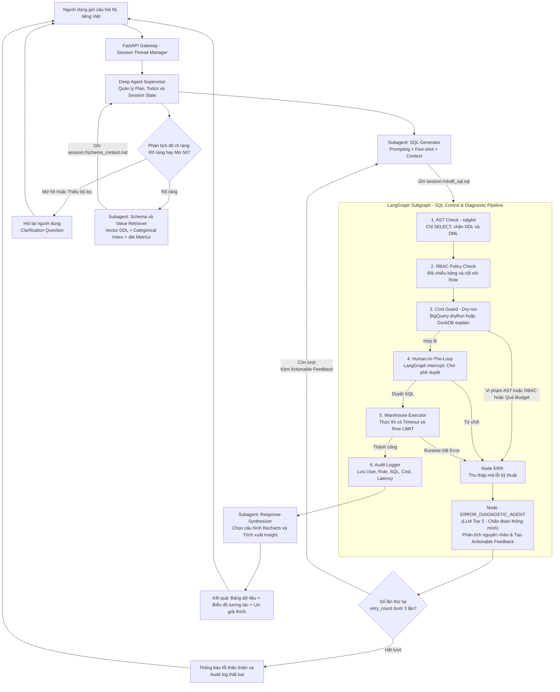

# Kiến trúc AI Agent Text-to-SQL Self-Service Analytics (DATA-01) - v3.0
### Mô hình kết hợp: DeepAgent Harness (Suy luận linh hoạt) + LangGraph Control Pipeline & Error Diagnostic Agent (Kiểm soát & Tự chẩn đoán)

---

## 1. Mục tiêu & Bối cảnh bài toán

- **Bối cảnh thực tế**: Nhân viên nghiệp vụ (kinh doanh, mua hàng, kế hoạch cung ứng, quản lý kho) tại doanh nghiệp phân phối & thương mại (bộ dữ liệu chuẩn TPC-H) cần số liệu định kỳ hoặc ad-hoc nhưng phụ thuộc hoàn toàn vào Data Team để viết SQL, gây tắc nghẽn thông tin từ vài ngày đến hàng tuần.
- **Mục tiêu hệ thống**: Xây dựng AI Agent có khả năng:
  1. Tiếp nhận câu hỏi tiếng Việt tự nhiên, nhận biết câu hỏi mơ hồ để **chủ động hỏi lại (Clarification)**.
  2. Lập kế hoạch truy vấn, thực hiện **Schema Linking** (8 bảng TPC-H) và **Categorical Value Retrieval** chính xác.
  3. Sinh SQL tối ưu, tuân thủ semantic metrics chuẩn TPC-H.
  4. Thực thi qua **hàng rào kiểm soát tất định (Governance Pipeline)**: AST validation, RBAC theo vai trò, ước tính chi phí quét dữ liệu (bytes scanned trên bảng lineitem), duyệt người dùng (HITL).
  5. **Tự chẩn đoán lỗi thông minh (Error Diagnostic Agent)**: Phân tích lỗi kỹ thuật từ pipeline/database để sinh chỉ dẫn sửa lỗi chính xác (Actionable Feedback), nâng cao tỷ lệ tự sửa lỗi.
  6. Chạy trên Data Warehouse (BigQuery / DuckDB), trả kết quả dạng bảng + biểu đồ trực quan + diễn giải insight kinh doanh.
  7. Tự sửa lỗi truy vấn (Self-Correction Loop) có giới hạn (<= 3 lần) và đo lường độ chính xác (Execution Accuracy).

---

## 2. Triết lý kiến trúc: Tại sao kết hợp DeepAgents và LangGraph?

Trong hệ thống dữ liệu doanh nghiệp, hai yêu cầu sau luôn mâu thuẫn:
1. **Tính linh hoạt (Agentic Reasoning)**: Hiểu ngôn ngữ tự nhiên tiếng Việt đa dạng, phát hiện ý định mơ hồ, chọn lọc schema phù hợp, suy luận cách join bảng, và tự chẩn đoán nguyên nhân lỗi truy vấn.
2. **Tính tất định & An toàn dữ liệu (Deterministic Governance)**: Không được phép để LLM "tự quyết định" việc có kiểm tra quyền bảo mật hay không, có kiểm tra dung lượng query hay không, hay có ghi log hay không.

### Phân công trách nhiệm (Separation of Concerns):
- **DeepAgents (Harness Layer - Bộ não suy luận)**:
  - Đảm nhiệm quy trình nhận thức: Decomposition, Planning (`write_todos`), Context Isolation qua Virtual Filesystem, và điều phối các subagents chuyên biệt.
  - Xử lý các bước bất định: Phân tích mơ hồ (Ambiguity Detection), Schema & Entity Linking, Soạn thảo SQL, Phân tích dữ liệu & Đề xuất Chart.
- **LangGraph (Control & Diagnostic Layer - Hàng rào kiểm soát tất định kết hợp Chẩn đoán lỗi)**:
  - Đóng gói thành một `CompiledSubAgent` (hoặc Subgraph bất biến).
  - Sử dụng code thuần (AST parser, RBAC matrix, Dry-run API, Audit Logger) để kiểm duyệt 100% các câu SQL trước và sau khi chạm vào warehouse.
  - Sử dụng cơ chế `interrupt()` của LangGraph để cài cắm chốt chặn Human-in-the-loop (HITL) có thể pause/resume phiên an toàn.
  - **Node Agentic bổ sung (`ERROR_DIAGNOSTIC_AGENT`)**: Kích hoạt khi có lỗi từ AST, RBAC, Cost hoặc Database. Sử dụng LLM Tier 2 để chẩn đoán nguyên nhân gốc rễ và tạo ra phản hồi hướng dẫn sửa lỗi chi tiết (Actionable Feedback) cho SQL Generator ở chu kỳ retry kế tiếp.

> **Tóm tắt luận điểm bảo vệ**: *"DeepAgents lo phần NGHĨ (linh hoạt theo ngôn ngữ tự nhiên), LangGraph lo phần KIỂM SOÁT (chặt chẽ, tất định, đảm bảo an toàn dữ liệu doanh nghiệp), kết hợp với Error Diagnostic Agent để biến phản hồi lỗi thành hành động sửa sai chính xác"*.

---

## 3. Sơ đồ Kiến trúc Tổng thể (Architecture Flowchart - v3.0)



---

## 4. Chi tiết các thành phần hệ thống

### 4.1. Deep Agent Supervisor & Session State Isolation
- Khởi tạo bằng `create_deep_agent` chạy trên nền LangGraph runtime.
- **Quản lý phiên đa người dùng (Multi-tenant Isolation)**:
  - Mọi thao tác I/O trên Virtual Filesystem được gắn với `thread_id` (ví dụ: `session://{thread_id}/draft_sql.sql`).
  - Tránh xung đột dữ liệu giữa các người dùng đồng thời trên FastAPI.
- **Nhiệm vụ**: Điều phối luồng làm việc theo todo list (`write_todos`), quyết định khi nào cần hỏi lại người dùng, khi nào gọi subagent tra cứu, và khi nào chuyển giao cho Control Pipeline.

### 4.2. Khâu phân tích & Hỏi lại người dùng (Clarification Loop)
- **Vấn đề giải quyết**: Tránh hiện tượng model tự suy diễn sai ý khi câu hỏi thiếu thông tin cốt lõi (ví dụ: *"Doanh thu gần đây thế nào?"* $\rightarrow$ Không rõ khu vực thị trường nào, phân khúc khách hàng nào, khoảng thời gian năm nào).
- **Cơ chế**:
  - LLM đánh giá intent và completeness của câu hỏi dựa trên semantic schema.
  - Nếu thiếu điều kiện lọc mang tính bắt buộc: Dừng luồng truy vấn, tạo câu hỏi làm rõ gợi ý kèm các option (ví dụ: *"Bạn muốn xem doanh thu theo: A. Năm 1995, B. Năm 1996, hay C. Toàn bộ các năm?"*).
  - Lịch sử đối thoại được lưu trong LangGraph State để nối tiếp ngữ cảnh khi người dùng phản hồi.

### 4.3. Subagent: Schema & Value Retriever (Dictionary-based SubAgent)
Khai báo theo chuẩn **DeepAgents SubAgent dictionary** (`name="schema-retriever"`):
- **Ngữ cảnh (`mode: "isolated"`)**: Áp dụng triệt để nguyên lý **Context Quarantine**. Subagent tự do gọi tool tra cứu, toàn bộ dữ liệu thô trung gian được giữ kín trong subagent, không làm phình context của Supervisor.
- **Mô hình (`model`)**: **Tier 2 Model** (`gpt-4o-mini` / `gemini-2.5-flash` / `claude-3-5-haiku`) tối ưu chi phí và phản hồi nhanh (<1s).
- **Công cụ (`tools`)**: `[search_tables_and_columns, search_categorical_values]`.
  1. **Vector DDL Indexing**: Tìm kiếm Top-k bảng và cột liên quan ngữ nghĩa trong 8 bảng TPC-H.
  2. **Categorical Value Search**: Tra cứu giá trị thực tế trong database. Ví dụ: Người dùng hỏi xe hoặc thép, subagent sẽ tra ra trong DB cột `p_type` lưu mã `'ECONOMY ANODIZED STEEL'`, hoặc phân khúc `c_mktsegment = 'AUTOMOBILE'`.
  3. **Semantic Metrics Layer (dbt Integration)**: Cung cấp công thức tính chỉ số chuẩn doanh nghiệp (ví dụ: `Discounted Net Revenue = l_extendedprice * (1 - l_discount)`), tránh việc LLM tự chế công thức tính toán.
- **Đầu ra có cấu trúc (`response_format: SchemaContextResult`)**: Sử dụng Pydantic Model để trả về dữ liệu chuẩn mực:
  - `selected_tables: list[str]`
  - `join_conditions: list[str]`
  - `categorical_filters: dict[str, str]` (ví dụ `{"c_mktsegment": "AUTOMOBILE"}`)
  - `metric_formulas: list[str]`
  - `context_markdown: str` (ghi kèm vào `session://{thread_id}/schema_context.md`)

### 4.4. Subagent: SQL Generator (Dictionary-based SubAgent)
Khai báo theo chuẩn **DeepAgents SubAgent dictionary** (`name="sql-generator"`):
- **Ngữ cảnh (`mode: "isolated"`)**: Chỉ nhận User Question + Schema Context + Error Feedback (nếu có). Tập trung 100% tài nguyên suy luận vào việc viết SQL, không bị phân tâm bởi lịch sử hội thoại trước đó.
- **Mô hình (`model`)**: **Tier 1 Model** (`gpt-4o` / `claude-3-5-sonnet`) đảm bảo tư duy logic JOIN nhiều bảng TPC-H, gom nhóm GROUP BY, và ép kiểu ngày tháng chính xác.
- **Công cụ (`tools: []`)**: Không cấp tools để ép agent chỉ tập trung reasoning và sinh SQL thuần dựa trên context đã cung cấp.
- **Đầu ra có cấu trúc (`response_format: SQLGenerationResult`)**:
  - `sql: str` (Câu lệnh SELECT SQL thuần túy, tuyệt đối không bọc markdown ```sql ```)
  - `dialect: str = "duckdb"` (hoặc `"bigquery"`)
  - `explanation: str` (Giải thích ngắn gọn logic query)
  - *Ý nghĩa then chốt*: Loại bỏ hoàn toàn lỗi vặt Markdown formatting, giúp AST Validator ở Control Pipeline parse được cú pháp SQL ngay lập tức mà không cần regex bóc tách.
- **Error-Aware Prompting**: Khi được kích hoạt từ luồng `RETRY_CHECK`, prompt sẽ được nạp bổ sung:
  - Câu SQL vừa sinh lỗi.
  - **DiagnosticResult có cấu trúc** từ `ERROR_DIAGNOSTIC_AGENT` (`error_category`, `root_cause`, `offending_entity`, `suggested_fix`, và chuỗi tóm tắt `actionable_feedback`).
  - Chỉ dẫn cụ thể để không lặp lại lỗi cũ.

### 4.5. LangGraph Deterministic Control Pipeline (CompiledSubAgent)
Được cài đặt bằng `StateGraph` của LangGraph thuần, bọc trong `CompiledSubAgent`:

| Bước (Node) | Cơ chế kỹ thuật | Quy tắc kiểm duyệt |
|---|---|---|
| **1. AST Validation** | Thư viện `sqlglot` | - Bắt buộc root expression là `exp.Select`.<br/>- Chặn tuyệt đối `exp.Insert`, `exp.Update`, `exp.Delete`, `exp.Drop`, `exp.Alter`.<br/>- Tự động bổ sung `LIMIT 1000` nếu query chưa có LIMIT. |
| **2. RBAC Policy Check** | Trích xuất AST table/column names | - Role `Analyst`: Cho phép đọc 8 bảng nghiệp vụ, cấm các cột PII & tài chính (`c_phone`, `c_acctbal`, `s_phone`, `s_acctbal`), cấm bảng audit nội bộ.<br/>- Role `Admin`: Được phép truy cập toàn bộ schema. |
| **3. Cost Guard (Dry-run)** | BigQuery `dryRun=True` / DuckDB `EXPLAIN` | - Ước lượng `bytes_scanned` trên bảng `lineitem`.<br/>- Cảnh báo hoặc chặn nếu vượt ngưỡng cấu hình (ví dụ: > 1GB đối với Analyst). |
| **4. Human-In-The-Loop (HITL)** | LangGraph `interrupt()` | - Tạm dừng graph state, đẩy payload về UI (câu SQL nháp, giải thích nghiệp vụ, chi phí ước tính).<br/>- Chờ người dùng nhấn **Phê duyệt** hoặc **Từ chối / Chỉnh sửa**. |
| **5. Warehouse Executor** | Client Driver (BigQuery / DuckDB) | - Thực thi câu lệnh an toàn, áp dụng query timeout (30s) và ngắt truy vấn tự động. |
| **6. Audit Logger** | Database Logging Table / JSONL | - Luôn luôn chạy (Fail-Safe): Ghi nhận `query_id`, `user_id`, `role`, `question`, `sql`, `status`, `bytes_scanned`, `execution_time_ms`, `timestamp`. |

### 4.6. Node Agentic: Error Diagnostic Agent (Thành phần mới trong v3.0)
Nằm tại lối ra của luồng lỗi (`err_node`) trong Control Pipeline Subgraph:
- **Vai trò**: Đóng vai trò là "Bác sĩ chuyên khoa chẩn đoán lỗi truy vấn", bắc cầu giữa lỗi thô của hệ thống kiểm duyệt/database và khả năng tự sửa của SQL Generator.
- **Cơ chế hoạt động**:
  1. Nhận đầu vào: Câu lệnh `draft_sql` lỗi, thông báo lỗi kỹ thuật raw (`error_message`, `error_type`), và ngữ cảnh `schema_context`.
  2. Gọi **LLM Tier 2** (model nhẹ, tốc độ cao như `gpt-4o-mini`) với prompt chuyên biệt về SQL Debugging.
  3. Phân tích nguyên nhân cốt lõi:
     - *Nếu lỗi AST*: Chỉ rõ từ khóa bị cấm hoặc vị trí sai cú pháp, gợi ý cấu trúc SELECT/CTE tương đương.
     - *Nếu lỗi RBAC*: Nhắc nhở vai trò người dùng bị cấm truy cập cột/bảng nào, gợi ý cột thay thế không vi phạm chính sách (ví dụ: không dùng `c_phone`, hãy dùng `c_name` hoặc `c_custkey`).
     - *Nếu lỗi Database (DuckDB/BigQuery)*: Chỉ ra sai lệch tên cột (ví dụ nhầm lẫn giữa `orders.o_orderdate` và `lineitem.l_shipdate`), sai lệch kiểu dữ liệu ngày tháng, hoặc thiếu điều kiện JOIN.
  4. Đóng gói kết quả thành **Actionable Diagnostic Feedback** ngắn gọn (2-3 câu), nạp trực tiếp vào `error_context` của state để gửi ngược về `SQL Generator`.

### 4.7. Vòng lặp Sửa lỗi có Giới hạn (Bounded Self-Correction)
- Biến trạng thái `retry_count` được theo dõi trong state graph.
- Ngưỡng tối đa: `MAX_RETRIES = 3`.
- **Hiệu quả của v3.0**: Nhờ có `ERROR_DIAGNOSTIC_AGENT`, SQL Generator nhận được hướng dẫn sửa lỗi có cấu trúc và có tính hành động cao, giúp giảm thiểu số vòng lặp sửa lỗi mù quáng (blind trial-and-error), nâng tỷ lệ sửa lỗi thành công ở lần thứ 2 lên đáng kể.
- Nếu vượt quá 3 lần: Pipeline dừng lại, trả thông báo lỗi thân thiện cho người dùng giải thích vì sao không thể thực hiện câu hỏi này, đồng thời lưu vết vào Audit log.

### 4.8. Subagent: Response Synthesizer (Dictionary-based SubAgent)
Khai báo theo chuẩn **DeepAgents SubAgent dictionary** (`name="response-synthesizer"`):
- **Ngữ cảnh (`mode: "isolated"`)**: Chỉ nhận User Question và bảng dữ liệu kết quả (`data_records: list[dict]`). Cách ly hoàn toàn với quá trình debug SQL phức tạp trước đó.
- **Mô hình (`model`)**: **Tier 2 Model** (`gpt-4o-mini` / `claude-3-5-haiku`) tối ưu hóa tốc độ và chi phí.
- **Công cụ (`tools: []`)**: Thuần LLM analysis & schema generation.
- **Đầu ra có cấu trúc (`response_format: SynthesizerResult`)**:
  - `chart_type: Literal["bar", "line", "pie", "area", "table"]`
  - `recharts_config: dict` (x_key, y_keys, series names, legend, title)
  - `business_insight: str` (2-3 câu diễn giải số liệu nổi bật bằng tiếng Việt)
  - *Ý nghĩa then chốt*: Frontend Next.js nhận trực tiếp JSON payload để render ngay component Recharts và bảng dữ liệu mà không cần tầng trung gian parse lại.

### 4.9. Bảng Đặc Tả Cấu Hình Subagents (DeepAgents Specification Matrix)

| Thuộc tính | `schema-retriever` | `sql-generator` | `response-synthesizer` | `control-pipeline` |
|---|---|---|---|---|
| **Phân loại cấu hình** | `SubAgent` (Dict-based) | `SubAgent` (Dict-based) | `SubAgent` (Dict-based) | `CompiledSubAgent` (LangGraph) |
| **Context Mode** | `mode: "isolated"` | `mode: "isolated"` | `mode: "isolated"` | `mode: "isolated"` |
| **Model Tier** | Tier 2 (`gpt-4o-mini`) | Tier 1 (`gpt-4o`) | Tier 2 (`gpt-4o-mini`) | Code thuần + Tier 2 (Node DIAG) |
| **Tools đính kèm** | `search_tables`, `search_values` | Không (`[]`) | Không (`[]`) | AST, RBAC, Cost, DB Executor, Audit |
| **Đầu ra (Format)**| `response_format=SchemaContextResult` | `response_format=SQLGenerationResult` | `response_format=SynthesizerResult` | `ControlState` (Data / Diagnostic) |
| **Cơ chế gọi** | Supervisor gọi qua `task()` | Supervisor gọi qua `task()` | Supervisor gọi qua `task()` | Supervisor điều phối sau bước SQL |

---

## 5. Danh mục Tools & Components phát triển

| Tên Tool / Node              | Thành phần sử dụng        | Mô tả chức năng                                                          | Xử lý lỗi / Fallback                                                          |
| ------------------------------| ---------------------------| --------------------------------------------------------------------------| -------------------------------------------------------------------------------|
| `retrieve_schema_and_values` | Schema Retriever          | Tra cứu vector DDL + bảng giá trị phân loại + dbt semantic metrics       | Trả về thông báo nếu không tìm thấy bảng phù hợp                              |
| `validate_sql_ast`           | LangGraph AST Node        | Parse SQL qua `sqlglot`, kiểm tra mệnh đề SELECT, kiểm tra SQL Injection | Trả về vị trí lỗi cú pháp hoặc danh sách lệnh bị cấm                          |
| `enforce_rbac_policy`        | LangGraph RBAC Node       | Đối chiếu các entity được SELECT với quyền của User Role                 | Trả về danh sách cột/bảng vi phạm quyền                                       |
| `estimate_query_cost`        | LangGraph Cost Node       | Chạy dry-run lấy bytes scanned (BigQuery) hoặc cost plan (DuckDB)        | Nếu driver không hỗ trợ dry-run, fallback về ước tính kích thước bảng         |
| `execute_warehouse_query`    | LangGraph Execute Node    | Chạy truy vấn trên database với timeout và limit                         | Bắt lỗi database exception, format lỗi gửi về node ERR                        |
| `persist_audit_log`          | LangGraph Audit Node      | Ghi vết truy vấn vào bảng audit log                                      | Lưu log bất đồng bộ, không làm crash luồng chính nếu log thất bại (Fail-Safe) |
| **`diagnose_query_error`**   | **Error Diagnostic Node** | **LLM phân tích nguyên nhân lỗi kỹ thuật và tạo Actionable Feedback**    | **Nếu LLM timeout/lỗi, fallback dùng trực tiếp thông báo lỗi kỹ thuật raw**   |

---

## 6. Chiến lược Tối ưu Chi phí & Hiệu năng (Model Tiering - v3.0)

```
                       [ Yêu cầu bài toán ]
                                |
       +------------------------+------------------------+
       |                                                 |
[ Tác vụ Suy luận Phức tạp ]               [ Tác vụ Rút gọn / Tiện ích / Chẩn đoán ]
       |                                                 |
  SQL Generator                             Schema Retriever, Response Synth &
       |                                      ERROR DIAGNOSTIC AGENT
       |                                                 |
  Tier 1 Model                                      Tier 2 Model
(Claude 3.5 Sonnet / GPT-4o)                      (Claude 3.5 Haiku / GPT-4o-mini)
       |                                                 |
Độ chính xác cú pháp & logic cao                    Tối ưu chi phí, độ trễ cực thấp (<1s)
```

- **Tiết kiệm token tối đa**: Các chốt chặn an toàn (AST, RBAC, Cost, Execute, Audit) vẫn chạy bằng code thuần 100% (Zero LLM Token). LLM chỉ được gọi tại `ERROR_DIAGNOSTIC_AGENT` **khi và chỉ khi có lỗi xảy ra**, và dùng model Tier 2 siêu nhẹ để tối ưu chi phí.
- **Tối ưu hạ tầng thực nghiệm**:
  - Giai đoạn phát triển & chạy unit test: Dùng **DuckDB** in-memory (0 chi phí, tốc độ millisecond).
  - Giai đoạn demo & đánh giá nghiệm thu: Dùng **BigQuery sandbox** (miễn phí 1TB query/tháng) để chứng minh tính năng đo bytes scanned hoạt động trên cloud warehouse thực tế.

---

## 7. Khung Đánh giá Thực nghiệm (Evaluation Framework)

Để đáp ứng tiêu chí đồ án nâng cao, hệ thống xây dựng bộ eval benchmark trên tập 50 câu hỏi mẫu (tiếng Việt, phân theo 3 mức độ: Dễ, Trung bình, Khó):

| Chỉ số (Metric)                  | Công thức / Cách đo                                                                     | Mục tiêu kỳ vọng                                    |
| ----------------------------------| -----------------------------------------------------------------------------------------| -----------------------------------------------------|
| **Valid SQL Rate (VSR)**         | $\frac{\text{Số câu SQL hợp lệ cú pháp}}{\text{Tổng số câu hỏi}} \times 100\%$          | $\ge 95\%$                                          |
| **Execution Accuracy (EX)**      | So khớp kết quả trả về của SQL sinh ra vs Ground-truth SQL trên cùng DB                 | $\ge 82\%$                                          |
| **Self-Correction Success Rate** | $\frac{\text{Số câu sửa thành công sau retry}}{\text{Số câu lỗi lần đầu}} \times 100\%$ | **$\ge 75\%$** *(tăng từ 60% nhờ Error Diagnostic)* |
| **Clarification Accuracy**       | Độ chính xác khi nhận diện câu hỏi mơ hồ (Precision/Recall)                             | $\ge 90\%$                                          |
| **Governance Compliance**        | Tỷ lệ chặn đứng các truy vấn vượt quyền RBAC / quá ngưỡng chi phí                       | **100% (Zero tolerance)**                           |

---

## 8. Lộ trình triển khai đề xuất (12 Tuần)

1. **Tuần 1 - 2: Thiết lập nền tảng & Dữ liệu TPC-H**
   - Khởi tạo repo, môi trường ảo, cấu hình database DuckDB sinh dữ liệu TPC-H (`CALL dbgen(sf=0.1)`).
   - Thiết lập 8 bảng DDL TPC-H, indexing vector cho DDL và categorical values (`r_name`, `c_mktsegment`, `p_type`).
2. **Tuần 3 - 4: Xây dựng Core Agent (DeepAgent)**
   - Cài đặt Deep Agent Supervisor, Schema Retriever, SQL Generator.
   - Thử nghiệm sinh SQL tiếng Việt trên DuckDB.
3. **Tuần 5 - 6: Cài đặt LangGraph Control & Diagnostic Pipeline**
   - Viết các node AST Validation (`sqlglot`), RBAC Policy, Dry-run Cost Guard.
   - Viết Node `ERROR_DIAGNOSTIC_AGENT` chẩn đoán lỗi.
   - Đóng gói thành `CompiledSubAgent` tích hợp vào Deep Agent.
4. **Tuần 7 - 8: Cơ chế HITL, Clarification & Warehouse Connector**
   - Cài đặt LangGraph `interrupt()` cho HITL.
   - Tích hợp BigQuery client và DuckDB client.
   - Xây dựng Clarification Loop.
5. **Tuần 9 - 10: Xây dựng Giao diện Người dùng (Frontend Next.js)**
   - Màn hình chat nhận câu hỏi tiếng Việt.
   - Modal hiển thị SQL nháp, chi phí quét, nút Phê duyệt / Từ chối (HITL).
   - Component hiển thị bảng số liệu và Recharts biểu đồ.
6. **Tuần 11 - 12: Đánh giá Eval, Tối ưu & Viết Báo cáo**
   - Chạy bộ benchmark 50 câu hỏi, đo Execution Accuracy và Self-Correction Rate với Diagnostic Node.
   - Tối ưu hóa prompt và few-shot examples.
   - Đóng gói Docker, hoàn thiện tài liệu báo cáo kỹ thuật.
