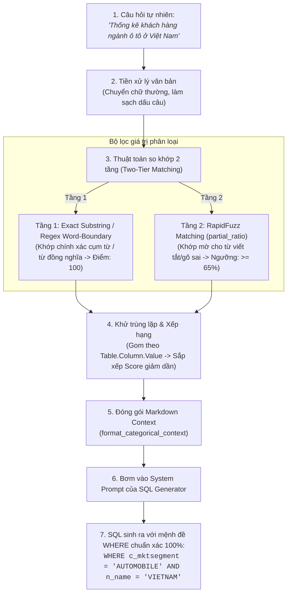

# CƠ CHẾ TRA CỨU & ÁNH XẠ GIÁ TRỊ PHÂN LOẠI THỰC TẾ (CATEGORICAL VALUE LINKING)

> **Component**: 2.2 — Categorical Value Search  
> **Mã nguồn**: [`src/utils/categorical_search.py`](file:///c:/text2sql-agent/src/utils/categorical_search.py)  
> **Kiểm thử**: [`tests/test_categorical_search.py`](file:///c:/text2sql-agent/tests/test_categorical_search.py)  
> **Mục đích**: Giải quyết bài toán Entity / Value Linking, kết nối ngôn ngữ tự nhiên của người dùng với các giá trị mã hóa thực tế trong cơ sở dữ liệu TPC-H.

---

## 1. BỐI CẢNH & BÀI TOÁN KỸ THUẬT (PROBLEM STATEMENT)

Trong các hệ thống Text-to-SQL truyền thống, lỗi phổ biến và nguy hiểm nhất không phải là lỗi cú pháp SQL (Syntax Error), mà là **Lỗi truy vấn rỗng (Silent Failure / Empty Result Set)**. 

Nguyên nhân xuất phát từ **khoảng vênh giữa ngôn ngữ con người nói và dữ liệu lưu trong cơ sở dữ liệu**:

| Người dùng hỏi (Ngôn ngữ tự nhiên) | Giá trị thực tế trong DB TPC-H | Hậu quả nếu không có Entity Linking |
| :--- | :--- | :--- |
| *"Khách hàng ngành **ô tô**"* | `c_mktsegment = 'AUTOMOBILE'` | LLM sinh `WHERE c_mktsegment = 'ô tô'` -> **Trả về 0 dòng!** |
| *"Khu vực **Châu Á**"* | `r_name = 'ASIA'` | LLM sinh `WHERE r_name = 'Chau A'` -> **Trả về 0 dòng!** |
| *"Đơn hàng đã **hoàn tất**"* | `o_orderstatus = 'F'` *(Fulfilled)* | LLM sinh `WHERE o_orderstatus = 'Completed'` -> **Trả về 0 dòng!** |
| *"Vận chuyển bằng **máy bay**"* | `l_shipmode = 'AIR'` | LLM sinh `WHERE l_shipmode = 'plane'` -> **Trả về 0 dòng!** |
| *"Khách hàng ở **Việt Nam**"* | `n_name = 'VIETNAM'` | LLM sinh `WHERE n_name = 'Việt Nam'` -> **Trả về 0 dòng!** |

👉 **Giải pháp**: Cơ chế **Categorical Value Linking** hoạt động như một "chiếc cầu nối tự động", quét câu hỏi của người dùng, tra cứu các thực thể phân loại và chỉ thị rõ ràng cho LLM giá trị chuẩn xác cần dùng trong mệnh đề `WHERE`.

---

## 2. KIẾN TRÚC TỔNG QUAN (ARCHITECTURE WORKFLOW)



---

## 3. CHI TIẾT THUẬT TOÁN 2 TẦNG (TWO-TIER MATCHING ALGORITHM)

Hàm cốt lõi `find_matching_categorical_values(query, top_k=5, min_score=65.0)` được thiết kế với 4 giai đoạn xử lý chặt chẽ:

### Giai đoạn 1: Tiền xử lý chuẩn hóa (`_normalize_text`)
- Chuyển toàn bộ chuỗi về chữ thường (`lower()`).
- Sử dụng biểu thức chính quy loại bỏ các dấu câu gây nhiễu: `? , . : ; ! " ' ( ) [ ] { }`.
- Chuẩn hóa khoảng trắng thừa thành khoảng trắng đơn.

### Giai đoạn 2: So khớp chính xác theo ranh giới từ (Exact Regex Substring)
- Duyệt qua từng `CategoricalEntry` trong kho từ điển [`CATEGORICAL_REGISTRY`](file:///c:/text2sql-agent/src/utils/categorical_search.py).
- Với mỗi từ đồng nghĩa (`alias`), thiết lập biểu thức chính quy khớp cả cụm từ:
  ```python
  pattern = rf"(?:\b|^){re.escape(norm_alias)}(?:\b|$)"
  ```
- **Ưu điểm**: Bắt chính xác các cụm từ đa âm tiết tiếng Việt như *"ô tô"*, *"châu á"*, *"việt nam"*, *"xây dựng"* mà không bị nhầm lẫn với các từ chứa một phần ký tự.
- Khi khớp thành công: Đánh dấu `exact_match = True` và gán điểm tuyệt đối `similarity_score = 100.0`.

### Giai đoạn 3: So khớp mờ bổ trợ (Fuzzy Matching qua RapidFuzz)
- Áp dụng cho các mục chưa khớp được ở Giai đoạn 2.
- Sử dụng thuật toán `rapidfuzz.fuzz.partial_ratio` so sánh khoảng cách ký tự Levenshtein giữa alias và câu hỏi.
- Lọc bỏ các kết quả có điểm số dưới ngưỡng `min_score` (mặc định 65.0/100) để ngăn chặn hiện tượng bắt nhầm (False Positives).

### Giai đoạn 4: Khử trùng lặp & Xếp hạng (Deduplication & Top-K Ranking)
- Sử dụng khóa duy nhất `(table, column, value)` để đảm bảo mỗi giá trị chỉ xuất hiện một lần duy nhất với điểm số cao nhất.
- Sắp xếp ưu tiên:
  1. `exact_match = True` lên đầu tiên.
  2. `similarity_score` giảm dần.
- Cắt lấy `top_k` kết quả có độ liên quan cao nhất (mặc định 5).

---

## 4. DANH MỤC CÁC CỘT PHÂN LOẠI ĐƯỢC CHỈ MỤC TRONG TPC-H

Hệ thống đã lập chỉ mục sẵn toàn bộ các trường phân loại trọng yếu của 8 bảng TPC-H:

### 1. Phân khúc thị trường khách hàng (`customer.c_mktsegment`)
- `'AUTOMOBILE'`: ô tô, xe hơi, phương tiện giao thông, automobile, car...
- `'BUILDING'`: xây dựng, công trình, vật liệu xây dựng, nhà ở, building...
- `'MACHINERY'`: máy móc, cơ khí, thiết bị máy móc, chế tạo máy, machinery...
- `'FURNITURE'`: nội thất, đồ gỗ, bàn ghế, furniture...
- `'HOUSEHOLD'`: đồ gia dụng, gia dụng, thiết bị gia đình, household...

### 2. Khu vực địa lý thế giới (`region.r_name`)
- `'ASIA'`: châu á, á châu, asia...
- `'EUROPE'`: châu âu, âu châu, europe...
- `'AMERICA'`: châu mỹ, bắc mỹ, nam mỹ, america...
- `'AFRICA'`: châu phi, africa...
- `'MIDDLE EAST'`: trung đông, middle east...

### 3. Quốc gia (`nation.n_name`)
- Đầy đủ 25 quốc gia chuẩn TPC-H kèm tên tiếng Việt và tiếng Anh (*VIETNAM, JAPAN, CHINA, UNITED STATES, GERMANY, FRANCE, UNITED KINGDOM, INDIA, INDONESIA, BRAZIL, RUSSIA...*).

### 4. Trạng thái đơn hàng (`orders.o_orderstatus`)
- `'O'`: đang mở, đang xử lý, chưa giao, open...
- `'F'`: đã hoàn tất, hoàn tất, đã giao xong, fulfilled, finished...
- `'P'`: đang chờ, chờ duyệt, pending...

### 5. Phương thức vận chuyển (`lineitem.l_shipmode`)
- `'AIR'`: đường hàng không, máy bay, air...
- `'SHIP'`: đường biển, đường tàu thủy, tàu biển, ship...
- `'TRUCK'`: đường bộ, xe tải, truck...
- `'RAIL'`: đường sắt, tàu hỏa, rail...
- `'MAIL'`: bưu điện, thư tín, mail...
- `'FOB'`: giao tại cảng, fob...
- `'REG AIR'`: hàng không thông thường, reg air...

### 6. Cờ hoàn trả hàng (`lineitem.l_returnflag`)
- `'R'`: hoàn trả, trả hàng, hoàn hàng, returned...
- `'A'`: chấp nhận, accepted...
- `'N'`: không hoàn, none...

---

## 5. ĐỊNH DẠNG ĐẦU RA CHO LLM PROMPT (`format_categorical_context`)

Khi tìm thấy các giá trị phân loại khớp với câu hỏi, hàm `format_categorical_context()` sẽ chuyển đổi thành đoạn chỉ thị rõ ràng trong Markdown:

### Ví dụ Thực tế:
- **Câu hỏi đầu vào**: *"Cho tôi xem danh sách các khách hàng thuộc ngành **ô tô** ở khu vực **Châu Á**"*
- **Kết quả `format_categorical_context()` sinh ra**:
  ```markdown
  ### GIÁ TRỊ PHÂN LOẠI THỰC TẾ TRONG DATABASE (CATEGORICAL VALUE LINKING):
  Khi sinh câu lệnh SQL, bắt buộc dùng đúng các giá trị chuẩn sau trong mệnh đề WHERE:
  - Cột **customer.c_mktsegment**: Dùng điều kiện `c_mktsegment = 'AUTOMOBILE'` (ánh xạ từ từ khóa: "ô tô", khớp chính xác)
  - Cột **region.r_name**: Dùng điều kiện `r_name = 'ASIA'` (ánh xạ từ từ khóa: "châu á", khớp chính xác)
  ```

- **Tác động tới SQL Generator**:
  Khi LLM nhìn thấy chỉ thị tường minh này, nó sẽ tự động chèn:
  ```sql
  SELECT c.c_name, c.c_mktsegment, r.r_name
  FROM customer c
  JOIN nation n ON c.c_nationkey = n.n_nationkey
  JOIN region r ON n.n_regionkey = r.r_regionkey
  WHERE c.c_mktsegment = 'AUTOMOBILE' AND r.r_name = 'ASIA';
  ```
  Nhờ đó, câu lệnh SQL đảm bảo **100% khớp dữ liệu thực tế và luôn trả về kết quả chính xác**.
