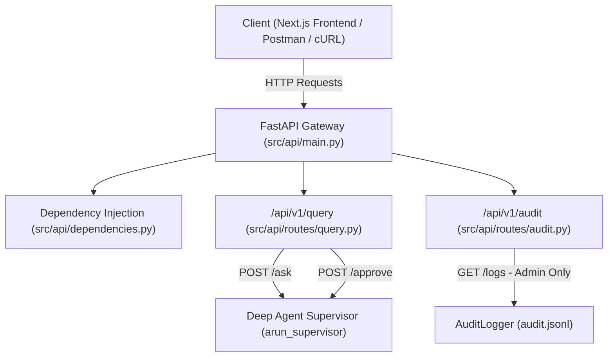

# Tổng Kết Triển Khai Component 5.1: FastAPI Gateway & Endpoints

> **Tài liệu tham chiếu gốc**: `docs/agent/agent-components-breakdown.md` (Component 5.1)  
> **Thời điểm hoàn thành**: 14/09/2026  
> **Trạng thái**: Đã hoàn thành 100% (9/9 API tests passed, 157/157 repository tests passed, Ruff lint clean).

---

## 1. Mục Đích & Vai Trò Của Component 5.1

Component 5.1 xây dựng tầng **API Gateway** đóng vai trò là giao diện đối ngoại duy nhất kết nối các ứng dụng người dùng cuối (Web Frontend Next.js, Postman, Mobile/BI tools) với tầng suy luận **Deep Agent Supervisor** (`src/agents/supervisor.py`):
1. Cung cấp chuẩn giao tiếp RESTful API bất đồng bộ (`async/await`) hiệu năng cao.
2. Điều phối các luồng nghiệp vụ:
   - Truy vấn phân tích dữ liệu tự động (`/api/v1/query/ask`).
   - Phê duyệt con người khi có rủi ro chi phí cao hoặc nhạy cảm (`/api/v1/query/approve`).
   - Tra cứu lịch sử phiên và vết artifacts (`/api/v1/query/history`).
   - Tra cứu nhật ký kiểm toán hệ thống được bảo vệ nghiêm ngặt bằng RBAC (`/api/v1/audit/logs`).
   - Kiểm tra tình trạng kết nối Data Warehouse và hệ thống (`/health`).

---

## 2. Danh Mục Các Tệp Tin Tạo Mới (New Files Added)

| STT | Đường dẫn tệp | Mô tả chi tiết & Trách nhiệm |
| :---: | :--- | :--- |
| 1 | [`src/models/api_schemas.py`](file:///c:/text2sql-agent/src/models/api_schemas.py) | **Pydantic V2 Schemas**: Định nghĩa cấu trúc dữ liệu đầu vào/đầu ra cho toàn bộ API Gateway (`AskQueryRequest`, `QueryResponse`, `ApprovalRequest`, `ApprovalResponse`, `QueryHistoryItem`, `QueryHistoryResponse`, `AuditLogsResponse`, `HealthResponse`). |
| 2 | [`src/api/__init__.py`](file:///c:/text2sql-agent/src/api/__init__.py) | **Package Init**: Đóng gói module `src/api` và re-export instance ứng dụng FastAPI `app`. |
| 3 | [`src/api/main.py`](file:///c:/text2sql-agent/src/api/main.py) | **Application Entrypoint**: Khởi tạo FastAPI app, quản lý vòng đời Lifespan (nạp dữ liệu DuckDB TPC-H khi startup), cấu hình CORS Middleware cho Next.js, bộ xử lý lỗi toàn cục (`global_exception_handler`), và root health check `/health`. |
| 4 | [`src/api/dependencies.py`](file:///c:/text2sql-agent/src/api/dependencies.py) | **Dependency Injection Layer**: Trích xuất `UserContext` từ Request Headers (`X-User-Id`, `X-User-Role`, `X-Session-Id`), kiểm tra phân quyền bảo mật `require_admin_role`, cung cấp singleton `DuckDBConnector`, `AuditLogger`, và `MemorySaver` checkpointer. |
| 5 | [`src/api/routes/__init__.py`](file:///c:/text2sql-agent/src/api/routes/__init__.py) | **Routers Init**: Đóng gói và xuất các router chính (`query_router`, `audit_router`). |
| 6 | [`src/api/routes/query.py`](file:///c:/text2sql-agent/src/api/routes/query.py) | **Query Router** (`/api/v1/query`):<br>- `POST /ask`: Gọi bất đồng bộ `arun_supervisor`, xử lý 3 luồng (Hoàn tất `COMPLETED`, Làm rõ `CLARIFICATION_REQUIRED`, Chờ duyệt `PENDING_APPROVAL`).<br>- `POST /approve`: Tiếp nhận quyết định duyệt/từ chối HITL để resume đồ thị từ `interrupt()`.<br>- `GET /history`: Truy xuất danh mục tệp artifacts của phiên. |
| 7 | [`src/api/routes/audit.py`](file:///c:/text2sql-agent/src/api/routes/audit.py) | **Audit Router** (`/api/v1/audit`):<br>- `GET /logs`: Đọc danh sách log kiểm toán JSONL từ `AuditLogger`. Bảo vệ phân quyền RBAC: chỉ người dùng có vai trò `ADMIN` mới được phép, trả về `403 Forbidden` nếu là `ANALYST`. |
| 8 | [`tests/test_api.py`](file:///c:/text2sql-agent/tests/test_api.py) | **Integration Test Suite**: Bộ kiểm thử 9 test cases tự động bằng `httpx.AsyncClient` bao phủ 100% các luồng endpoints, xử lý lỗi validation 422, phân quyền 403, và kiểm tra health check. |
| 9 | [`docs/agent/component-5.1-fastapi-specification.md`](file:///c:/text2sql-agent/docs/agent/component-5.1-fastapi-specification.md) | **Tài liệu đặc tả**: Bản mô tả thiết kế kỹ thuật, schemas, và kế hoạch TDD cho Component 5.1. |
| 10 | [`docs/agent/component-5.1-implementation-summary.md`](file:///c:/text2sql-agent/docs/agent/component-5.1-implementation-summary.md) | **Tài liệu tổng kết**: Tệp tin này, ghi chép toàn bộ danh mục tệp thay đổi và kết quả xác minh. |

---

## 3. Danh Mục Các Tệp Tin Đã Cập Nhật (Modified Files)

| Đường dẫn tệp | Thay đổi chi tiết |
| :--- | :--- |
| [`requirements.txt`](file:///c:/text2sql-agent/requirements.txt) | Bổ sung 3 thư viện cốt lõi cho tầng Web API:<br>- `fastapi>=0.115.0`<br>- `uvicorn[standard]>=0.30.0`<br>- `httpx>=0.27.0` |

---

## 4. Chi Tiết Các Endpoints Cung Cấp Bởi Component 5.1



### Chi tiết đặc tả các Route:

1. **`GET /health`** & **`GET /api/v1/health`**:
   - Trả về: `{"status": "healthy", "database": "connected", "version": "1.0.0"}`.
2. **`POST /api/v1/query/ask`**:
   - Request Body: `{"question": "...", "session_id": "...", "user_id": "...", "role": "Analyst"}`.
   - Response Body: Trả về trạng thái `COMPLETED` kèm dữ liệu `data`, `columns`, `final_answer`, `recharts_config`; hoặc trạng thái `CLARIFICATION_REQUIRED` kèm `clarification_question` và `suggested_options`.
3. **`POST /api/v1/query/approve`**:
   - Request Body: `{"session_id": "...", "approved": true/false, "rejection_reason": "..."}`.
   - Response Body: Trả về trạng thái tiếp nhận duyệt và kích hoạt Command resume đồ thị.
4. **`GET /api/v1/query/history?session_id=...`**:
   - Query Parameter: `session_id`.
   - Response Body: Danh sách artifacts sinh ra trong phiên (`00_question.json`, `01_clarification.json`,...).
5. **`GET /api/v1/audit/logs`**:
   - Header bắt buộc: `X-User-Role: Admin` (Nếu là Analyst sẽ nhận `HTTP 403 Forbidden`).
   - Query Parameters: `limit`, `offset`, `session_id`.
   - Response Body: Danh sách sự kiện kiểm toán có cấu trúc.

---

## 5. Kết Quả Kiểm Thử & Xác Minh (Verification)

### 5.1. Unit & Integration Tests cho API (`tests/test_api.py`)
- `test_health_check`: **PASSED**
- `test_ask_query_clear_question_success`: **PASSED**
- `test_ask_query_ambiguous_question_clarification`: **PASSED**
- `test_ask_query_validation_error_empty_question`: **PASSED**
- `test_approve_query_success`: **PASSED**
- `test_approve_query_rejection`: **PASSED**
- `test_query_history_endpoint`: **PASSED**
- `test_audit_logs_admin_authorized`: **PASSED**
- `test_audit_logs_analyst_forbidden`: **PASSED**

👉 **9/9 API tests PASSED**

### 5.2. Toàn bộ Test Suite Dự Án
- Tổng số bài test: **157/157 tests PASSED** (Thời gian chạy ~4.3s).
- Kiểm tra quy chuẩn chất lượng mã nguồn: `ruff check .` **100% sạch, không có vi phạm linting**.

---

## 6. Lệnh Khởi Chạy Server Thực Tế

Khởi chạy máy chủ API Gateway ở chế độ reload (Hot-reload dành cho dev):
```powershell
.venv\Scripts\uvicorn.exe src.api.main:app --reload --host 127.0.0.1 --port 8000
```
Truy cập tài liệu tương tác tự động Swagger UI:
- **Swagger Docs**: `http://127.0.0.1:8000/docs`
- **ReDoc**: `http://127.0.0.1:8000/redoc`
