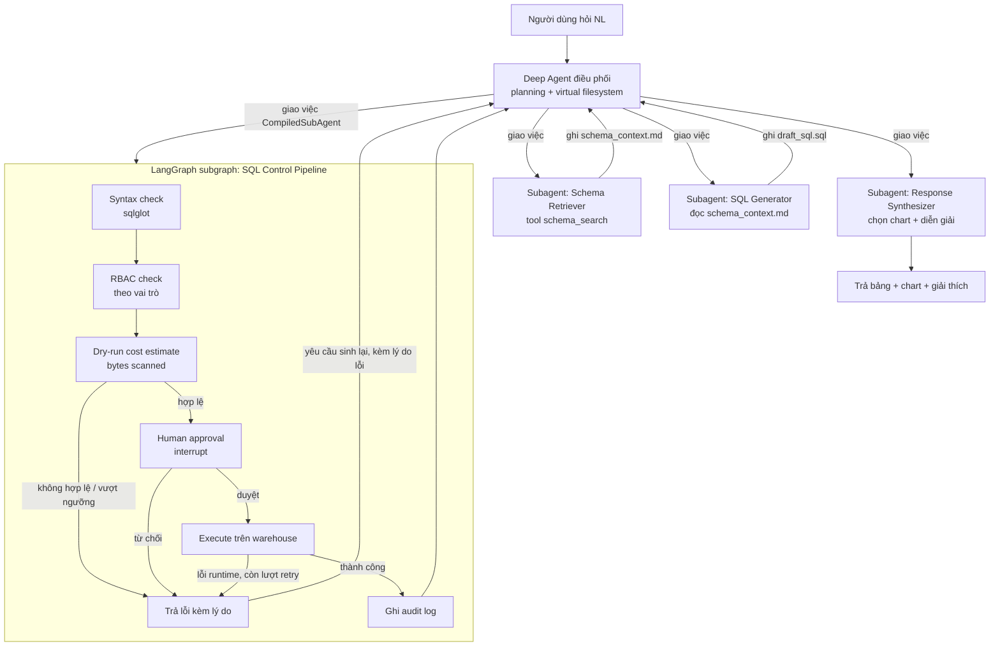

# Kiến trúc AI Agent Text-to-SQL Self-Service Analytics (DATA-01)
### Phiên bản: deepagents (harness) + LangGraph (control layer) kết hợp

## 1. Mục tiêu & phạm vi

**Bài toán gốc**: Nhân viên nghiệp vụ hỏi bằng tiếng Việt tự nhiên → agent tự lập kế hoạch, sinh SQL đúng schema, chạy trên warehouse, trả bảng + biểu đồ + diễn giải. Có HITL duyệt SQL, RBAC theo vai trò, kiểm soát chi phí quét dữ liệu.

**Phạm vi đề xuất cho Đồ án II** (không đổi so với bản trước):

- Cơ bản: đăng nhập 2 vai trò (Analyst/Admin), agent nhận câu hỏi → sinh SQL → HITL duyệt → chạy → trả bảng + chart + giải thích, log lại mọi truy vấn.
- Nâng cao (chọn 2-3 mục): agent tự sửa lỗi SQL khi query fail (retry có giới hạn), bộ eval đo execution accuracy, ước tính & giới hạn chi phí quét (bytes scanned).

## 2. Vì sao kết hợp deepagents với LangGraph thay vì chỉ dùng một trong hai

Đây là quyết định kiến trúc đáng nói trong báo cáo, nên trình bày rõ lý do thay vì chỉ nói "em dùng cả hai":

- **deepagents** là một "agent harness" — cho sẵn: planning (`write_todos`), virtual filesystem để quản lý context, cơ chế spawn subagent cô lập context, và chạy trên nền LangGraph runtime (streaming, checkpoint, interrupt). Phù hợp cho các bước cần LLM tự suy luận linh hoạt: hiểu câu hỏi mơ hồ, tra schema, soạn SQL, diễn giải kết quả.
- **LangGraph** (dùng trực tiếp, không qua deepagents) cho phép kiểm soát tường minh: node cố định, cạnh có điều kiện rõ ràng, đảm bảo mọi truy vấn đều đi qua đúng thứ tự Validate → Duyệt → Chạy, không phụ thuộc vào việc LLM "có nhớ" phải làm bước đó hay không. Đây là điều bắt buộc với các ràng buộc governance của đề (RBAC, kiểm soát chi phí, HITL) — những bước này cần **tất định (deterministic)**, không nên để agent tự quyết có làm hay không.
- **Cách ghép**: theo tài liệu chính thức của deepagents, một `CompiledStateGraph` viết bằng LangGraph thuần có thể được đóng gói thành một `CompiledSubAgent` và truyền vào `create_deep_agent(subagents=[...])`. Nghĩa là: agent chính (deep agent) vẫn là bộ não linh hoạt điều phối toàn bộ, nhưng khi cần "giao việc" cho khâu Validate → Duyệt → Chạy, nó gọi vào một subgraph LangGraph được viết tay, chạy đúng logic cố định, không đoán mò.

Nói ngắn gọn cho báo cáo: **deepagents lo phần "nghĩ" (schema, SQL, diễn giải), LangGraph lo phần "kiểm soát" (validate, duyệt, thực thi, audit)**.

## 3. Kiến trúc tổng thể

**Luồng chính**: người dùng hỏi → Deep Agent tự lập kế hoạch (write_todos) → giao việc lần lượt cho các subagent linh hoạt (Schema Retriever, SQL Generator) → khi có SQL nháp, giao cho subgraph LangGraph cố định để validate/duyệt/chạy → nếu lỗi ở bất kỳ bước nào trong subgraph, trả lỗi về Deep Agent để nó tự quyết định gọi lại SQL Generator (có kèm lý do cụ thể) → khi có kết quả, giao cho Response Synthesizer để dựng chart + giải thích.

## 4. Chi tiết từng thành phần

### 4.1 Deep Agent điều phối (agent chính)
- Tạo bằng `create_deep_agent(model=..., subagents=[...], system_prompt=...)`.
- `system_prompt` mô tả rõ quy trình mong muốn: khi nào hỏi lại người dùng (câu hỏi mơ hồ), thứ tự giao việc cho các subagent, giới hạn số lần thử lại khi SQL lỗi.
- Virtual filesystem đóng vai trò "bộ nhớ chung" giữa các subagent — thay vì nhét toàn bộ schema/lịch sử vào context, các subagent đọc/ghi qua file: `schema_context.md`, `draft_sql.sql`, `validation_report.md`. Đây cũng là nơi bạn có thể "chộp" lại để làm bằng chứng minh họa trong báo cáo (chụp lại nội dung file tại từng bước).
- Không cần tự viết logic hỏi lại khi mơ hồ — chỉ cần mô tả rõ trong system prompt, deep agent sẽ tự quyết định dùng lượt hội thoại để hỏi lại thay vì đoán.

### 4.2 Subagent: Schema Retriever
- Khai báo dạng subagent thường (dict cấu hình `name`, `description`, `system_prompt`, `tools=[schema_search]`) — không cần LangGraph riêng vì đây là việc "tìm kiếm rồi tổng hợp", không cần luồng rẽ nhánh phức tạp.
- Tool `schema_search(query)`: bạn tự viết — tra vector DB (pgvector/Qdrant) lấy top-k bảng/cột + few-shot examples liên quan.
- Kết quả được subagent tóm tắt và ghi ra `schema_context.md` trong virtual filesystem, không trả thẳng toàn bộ dữ liệu thô về context của agent chính.

### 4.3 Subagent: SQL Generator
- Subagent thường, đọc `schema_context.md` + câu hỏi + vai trò người dùng, sinh SQL kèm giải thích ngắn.
- Ghi kết quả ra `draft_sql.sql` (và một đoạn giải thích ngắn cho bước HITL đọc).
- Khi bị agent chính gọi lại do lỗi (từ `ERR`), nhận thêm lý do lỗi cụ thể trong prompt — không sinh lại mù quáng.

### 4.4 LangGraph subgraph: SQL Control Pipeline (CompiledSubAgent)
Đây là phần bạn **viết bằng LangGraph thuần**, sau đó bọc lại bằng `CompiledSubAgent(name=..., description=..., runnable=graph)` để deep agent gọi vào như một subagent bình thường — nhưng bên trong chạy đúng logic cố định bạn định nghĩa, không phải LLM tự quyết.

Các node trong subgraph:
1. **Syntax check**: parse `draft_sql.sql` bằng `sqlglot`, không cần chạy thật.
2. **RBAC check**: đối chiếu bảng/cột được tham chiếu với quyền của vai trò (analyst chỉ đọc, không đụng bảng admin-only).
3. **Dry-run cost estimate**: gọi `dryRun` của BigQuery (hoặc `EXPLAIN` của DuckDB khi dev) để ước lượng bytes sẽ quét; so với ngưỡng cấu hình.
4. **Cạnh có điều kiện**: nếu bất kỳ bước 1-3 fail → sang node `ERR` kèm lý do cụ thể (không cần LLM đoán lỗi ở đâu, subgraph tự biết chính xác).
5. **Human approval (interrupt)**: dùng `interrupt()` của LangGraph để tạm dừng, trả về UI câu SQL + giải thích + ước tính chi phí, chờ người dùng bấm Duyệt/Từ chối.
6. **Execute**: chạy thật trên warehouse nếu được duyệt, có timeout + LIMIT mặc định.
7. **Log audit**: ghi `id, user_id, role, question, generated_sql, approved_by, bytes_scanned, execution_time, status, timestamp` vào bảng audit — đảm bảo bước này **luôn chạy** dù kết quả thành công hay thất bại, vì đây là node cố định chứ không phải "agent nhớ thì log".

Lý do tách riêng thành LangGraph thuần thay vì để deep agent tự làm bằng tool calls tuần tự: nếu để LLM tự quyết định thứ tự gọi tool, không có gì đảm bảo nó luôn check RBAC trước khi chạy, hoặc luôn ghi log kể cả khi lỗi. Với một subgraph viết tay, thứ tự và tính đầy đủ được đảm bảo bởi code, không phụ thuộc vào việc model có "quên" hay không — đây chính là điểm mạnh cần nhấn khi bảo vệ đồ án.

### 4.5 Subagent: Response Synthesizer
- Subagent thường, nhận kết quả từ Control Pipeline (dữ liệu trả về + audit log), chọn loại chart phù hợp theo shape dữ liệu, sinh diễn giải NL nêu insight (không chỉ lặp số liệu).

## 5. Bộ tools cần tự viết

| Tool | Dùng bởi | Việc chính |
|---|---|---|
| `schema_search(query)` | Schema Retriever | Tra vector DB lấy bảng/cột + few-shot liên quan |
| `sql_dry_run(sql)` | LangGraph node Dry-run | Parse + ước lượng bytes scanned |
| `check_rbac(sql, role)` | LangGraph node RBAC check | Đối chiếu bảng/cột với quyền vai trò |
| `execute_sql(sql)` | LangGraph node Execute | Chạy thật trên warehouse, có timeout/LIMIT |
| `write_audit_log(record)` | LangGraph node Log audit | Ghi bảng audit |

Ranh giới rõ ràng cho báo cáo: **framework cho sẵn** (planning, virtual filesystem, subagent isolation, LangGraph interrupt/checkpoint) — **phần bạn tự viết** (5 tool trên + logic subgraph + prompt thiết kế cho từng subagent).

## 6. Tech stack đề xuất

| Thành phần | Lựa chọn | Ghi chú |
|---|---|---|
| Agent harness | `deepagents` (Python) | Agent chính + 3 subagent linh hoạt |
| Control layer | `langgraph` thuần | Subgraph Validate → Duyệt → Chạy, bọc bằng `CompiledSubAgent` |
| LLM | Claude Sonnet (SQL gen) + Claude Haiku (schema retrieval, response synth) | Tách tier model theo độ khó của từng subagent |
| Vector DB | pgvector hoặc Qdrant | Dùng cho `schema_search` |
| Warehouse | BigQuery sandbox (free tier) hoặc DuckDB khi dev | Xem phần 7 về chi phí |
| Backend | FastAPI | Expose `/ask`, `/approve` (resume interrupt), `/history` |
| Frontend | Next.js + Recharts | Cần UI riêng cho màn hình "chờ duyệt SQL" (đọc payload từ interrupt) |
| Auth | Supabase Auth | RBAC cơ bản theo vai trò |
| Deploy | Frontend: Vercel; Backend: Render/Railway | Free tier đủ cho demo đồ án |

## 7. Kiểm soát chi phí API & warehouse

- Tách tier model: subagent "nghĩ nhẹ" (Schema Retriever, Response Synthesizer) dùng Haiku; SQL Generator — bước quyết định độ chính xác — dùng Sonnet.
- LangGraph subgraph không gọi LLM ở hầu hết các node (syntax check, RBAC, dry-run, execute, log đều là code thuần) — chỉ có node HITL là chờ người, không tốn thêm token. Đây là điểm cộng chi phí so với cách để agent tự "nghĩ" qua từng bước validate bằng LLM.
- Giai đoạn dev dùng DuckDB (không tốn phí) để test toàn bộ pipeline, chuyển sang BigQuery sandbox (free tier 1TB/tháng) khi demo chính thức để chứng minh dry-run/cost-guard hoạt động thật.
- Giới hạn top-k khi `schema_search`, giới hạn lịch sử hội thoại giữ trong virtual filesystem.

## 8. Đánh giá (Eval)

- Tập câu hỏi mẫu tiếng Việt (~30-50 câu) kèm SQL đúng kỳ vọng.
- Đo **execution accuracy**: so kết quả trả về, không so khớp text SQL.
- Đo thêm: tỷ lệ câu cần quay lại `ERR` mới chạy được (đo hiệu quả của việc tách control layer), số lần trung bình agent phải hỏi lại người dùng.

## 9. Gợi ý mốc thời gian (khoảng 12-14 tuần)

1. Tuần 1-2: Setup hạ tầng (repo, DB schema demo, auth).
2. Tuần 3-4: Deep agent chính + Schema Retriever + SQL Generator (chưa có control layer, test bằng auto-approve tạm).
3. Tuần 5-6: Viết LangGraph subgraph (Validate → RBAC → Dry-run), bọc thành `CompiledSubAgent`.
4. Tuần 7-8: Human approval (interrupt) + UI duyệt SQL + Execute + audit log.
5. Tuần 9-10: Response Synthesizer + bắt đầu xây bộ eval.
6. Tuần 11-12: Hoàn thiện eval, đo số liệu, tối ưu chi phí, viết báo cáo.
7. Tuần 13-14: Buffer, polish UI, chuẩn bị demo/bảo vệ.

## 10. Hướng mở rộng cho Đồ án tốt nghiệp

- Mở rộng sang nhiều nguồn dữ liệu (Data Mesh — DATA-08): thêm một subagent "Router" chọn đúng domain/warehouse trước khi giao việc cho SQL Generator; LangGraph Control Pipeline có thể nhân bản để chạy song song trên nhiều nguồn rồi hợp nhất.
- Hoặc mở rộng Response Synthesizer thành agent tự dựng dashboard nhiều biểu đồ, tinh chỉnh qua hội thoại (DATA-16).
- Cấu trúc hybrid này giữ nguyên gần như toàn bộ: Deep Agent điều phối, virtual filesystem, LangGraph Control Pipeline — chỉ cần thêm subagent mới hoặc mở rộng subgraph, không phải viết lại từ đầu.
