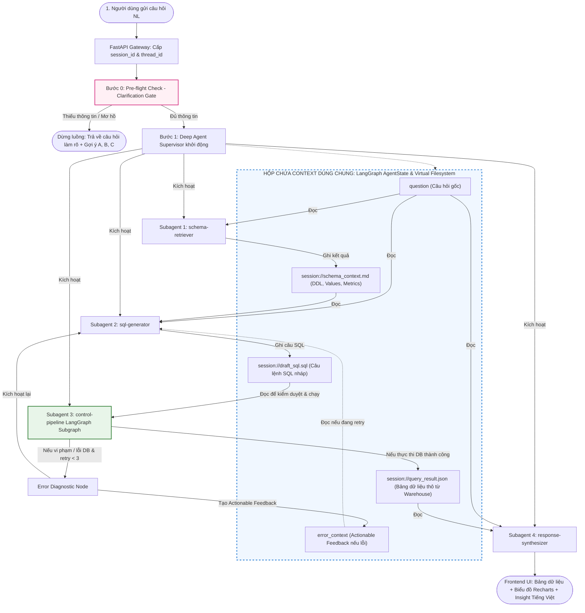

# Quy Trình Thực Thi End-to-End & Chia Sẻ Ngữ Cảnh (End-to-End Execution Flow)

Tài liệu này đặc tả chi tiết toàn bộ luồng xử lý truy vấn từ lúc người dùng gửi câu hỏi tự nhiên bằng tiếng Việt cho đến khi nhận được bảng dữ liệu, biểu đồ tương tác Recharts và diễn giải nghiệp vụ. Đồng thời giải thích cơ chế chia sẻ ngữ cảnh (Context Sharing) an toàn giữa các Subagents.

---

## 1. Sơ Đồ Tổng Thể Luồng Dữ Liệu (Architecture Diagram)

---

## 2. Chi Tiết Từng Bước Thực Thi (Step-by-Step Execution)

### Bước 0: Pre-flight Check — Lọc Câu Hỏi Mơ Hồ (Clarification Gatekeeper)
* **Thành phần**: Hàm `check_clarification_needed` trong `src/agents/clarification.py`.
* **Mô hình**: LLM Tier 2 (`gpt-4o-mini` / `gemini-2.5-flash`).
* **Input nhận vào**: Chuỗi câu hỏi tự nhiên của người dùng (`question`).
* **Logic xử lý**:
  1. *Fast-path*: Nếu câu hỏi rỗng hoặc chỉ có khoảng trắng, tự động bốc ngẫu nhiên 3 gợi ý từ Pool 10 câu hỏi chuẩn TPC-H trả về ngay (0 token LLM, 0ms).
  2. *Phân tích ý định (Intent Analysis)*: Nhận diện các câu hỏi quá chung chung, thiếu mốc thời gian, khu vực hoặc chỉ số đo lường (ví dụ: *"Doanh thu thế nào?"*).
* **Output & Lưu trữ**:
  - Lưu vào trường `AgentState["needs_clarification"]`.
  - **Nếu `needs_clarification = True`**: Dừng toàn bộ luồng ngay tại cổng. Trả về Frontend câu hỏi gợi ý và danh sách lựa chọn A, B, C.
  - **Nếu `needs_clarification = False`**: Mở cổng cho luồng chính và chuyển giao cho Supervisor.

---

### Bước 1: Schema & Entity Linking (Subagent: `schema-retriever`)
* **Thành phần**: SubAgent `schema-retriever` trong `src/agents/schema_retriever.py`.
* **Mô hình**: LLM Tier 2 (`mode: "isolated"`).
* **Công cụ đính kèm**: `search_tables_and_columns`, `search_categorical_values`.
* **Cách nhận Context**: Đọc câu hỏi gốc từ `AgentState["question"]`.
* **Logic xử lý**:
  - Chạy chu trình ReAct tự gọi tool:
    1. `search_tables_and_columns`: Tìm kiếm Top-k bảng liên quan trong 8 bảng TPC-H (ví dụ: `customer`, `orders`, `lineitem`).
    2. `search_categorical_values`: Tra cứu giá trị danh mục thực tế trong DB (ví dụ: "ô tô" $\rightarrow$ `c_mktsegment = 'AUTOMOBILE'`).
    3. Nạp công thức Semantic Metrics chuẩn: `Net Revenue = l_extendedprice * (1 - l_discount)`.
* **Output & Lưu trữ**:
  - Trả về Pydantic model `SchemaContextResult`.
  - Cập nhật vào `AgentState["schema_context"]`.
  - Ghi file ảo: `session://{thread_id}/schema_context.md`.

---

### Bước 2: Soạn Thảo Câu Lệnh SQL (Subagent: `sql-generator`)
* **Thành phần**: SubAgent `sql-generator` trong `src/agents/sql_generator.py`.
* **Mô hình**: LLM Tier 1 (`gpt-4o` / `claude-3-5-sonnet`) tối đa hóa độ chính xác Execution Accuracy (EX).
* **Công cụ đính kèm**: Không (`tools: []`) — Zero-tool pure reasoning.
* **Cách nhận Context**:
  - Đọc `question` từ `AgentState["question"]`.
  - Đọc `schema_context` từ file ảo `session://{thread_id}/schema_context.md`.
  - Đọc `error_context` từ `AgentState["error_context"]` (nếu đang ở chu kỳ retry $\ge 1$).
* **Logic xử lý**:
  - Áp dụng các quy tắc phương ngữ (Dialect Rules) của DuckDB (cú pháp ngày tháng `DATE '1995-01-01'`, hàm `INTERVAL`, công thức tính doanh thu thuần).
  - Sinh duy nhất câu lệnh `SELECT` SQL thuần túy, sạch sẽ, không bọc markdown fences.
* **Output & Lưu trữ**:
  - Trả về Pydantic model `SQLGenerationResult`.
  - Cập nhật vào `AgentState["draft_sql"]`.
  - Ghi file ảo: `session://{thread_id}/draft_sql.sql`.

---

### Bước 3: Kiểm Duyệt An Toàn & Thực Thi (CompiledSubAgent: `control-pipeline`)
* **Thành phần**: Subgraph LangGraph bất biến gồm 6 nodes trong `src/agents/control_pipeline/`.
* **Cách nhận Context**: Đọc trực tiếp câu lệnh SQL từ `AgentState["draft_sql"]`.
* **Logic xử lý**: Chạy tuần tự 6 node bằng **Python code thuần tất định**:
  1. **Node AST Sanitizer** (`sqlglot`): Bắt buộc root expression là `SELECT`. Chặn 100% các câu lệnh DDL/DML biến đổi dữ liệu (`INSERT`, `UPDATE`, `DELETE`, `DROP`). Tự động ép `LIMIT 1000` nếu thiếu.
  2. **Node RBAC Enforcer**: Kiểm tra quyền theo User Role (Role `Analyst` bị chặn các cột PII và tài chính `c_phone`, `c_acctbal`...).
  3. **Node Cost Guard**: Chạy dry-run ước tính dung lượng dữ liệu quét (bytes scanned). Chặn nếu vượt ngưỡng cấu hình.
  4. **Node HITL Approval**: Tạm dừng đồ thị qua cơ chế `interrupt()` nếu câu query có chi phí lớn, đẩy câu lệnh lên UI chờ người dùng bấm duyệt.
  5. **Node Warehouse Executor**: Thực thi an toàn trên DuckDB với timeout 30s.
  6. **Node Audit Logger**: Luôn luôn ghi log JSON có cấu trúc (Fail-Safe) lưu lịch sử truy vấn vào bảng audit.

#### Cơ chế Tự Sửa Lỗi (Bounded Self-Correction Loop $\le 3$ lần)
- **Nếu phát hiện lỗi (AST vi phạm, cấm RBAC, hoặc lỗi cú pháp DuckDB)**:
  1. Node `ERROR_DIAGNOSTIC_AGENT` (LLM Tier 2) được kích hoạt để phân tích nguyên nhân gốc rễ.
  2. Tạo ra đoạn hướng dẫn sửa lỗi có cấu trúc (`Actionable Feedback`).
  3. Nạp feedback vào `AgentState["error_context"]` và tăng `retry_count += 1`.
  4. Nếu `retry_count < 3`: Chuyển ngược lại **Bước 2 (`sql-generator`)** để mô hình tự sửa.
  5. Nếu `retry_count >= 3`: Dừng luồng, kích hoạt Graceful Failure thông báo thân thiện cho người dùng.
- **Nếu thực thi THÀNH CÔNG**:
  - Cập nhật kết quả vào `AgentState["query_result"]`: `{"data": [...], "columns": [...], "execution_time_ms": ..., "bytes_scanned": ...}`.
  - Ghi file ảo: `session://{thread_id}/query_result.json`.

---

### Bước 4: Trực Quan Hóa & Viết Insight (Subagent: `response-synthesizer`)
* **Thành phần**: SubAgent `response-synthesizer` trong `src/agents/synthesizer.py`.
* **Mô hình**: LLM Tier 2 (`gpt-4o-mini` / `gemini-2.5-flash`).
* **Công cụ đính kèm**: Không (`tools: []`).
* **Cách nhận Context**:
  - Đọc `question` từ `AgentState["question"]`.
  - Đọc `data` và `columns` từ `AgentState["query_result"]` (hoặc file `session://{thread_id}/query_result.json`).
* **Logic xử lý**:
  - *Fast-path dữ liệu rỗng*: Nếu `data = []`, trả về cấu hình bảng mặc định kèm lời nhắn không có dữ liệu (0 token LLM, 0ms).
  - *Phân tích hình thái dữ liệu (Data Shape)*:
    - Dữ liệu thời gian $\rightarrow$ đề xuất `line` hoặc `area`.
    - Phân bố danh mục $\le 7$ nhóm hoặc Ranking Top-N $\rightarrow$ đề xuất `bar` hoặc `pie`.
    - Dữ liệu đa chiều phức tạp $\rightarrow$ đề xuất `table`.
  - *Tạo cấu hình Recharts*: Trích xuất `x_key`, `y_keys`, `series_labels`, `title`.
  - *Diễn giải nghiệp vụ (Business Insight)*: Viết 2-3 câu tiếng Việt súc tích, nêu bật các con số chủ chốt, xu hướng hoặc đối tượng dẫn đầu.
* **Output & Lưu trữ**:
  - Cập nhật vào `AgentState["response_insight"]` và `AgentState["visualization_config"]`.
  - Trả về payload hoàn chỉnh cho FastAPI Gateway hiển thị lên UI người dùng.

---

## 3. Ma Trận Chia Sẻ Ngữ Cảnh Giữa Các Subagents

| Subagent / Node | Đọc Context từ đâu? (Input) | Cơ chế truyền nhận | Ghi Context vào đâu? (Output) |
|---|---|---|---|
| **Clarification Gate** | `user_query` | Tham số gọi API | `AgentState["needs_clarification"]` |
| **`schema-retriever`** | `AgentState["question"]` | Prompt Injection | `session://schema_context.md` `AgentState["schema_context"]` |
| **`sql-generator`** | `AgentState["question"]` `session://schema_context.md` `AgentState["error_context"]` | Prompt Template + File Pointer | `session://draft_sql.sql` `AgentState["draft_sql"]` |
| **`control-pipeline`** | `session://draft_sql.sql` `user_context` (Role) | Deterministic State Dispatcher | `session://query_result.json` `AgentState["query_result"]` |
| **`response-synthesizer`** | `AgentState["question"]` `session://query_result.json` | Deterministic Template / File Pointer | `AgentState["response_insight"]` `AgentState["visualization_config"]` |

---

## 4. Ba Nguyên Tắc Bảo Đảm Tính Toàn Vẹn Ngữ Cảnh

1. **Không để LLM "chép phạt" dữ liệu (Tránh Hallucination & Data Loss)**:
   - Các Subagent không bao giờ giao tiếp thông qua việc để một con LLM khác tóm tắt lại kết quả. Dữ liệu bảng từ database được giữ nguyên cấu trúc Python / JSON thô và chuyển thẳng qua State hoặc Virtual Filesystem.
2. **Cô lập ngữ cảnh tuyệt đối (Context Quarantine - `mode: "isolated"`)**:
   - Mỗi Subagent chỉ nhận đúng phần context tối thiểu nó cần để làm việc:
     - `sql-generator` không cần biết database đã chạy những query gì trước đó.
     - `response-synthesizer` không cần quan tâm đến lỗi AST hay câu SQL được viết như thế nào, chỉ nhìn vào bảng số liệu cuối cùng.
   - Giúp context window luôn gọn gàng, giảm 70% chi phí token và tránh hiện tượng mô hình bị phân tâm.
3. **An toàn đa người dùng (Multi-tenant Session Isolation)**:
   - Mọi khóa trong State và mọi file trên Virtual Filesystem đều được tiền tố hóa bằng `session_id` và `thread_id` (ví dụ: `session://thread_abc123/draft_sql.sql`).
   - Hai người dùng gửi câu hỏi cùng một thời điểm hoàn toàn không thể đọc hoặc ghi đè context của nhau.
