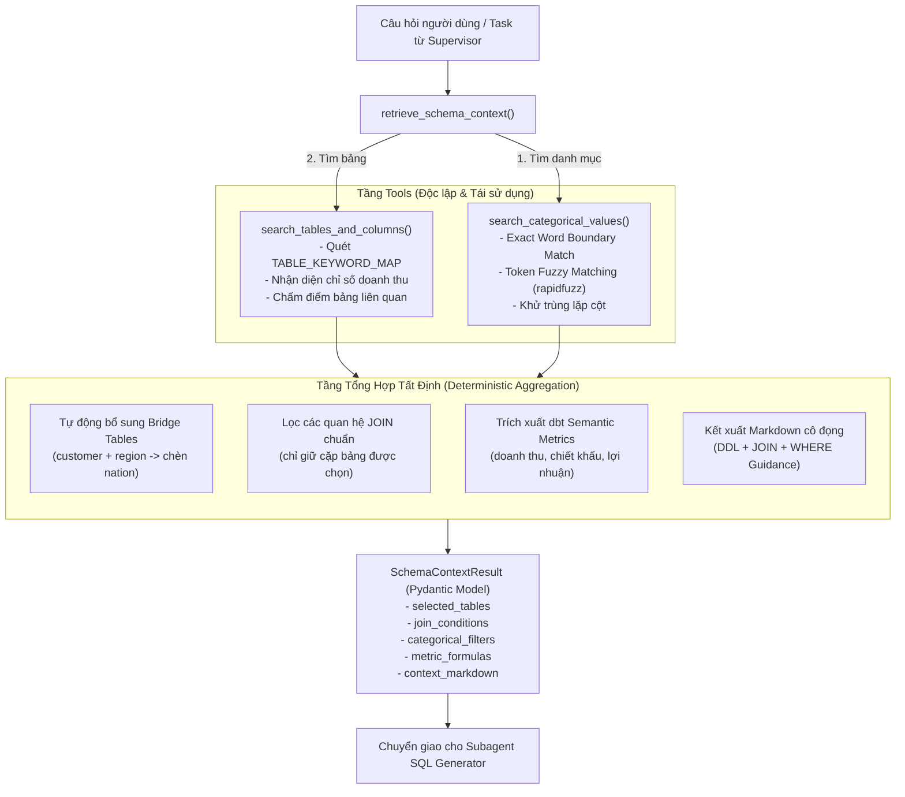

# Giải Thích Chi Tiết Các Function Trong Subagent Schema & Value Retriever

> **File cài đặt**: `src/agents/schema_retriever.py`  
> **Component**: 2.3 trong [agent-components-breakdown.md](file:///c:/text2sql-agent/docs/agent/agent-components-breakdown.md)  
> **Kiến trúc liên quan**: [agent-architecture-v3.md](file:///c:/text2sql-agent/docs/agent/agent-architecture-v3.md)  
> **Mục tiêu**: Làm rõ vai trò, logic thuật toán nội bộ, tham số vào/ra (I/O) và cách thức phối hợp giữa 3 hàm cốt lõi: `search_tables_and_columns`, `search_categorical_values` và `retrieve_schema_context`.

---

## 1. Sơ Đồ Phối Hợp Giữa Các Functions

Subagent **Schema & Value Retriever** giải quyết bài toán: Chuyển đổi câu hỏi ngôn ngữ tự nhiên thành một ngữ cảnh lược đồ dữ liệu tối giản nhưng đầy đủ (Schema Linking + Categorical Linking + Bridge Tables + dbt Metrics).



---

## 2. Chi Tiết Từng Function

---

### Function 1: `search_tables_and_columns`

```python
def search_tables_and_columns(query: str, top_k: int = 5) -> list[dict[str, Any]]:
```

#### 1. Mục đích & Vai trò
- Là **Tool chuyên biệt** được đăng ký cho Subagent, có nhiệm vụ xác định Top các bảng TPC-H thực sự liên quan đến câu hỏi của người dùng.
- Tránh hiện tượng **Context Bloat** (nạp bừa bãi toàn bộ 8 bảng TPC-H vào prompt làm LLM bị phân tâm và tốn token).

#### 2. Tham số Đầu vào (Input)
- `query` (`str`): Câu hỏi ngôn ngữ tự nhiên hoặc từ khóa cần tra cứu.
- `top_k` (`int`, mặc định = 5): Số lượng bảng tối đa cần trích xuất.

#### 3. Thuật toán Xử lý
1. **Chuẩn hóa chuỗi**: Chuyển `query` về dạng chữ thường (`query.lower()`).
2. **Chấm điểm bảng dựa trên từ điển (`TABLE_KEYWORD_MAP`)**:
   - Quét qua từ điển từ đồng nghĩa tiếng Việt/tiếng Anh trong `src/utils/table_keywords.py`.
   - Nếu từ khóa đồng nghĩa xuất hiện trong query $\rightarrow$ **+2 điểm** (ví dụ: *"khách hàng"*, *"đơn hàng"*, *"linh kiện"*).
   - Nếu tên bảng tiếng Anh xuất hiện trực tiếp trong query $\rightarrow$ **+3 điểm** (ví dụ: *"orders"*, *"customer"*).
3. **Ưu tiên bảng chứa chỉ số kinh doanh**:
   - Nếu query chứa các từ khóa: `"doanh thu"`, `"doanh so"`, `"revenue"`, `"lợi nhuận"`, `"chiết khấu"` $\rightarrow$ Tự động cộng **+4 điểm** cho bảng `lineitem` và **+3 điểm** cho bảng `orders`.
4. **Xếp hạng & Cắt Top-k**: Sắp xếp các bảng có điểm $> 0$ giảm dần và lấy `top_k` bảng có điểm cao nhất.
5. **Cơ chế Fallback**: Nếu câu hỏi quá trừu tượng không khớp từ khóa nào (điểm = 0) $\rightarrow$ Fallback trả về 5 bảng cốt lõi: `["orders", "customer", "lineitem", "part", "supplier"]`.

#### 4. Dữ liệu Đầu ra (Output)
Trả về danh sách các `dict` gồm:
```python
[
    {
        "table": "customer",
        "relevance_score": 5,
        "schema_ddl": "CREATE TABLE customer (\n    c_custkey INTEGER PRIMARY KEY,\n    ...",
    },
    ...,
]
```

---

### Function 2: `search_categorical_values`

```python
def search_categorical_values(
    query: str, min_score: float = 65.0, top_k: int = 5
) -> list[dict[str, Any]]:
```

#### 1. Mục đích & Vai trò
- Là **Tool chuyên biệt** giải quyết bài toán **Entity / Value Linking**: Người dùng thường đặt câu hỏi bằng ngôn ngữ tự nhiên đời thường, nhưng cơ sở dữ liệu lại lưu trữ dưới dạng mã phân loại chuẩn hóa.
  - *Ví dụ*: Người dùng hỏi *"ngành ô tô tại châu á"*, DB lưu `c_mktsegment = 'AUTOMOBILE'` và `r_name = 'ASIA'`.
- Giúp LLM sinh mệnh đề `WHERE` chính xác 100%, không bịa đặt hoặc dịch sai tên giá trị.

#### 2. Tham số Đầu vào (Input)
- `query` (`str`): Câu hỏi hoặc cụm từ tìm kiếm của người dùng.
- `min_score` (`float`, mặc định = 65.0): Ngưỡng điểm tương đồng tối thiểu (0-100).
- `top_k` (`int`, mặc định = 5): Số lượng giá trị phân loại tối đa cần trả về.

#### 3. Thuật toán Xử lý
Hàm bọc (wrapper) hàm `find_matching_categorical_values` từ `src.utils.categorical_search`:
1. **Bước 1 — Exact Match theo Word Boundary**:
   - Dùng Regex `rf"(?:\b|^){re.escape(alias)}(?:\b|$)"` để tìm kiếm chính xác từng từ/cụm từ đồng nghĩa.
   - Nếu khớp $\rightarrow$ Gán điểm tuyệt đối `100.0` và đánh dấu `exact_match = True`.
2. **Bước 2 — Token Fuzzy Match (`token_set_ratio`)**:
   - Áp dụng cho các trường hợp gõ sai hoặc biến thể từ ngữ.
   - Bỏ qua các alias quá ngắn ($< 4$ ký tự như *"nga"*, *"car"*) để tránh false positive.
   - Nếu cột đó đã có kết quả Exact Match ở Bước 1 $\rightarrow$ Bỏ qua bước fuzzy cho cùng cột để tránh trùng lặp/ghi đè.
3. **Đóng gói kết quả**: Chuyển đổi các đối tượng `CategoricalMatch` thành danh sách `dict` sạch cho Agent.

#### 4. Dữ liệu Đầu ra (Output)
```python
[
    {
        "table": "customer",
        "column": "c_mktsegment",
        "value": "AUTOMOBILE",
        "query_keyword": "ngành ô tô",
        "similarity_score": 100.0,
        "exact_match": True,
    },
    {
        "table": "region",
        "column": "r_name",
        "value": "ASIA",
        "query_keyword": "châu á",
        "similarity_score": 100.0,
        "exact_match": True,
    },
]
```

---

### Function 3: `retrieve_schema_context`

```python
def retrieve_schema_context(
    question: str, selected_tables: list[str] | None = None
) -> SchemaContextResult:
```

#### 1. Mục đích & Vai trò
- Là **Hàm tổng hợp trung tâm (Aggregator / Core Pipeline)** của Subagent.
- Điều phối toàn bộ quy trình: từ tra cứu bảng, tìm danh mục, bảo đảm tính toàn vẹn quan hệ JOIN (Bridge Tables), đến trích xuất công thức dbt metrics và định dạng chuỗi Markdown hoàn chỉnh.
- Có thể được gọi qua tool trong SubAgent hoặc chạy trực tiếp như một hàm Python tất định (Zero LLM token khi chạy độc lập).

#### 2. Tham số Đầu vào (Input)
- `question` (`str`): Câu hỏi người dùng bằng ngôn ngữ tự nhiên.
- `selected_tables` (`list[str] | None`): Tùy chọn chỉ định sẵn danh sách bảng cần dùng. Nếu truyền vào, hàm sẽ bỏ qua bước tự đoán bảng bằng từ khóa.

#### 3. Luồng Xử Lý 5 Bước Tuần Tự

```
[Câu hỏi] ──► (1) Categorical Search ──► cat_filters
          ──► (2) Table Search + Bridge Tables Insertion ──► tables_to_use
          ──► (3) Extract Relevant Foreign Key Joins ────► relevant_joins
          ──► (4) Extract dbt Semantic Metrics Formulas ──► metric_formulas
          ──► (5) Render Markdown Schema Context ────────► context_markdown
          ──► SchemaContextResult (Pydantic Model)
```

##### Bước 1: Tra cứu danh mục phân loại thực tế
- Gọi `find_matching_categorical_values(question, top_k=5, min_score=65.0)`.
- Lọc giữ lại giá trị có độ ưu tiên cao nhất cho mỗi cột vào `cat_filters`:
  `{"c_mktsegment": "AUTOMOBILE", "r_name": "ASIA"}`.

##### Bước 2: Xác định danh sách bảng & Bổ sung Bảng cầu nối (Bridge Tables)
- Lấy danh sách bảng từ `search_tables_and_columns`.
- Bổ sung bảng chứa các cột danh mục tìm được ở Bước 1.
- **Bảo đảm toàn vẹn quan hệ JOIN (Quy tắc Bridge Table TPC-H)**:
  - Nếu có `customer` và `region`, bắt buộc phải chèn thêm bảng `nation` (vì `customer` chỉ liên kết với `nation`, sau đó `nation` mới liên kết với `region`).
  - Nếu có `supplier` và `region`, bắt buộc phải chèn thêm `nation`.
  - Nếu có `customer` và `lineitem`, bắt buộc phải chèn thêm `orders` (`customer -> orders -> lineitem`).

##### Bước 3: Trích xuất các điều kiện JOIN chuẩn
- Quét qua danh sách `TPCH_JOIN_RELATIONSHIPS`.
- Chỉ chọn ra các điều kiện JOIN mà **cả 2 bảng** (`from_table` và `to_table`) đều nằm trong tập hợp `tables_to_use`.
- Ví dụ: `["orders.o_custkey = customer.c_custkey", "customer.c_nationkey = nation.n_nationkey", "nation.n_regionkey = region.r_regionkey"]`.

##### Bước 4: Trích xuất công thức chỉ số nghiệp vụ (dbt Semantic Metrics)
- Quét qua `TPCH_SEMANTIC_METRICS`.
- Nếu bảng yêu cầu của metric có mặt trong `tables_to_use`, thêm công thức vào `metric_formulas`:
  `"Doanh thu thực tế (Net Revenue): SUM(l_extendedprice * (1 - l_discount))"`.

##### Bước 5: Kết xuất chuỗi Markdown hoàn chỉnh
- Gọi `render_schema_context(tables_to_use)` sinh DDL + JOIN + Metrics.
- Gọi `format_categorical_context(categorical_matches)` sinh hướng dẫn mệnh đề `WHERE`.
- Nối hai chuỗi lại thành `context_markdown`.

#### 4. Dữ liệu Đầu ra (Output)
Trả về đối tượng Pydantic **`SchemaContextResult`**:
```python
SchemaContextResult(
    selected_tables=["customer", "orders", "lineitem", "nation", "region"],
    join_conditions=[
        "orders.o_custkey = customer.c_custkey",
        "lineitem.l_orderkey = orders.o_orderkey",
        "customer.c_nationkey = nation.n_nationkey",
        "nation.n_regionkey = region.r_regionkey",
    ],
    categorical_filters={
        "c_mktsegment": "AUTOMOBILE",
        "r_name": "ASIA",
    },
    metric_formulas=[
        "Doanh thu thực tế (Net Revenue): SUM(l_extendedprice * (1 - l_discount))"
    ],
    context_markdown="### NGỮ CẢNH LƯỢC ĐỒ CƠ SỞ DỮ LIỆU (TPC-H SCHEMA)...\n...",
)
```

---

## 3. Cấu Hình SubAgent Chuẩn DeepAgents

Được khởi tạo thông qua hàm `get_schema_retriever_subagent()`:

```python
def get_schema_retriever_subagent(model: str | None = None) -> dict[str, Any]:
    settings = get_settings()
    active_model = model or settings.tier2_model

    return {
        "name": "schema-retriever",
        "description": "Chuyên tra cứu lược đồ cơ sở dữ liệu TPC-H (bảng, cột, quan hệ JOIN)...",
        "system_prompt": SCHEMA_RETRIEVER_SYSTEM_PROMPT,
        "mode": "isolated",
        "tools": [search_tables_and_columns, search_categorical_values],
        "model": active_model,  # Tier 2: gpt-4o-mini
        "response_format": SchemaContextResult,  # Cấu trúc đầu ra chuẩn Pydantic
    }
```

- **`mode: "isolated"` (Context Quarantine)**: Đảm bảo toàn bộ quá trình tìm kiếm, so khớp từ khóa và dữ liệu thô trung gian được giữ kín trong subagent, không làm ô nhiễm context của Deep Agent Supervisor.
- **Model Tier 2**: Tối ưu chi phí và tốc độ phản hồi $(< 1\text{s})$.
- **`response_format`**: Ép LLM trả về đúng schema Pydantic `SchemaContextResult`.

---

## 4. Bảng So Sánh 3 Functions

| Tiêu chí | `search_tables_and_columns` | `search_categorical_values` | `retrieve_schema_context` |
|---|---|---|---|
| **Bản chất** | Tool tìm kiếm bảng | Tool tìm kiếm danh mục | Hàm tổng hợp trung tâm (Aggregator) |
| **Phạm vi tác vụ** | Schema Linking | Entity / Value Linking | Toàn diện (Schema + Value + Join + Metric) |
| **Cơ chế chính** | Đối chiếu `TABLE_KEYWORD_MAP` | Exact Regex + Token Fuzzy Match | Ghép nối tất định + Logic Bridge Tables |
| **Được dùng ở đâu** | Cấp cho LLM trong SubAgent tools | Cấp cho LLM trong SubAgent tools | Supervisor gọi hoặc test độc lập |
| **Kiểu trả về** | `list[dict]` (bảng, DDL, score) | `list[dict]` (cột, giá trị DB, score) | `SchemaContextResult` (Pydantic Model) |
