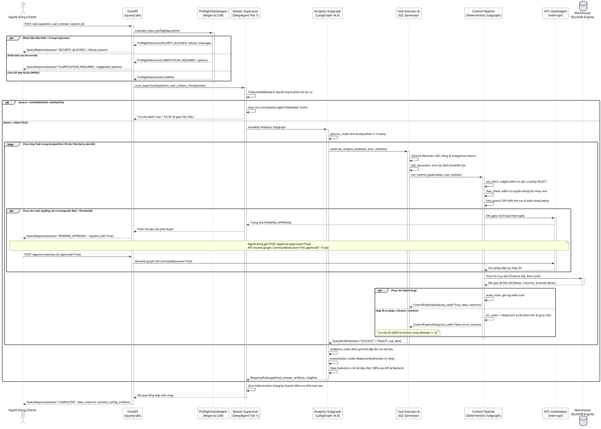

# Báo Cáo Kiến Trúc Hệ Thống & Luồng Hoạt Động Agent (v4.0)

> **Tuyên bố phương pháp**: Tài liệu và các sơ đồ trực quan dưới đây được trích xuất và phân tích **100% từ mã nguồn thực tế** của repository (không sử dụng hay đối chiếu với các tệp thiết kế tài liệu cũ trong thư mục `docs/`).  
> Định dạng trực quan tuân thủ tuyệt đối quy chuẩn **`/documd-visuals`** (Bare HTML/CSS Layouts và PlantUML Fences theo bảng màu Slate Theme).

---

## 1. SƠ ĐỒ KIẾN TRÚC TỔNG THỂ (AGENT ARCHITECTURE BLUEPRINT)

Hệ thống được thiết kế theo mô hình **Hybrid Architecture**: kết hợp tầng suy luận tác tử phân cấp ([`deepagents`](file:///d:/Text2SQL-AI-Agent/src/agents/supervisor.py)) với đường ống kiểm soát an toàn tất định ([`LangGraph`](file:///d:/Text2SQL-AI-Agent/src/agents/control_pipeline/builder.py)).

  
  <section class="arch-cs">
    <h1 class="arch-cs-title">Text2SQL AI Agent: Hệ Thống Kiến Trúc Thực Tế (v4.0)</h1>
    
Kiến trúc đa tầng kết hợp suy luận tác tử (DeepAgents) và đường ống kiểm soát tất định (LangGraph)

    

      <aside class="arch-cs-wing">
        
An ninh &amp; Vận hành (Cross-Cutting)

        

          
Ngữ cảnh &amp; Quyền hạn

          

            
UserContext (RBAC)

            
Thread / Session ID

          

        

        

          
Bộ nhớ &amp; Trạng thái

          

            
MemorySaver Checkpointer

            
StateBackend Virtual FS

          

        

        

          
Quan sát &amp; Ghi vết

          

            
SessionTracer (Artifacts)

            
AuditLogger (JSON Logs)

          

        

      </aside>
      

        

          

            Tầng 1: Interface &amp; API Layer
            Cổng giao tiếp FastAPI &amp; Frontend
          

          

            
POST /api/v1/query/ask<small>Tiếp nhận truy vấn tự nhiên</small>

            
POST /api/v1/query/approve<small>Phê duyệt HITL (Command Resume)</small>

            
GET /api/v1/query/history<small>Tra cứu Session Trace &amp; Artifacts</small>

          

        

        

          

            Tầng 2: Pre-Flight Gatekeeper Engine
            Chốt chặn an toàn 2 tầng &amp; Fast-Path Clarification
          

          

            
Tier 1: Regex Guardrails<small>&lt;0.1ms, chặn DDL/DML &amp; Injection</small>

            
Tier 2: Unified LLM Guard<small>Đánh giá mơ hồ &amp; ngoài miền TPC-H</small>

            
Decision Router<small>ALLOWED | CLARIFICATION | BLOCKED</small>

          

        

        

          

            Tầng 3: Master Deep Agent Supervisor
            Điều phối tối cao (Pure Orchestration via deepagents)
          

          

            
Tier 1 Reasoning LLM<small>OpenAI / Gemini 2.5 Pro</small>

            
TodoListMiddleware<small>Lập kế hoạch động (write_todos)</small>

            
Context &amp; Loop Guard<small>ToolCallLimit &amp; Summarization</small>

          

          

            
Subagent: consultation-agent<small>Giao tiếp xã giao &amp; tra cứu danh mục TPC-H (No SQL)</small>

            
Subagent: analytics-subagent<small>CompiledSubAgent đóng gói Analytics LangGraph Subgraph</small>

          

        

        

          

            Tầng 4: Analytics LangGraph Subgraph (v4.0)
            Quy trình phân tích dữ liệu đa nhiệm &amp; Đóng gói phản hồi
          

          

            
planner_node<small>Sinh AnalysisPlan (1-3 tasks)</small>

            
executor_node<small>Schema + SQLGen + Control Pipeline</small>

            
evidence_node<small>Evidence Analyzer &amp; Drill-down</small>

            
presentation_node<small>ResponseSynthesizer + Data Hydration</small>

          

        

        

          

            Tầng 5: Deterministic Control Pipeline Subgraph
            Hàng rào an ninh tất định &amp; Tự chẩn đoán lỗi
          

          

            
ast_check<small>sqlglot SELECT only</small>

            
rbac_check<small>Bảo vệ cột nhạy cảm</small>

            
cost_guard<small>Dry-run &amp; Quét dung lượng</small>

            
hitl_gate<small>interrupt() chờ duyệt</small>

            
execute<small>Warehouse limit/timeout</small>

          

          

            
err_node &amp; diagnostic<small>LLM phân tích nguyên nhân lỗi &amp; gợi ý sửa</small>

            
audit_node<small>Ghi log kiểm toán toàn diện trước khi END</small>

          

        

        

          

            Tầng 6: Data &amp; Warehouse Layer
            Cơ sở dữ liệu TPC-H Benchmark
          

          

            
DuckDB Engine<small>OLAP In-Memory / Local DB</small>

            
8 Bảng TPC-H<small>CUSTOMER, ORDERS, LINEITEM...</small>

            
dbt Semantic Layer<small>Công thức Metrics chuẩn</small>

            
Vector/Keyword Index<small>Tra cứu Categorical Values</small>

          

        

      

      <aside class="arch-cs-wing">
        
Kỹ Năng &amp; Tri Thức (Domain Knowledge)

        

          
Kỹ năng DeepAgents

          

            
skills/tpch-analytics

            
skills/duckdb-sql

            
skills/analytics-orchestrator

          

        

        

          
Quy chuẩn Vận hành

          

            
AGENTS.md Memory

            
DuckDB Dialect Rules

          

        

        

          
Metadata Tools

          

            
search_tables_and_columns

            
get_column_samples_and_values

            
find_join_path (BFS)

            
search_business_definition

          

        

      </aside>
    

    
Cấu trúc thực tế bóc tách từ mã nguồn: Hai cánh hỗ trợ kéo dài bao bọc toàn bộ chu trình xử lý của tác tử.

  </section>

---

## 2. LUỒNG TIẾN TRÌNH END-TO-END (PIPELINE STAGES FLOW)

Toàn bộ quá trình từ khi tiếp nhận câu hỏi của người dùng cho đến khi trả về kết quả số liệu, biểu đồ Recharts và bài phân tích trải qua 5 giai đoạn nghiêm ngặt:

  
  <section class="arch-pipe">
    <h1 class="arch-pipe-title">Luồng Hoạt Động Xử Lý Truy Vấn End-to-End</h1>
    
Tiến trình 5 giai đoạn từ lúc gửi câu hỏi đến khi nhận bảng dữ liệu và biểu đồ trực quan

    

      
Đầu vào 1: Câu hỏi phân tích (NL Question)

      
Đầu vào 2: User Context (ID, Role, Session ID)

      
Đầu vào 3: HITL Decision (Approved / Rejected)

    

    

      

        
1Pre-Flight

        
Tier 1 Regex Guard<small>&lt;0.1ms, chặn DDL/DML</small>

        
Tier 2 LLM Guard<small>Kiểm tra mơ hồ / ngoài miền</small>

        
Chặn vi phạm<small>SECURITY_BLOCKED</small>

        
Fast-Path làm rõ<small>CLARIFICATION_REQUIRED</small>

      

      
→

      

        
2Supervisor

        
Context Isolation<small>Tracer &amp; StateBackend</small>

        
TodoList Planning<small>Phân bổ tác vụ động</small>

        
Consultation Agent<small>Xã giao / tra cứu metadata</small>

        
Delegate Analytics<small>Gọi analytics-subagent</small>

      

      
→

      

        
3Analytics Subgraph

        
Planner Node<small>Sinh AnalysisPlan (1-3 tasks)</small>

        
Schema &amp; Categorical<small>Top-k tables &amp; values</small>

        
SQL Generator<small>DuckDB dialect + 4 tools</small>

        
Self-Correction<small>Vòng lặp sửa lỗi ≤ 3 lần</small>

      

      
→

      

        
4Control Pipeline

        
AST Sanitizer<small>sqlglot SELECT only</small>

        
RBAC Policy<small>Kiểm soát quyền truy cập</small>

        
Cost &amp; Risk Guard<small>Dry-run &amp; Cartesian check</small>

        
HITL Gatekeeper<small>interrupt() PENDING_APPROVAL</small>

        
Warehouse Executor<small>Timeout 30s &amp; Limit 5000</small>

      

      
→

      

        
5Synthesis &amp; Serve

        
Evidence Analyzer<small>Đánh giá đủ dữ liệu / Drill-down</small>

        
Response Synthesizer<small>Nhịp 1: Direct answer &amp; Specs</small>

        
Data Hydrator<small>Nhịp 2: Rót data thật 100%</small>

        
Final Response<small>KPI, Recharts, Data Table, SQL</small>

      

    

    

      
<b>&lt; 0.1 ms</b>Tier 1 Regex Latency

      
<b>Tối đa 3 lần</b>Self-Correction Retry

      
<b>100% Thực tế</b>Data Hydration Accuracy

      
<b>SELECT Only</b>Cấm tuyệt đối DDL/DML

    

    
Các ô nét đứt màu đỏ là các lối thoát rẽ nhánh an toàn (Chặn an ninh, Fast-Path yêu cầu làm rõ, hoặc Tạm dừng chờ duyệt HITL).

  </section>

---

## 3. BIỂU ĐỒ TUẦN TỰ TƯƠNG TÁC (PLANTUML SEQUENCE FLOW)

---

## 4. BẢNG ĐỐI CHIẾU MÃ NGUỒN CÁC MODULE CHỦ CHỐT

| Thành phần | Đường dẫn mã nguồn | Trách nhiệm chính |
|---|---|---|
| **API Endpoints** | [`src/api/routes/query.py`](file:///d:/Text2SQL-AI-Agent/src/api/routes/query.py) | Xử lý `/ask`, `/approve` (resume checkpoint), `/history` |
| **Preflight Gatekeeper** | [`src/agents/preflight_gatekeeper.py`](file:///d:/Text2SQL-AI-Agent/src/agents/preflight_gatekeeper.py) | Phòng thủ 2 tầng: Regex (<0.1ms) + Tier 2 LLM đánh giá mơ hồ |
| **Regex Guardrails** | [`src/agents/guardrails/regex_guard.py`](file:///d:/Text2SQL-AI-Agent/src/agents/guardrails/regex_guard.py) | Chặn DDL/DML, prompt injection thô thiển |
| **Master Supervisor** | [`src/agents/supervisor.py`](file:///d:/Text2SQL-AI-Agent/src/agents/supervisor.py) | DeepAgent Tier 1 điều phối, TodoListMiddleware, Zero-Hallucination Guard |
| **Consultation Subagent** | [`src/agents/consultation.py`](file:///d:/Text2SQL-AI-Agent/src/agents/consultation.py) | Giao tiếp xã giao & giải thích metadata TPC-H không chạy SQL |
| **Analytics Subagent** | [`src/agents/analytics/graph.py`](file:///d:/Text2SQL-AI-Agent/src/agents/analytics/graph.py) | LangGraph Subgraph điều phối quy trình phân tích đa nhiệm |
| **Analysis Planner** | [`src/agents/analytics/planner.py`](file:///d:/Text2SQL-AI-Agent/src/agents/analytics/planner.py) | Sinh kế hoạch `AnalysisPlan` (1 - 3 nhiệm vụ) |
| **Task Executor** | [`src/agents/analytics/task_executor.py`](file:///d:/Text2SQL-AI-Agent/src/agents/analytics/task_executor.py) | Thực thi task với vòng lặp Self-Correction (tối đa 3 lần) |
| **Evidence Analyzer** | [`src/agents/analytics/evidence_analyzer.py`](file:///d:/Text2SQL-AI-Agent/src/agents/analytics/evidence_analyzer.py) | Đánh giá tính đầy đủ của dữ liệu thu thập & kích hoạt drill-down |
| **Response Synthesizer** | [`src/agents/analytics/response_synthesizer.py`](file:///d:/Text2SQL-AI-Agent/src/agents/analytics/response_synthesizer.py) | Tổng hợp phản hồi 2 nhịp & Data Hydration 100% dữ liệu thực |
| **Control Pipeline** | [`src/agents/control_pipeline/builder.py`](file:///d:/Text2SQL-AI-Agent/src/agents/control_pipeline/builder.py) | Đồ thị LangGraph an ninh: AST, RBAC, Cost, HITL, Execute, Audit |
| **HITL Risk Evaluator** | [`src/agents/control_pipeline/hitl_evaluator.py`](file:///d:/Text2SQL-AI-Agent/src/agents/control_pipeline/hitl_evaluator.py) | Chấm điểm rủi ro (Cartesian join, quét bảng lớn không partition) |
| **Error Diagnostic** | [`src/agents/control_pipeline/diagnostic.py`](file:///d:/Text2SQL-AI-Agent/src/agents/control_pipeline/diagnostic.py) | LLM phân tích nguyên nhân gốc của lỗi và sinh `suggested_fix` |
| **Warehouse Connector** | [`src/utils/db_connector.py`](file:///d:/Text2SQL-AI-Agent/src/utils/db_connector.py) | DuckDB In-Memory / OLAP Warehouse Adapter (Timeout, Row limits) |
| **Session Tracer** | [`src/utils/session_tracer.py`](file:///d:/Text2SQL-AI-Agent/src/utils/session_tracer.py) | Ghi vết artifact đa phiên độc lập trên virtual filesystem |
| **Audit Logger** | [`src/utils/audit_logger.py`](file:///d:/Text2SQL-AI-Agent/src/utils/audit_logger.py) | Ghi log JSON có cấu trúc phục vụ tuân thủ và audit |
