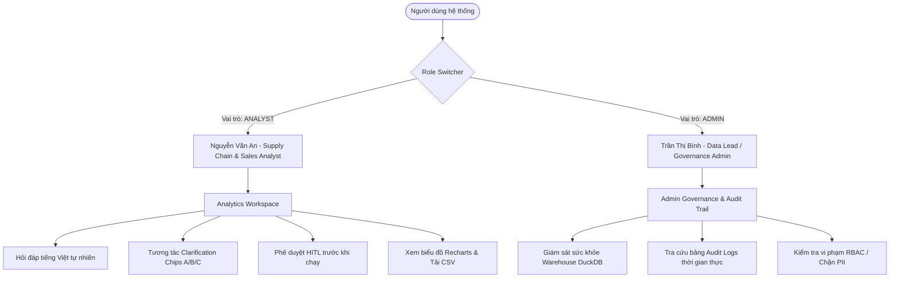
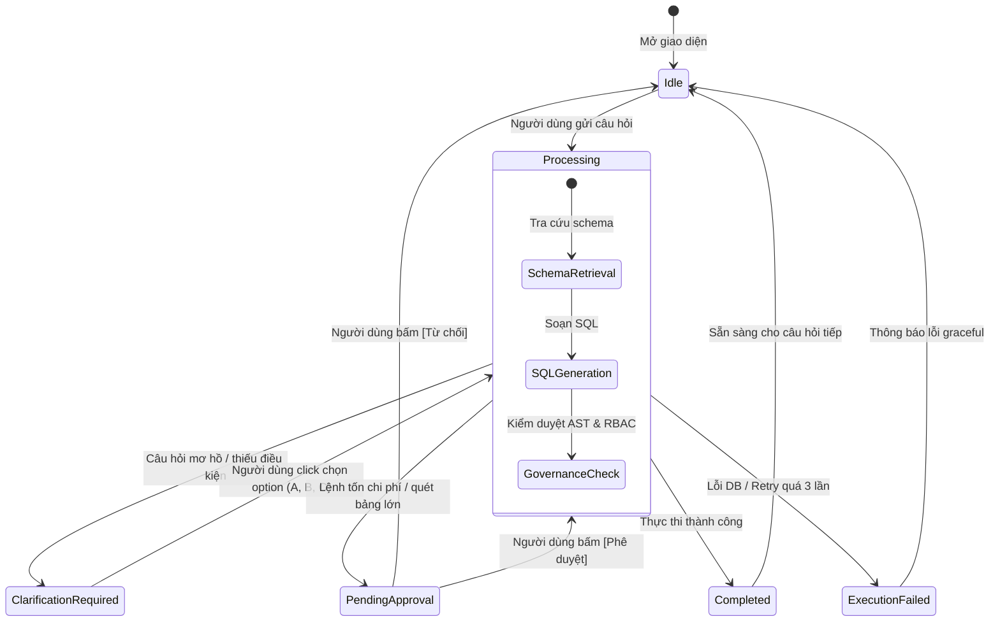

# FRONTEND_DESIGN.md — Thiết Kế Kiến Trúc Giao Diện & Trải Nghiệm Người Dùng (Frontend UI/UX & Conversational BI)

> **Tài liệu tham chiếu**:
> - Đề tài & Yêu cầu chấm điểm: [`docs/DETAI.md`](file:///d:/Text2SQL-AI-Agent/docs/DETAI.md)
> - Đặc tả yêu cầu sản phẩm: [`docs/PRD.md`](file:///d:/Text2SQL-AI-Agent/docs/PRD.md)
> - Thiết kế hệ thống 3 tầng: [`docs/ARCHITECTURE.md`](file:///d:/Text2SQL-AI-Agent/docs/ARCHITECTURE.md)
> - Đặc tả Gateway API: [`docs/agent/component-5.1-fastapi-specification.md`](file:///d:/Text2SQL-AI-Agent/docs/agent/component-5.1-fastapi-specification.md)
> - Quy ước kỹ thuật AI Agent: [`AGENTS.md`](file:///d:/Text2SQL-AI-Agent/AGENTS.md)

---

## 1. TỔNG QUAN & TRIẾT LÝ THIẾT KẾ (DESIGN PHILOSOPHY)

### 1.1. Bối cảnh & Mục tiêu
Hệ thống **AI Agent Text-to-SQL Self-Service Analytics** hướng tới việc giải phóng nhân viên nghiệp vụ (Kinh doanh, Mua hàng, Quản lý kho, Chuỗi cung ứng) khỏi sự phụ thuộc vào đội Data Engineer khi cần số liệu báo cáo trên kho dữ liệu chuẩn **TPC-H Benchmark (8 bảng)**.

Thay vì phải gửi ticket chờ từ 2 đến 5 ngày, người dùng có thể đặt câu hỏi tự nhiên bằng tiếng Việt và nhận về kết quả trong vòng chưa đầy 30 giây.

### 1.2. Triết lý Thiết kế: "Conversational BI & Self-Service Analytics Workspace"
Giao diện không thể chỉ là một khung trò chuyện dạng text đơn giản (như ChatGPT thông thường), mà phải là một **Nền tảng Tự phục vụ Dữ liệu Doanh nghiệp Hiện đại (Modern Enterprise Data Platform)**, kế thừa trải nghiệm tinh gọn và chuyên nghiệp từ các hệ thống như *Snowflake Snowsight, Metabase, Supabase Studio và Linear*:

1. **Lấy Dữ liệu Làm Trung tâm (Data-First Experience)**: 
   - Số liệu kinh doanh là mục tiêu cốt lõi. Mọi câu trả lời của Agent phải được thể hiện trực quan qua **Biểu đồ động Recharts**, **Bảng số liệu tương tác** và **Đoạn tóm tắt Business Insight súc tích**.
2. **Minh bạch & An tâm Tuyệt đối (Governance Transparency)**:
   - Thể hiện rõ câu SQL thực thi, thời gian phản hồi (ms), dung lượng dữ liệu quét (bytes scanned), và các con dấu kiểm duyệt an toàn (`AST Verified`, `RBAC Enforced`, `Cost Guard Checked`).
3. **Thẩm mỹ Doanh nghiệp Cao cấp (Enterprise Aesthetics)**:
   - Mặc định sử dụng **Dark Mode cao cấp** (nền Slate-950 / Zinc-900, điểm nhấn xanh Indigo `#6366f1` và ngọc lục bảo Emerald `#10b981`).
   - Đường viền mờ tinh tế (subtle borders `rgba(255,255,255,0.08)`), card kính mờ (glassmorphism), typography sắc nét với font **Inter**.

---

## 2. CHÂN DUNG NGƯỜI DÙNG & YÊU CẦU TRẢI NGHIỆM

Hệ thống phục vụ 2 nhóm người dùng (Personas) với nhu cầu giao diện khác nhau:



### 2.1. Persona 1: Nguyễn Văn An — Supply Chain & Sales Analyst (`Role: Analyst`)
- **Nhu cầu**: Cần số liệu doanh số bán hàng, tồn kho, tỷ lệ hoàn hàng, tình trạng giao trễ theo khu vực và phân khúc khách hàng.
- **Trải nghiệm mong đợi**:
  - Không cần biết viết SQL.
  - Khi câu hỏi chưa đủ rõ (ví dụ: *"Doanh thu thế nào?"*), giao diện hiển thị các thẻ gợi ý (Chips A, B, C) để chọn nhanh.
  - Kết quả trả về gồm biểu đồ trực quan, bảng số liệu có hỗ trợ tải file CSV về phân tích tiếp bằng Excel.
  - Được xem trước câu SQL nháp và chi phí quét để bấm duyệt trước khi thực thi lệnh lớn.

### 2.2. Persona 2: Trần Thị Bình — Data Lead / Admin (`Role: Admin`)
- **Nhu cầu**: Kiểm soát an toàn kho dữ liệu, bảo đảm không có lệnh phá hoại (DML/DDL), ngăn chặn rò rỉ dữ liệu nhạy cảm (PII: số điện thoại, số dư tài khoản).
- **Trải nghiệm mong đợi**:
  - Có trang riêng **Audit Trail & Governance Logs** để theo dõi ai đã hỏi gì, SQL chạy ra sao, chi phí quét bao nhiêu.
  - Có thể chuyển đổi tức thì giữa vai trò `Analyst` và `Admin` trên giao diện để kiểm thử phân quyền RBAC.

---

## 3. BỐ CỤC KHÔNG GIAN LÀM VIỆC (WORKSPACE LAYOUT)

Giao diện chính được chia thành **3 phân vùng linh hoạt**:

```
+----------------------------------------------------------------------------------------------------+
| [Logo: Text2SQL Agent] | Warehouse: DuckDB [Connected • 12ms]     | Role: [ Analyst ▾ ] | User: alex|
+----------------------+----------------------------------------------------+------------------------+
| 📁 SIDEBAR           | 💬 MAIN ANALYTICS WORKSPACE (Feed + Result Canvas) | 📊 SCHEMA EXPLORER     |
|                      |                                                    | (Collapsible Drawer)   |
| • [+ Phiên mới]      | [User]: "Doanh thu theo 5 khu vực năm 1995"         |                        |
|                      |                                                    | • 8 Bảng TPC-H         |
| • Lịch sử phiên:     | [Agent]:                                           |   ├─ lineitem (60K)    |
|   - Top 5 khách hàng | ┌─ 💡 Business Insight: Khu vực ASIA dẫn đầu... ─┐ |   ├─ orders (15K)      |
|   - Tồn kho theo kho | ├─ 📊 Recharts: [Bar Chart tương tác mượt mà]     ┤ |   ├─ customer (1.5K)   |
|                      | ├─ 📋 Bảng số liệu (Phân trang + Tải CSV)         ┤ |   └─ 5 bảng danh mục   |
| • Gợi ý câu hỏi mẫu: | └─ 🔍 SQL Code & Trace: [SELECT ... (Copy)]       ┘ |                        |
|   - "Doanh số khu vực"                                                    | • Quy tắc an ninh:     |
|   - "Tỷ lệ giao trễ" |                                                    |   - Chỉ đọc (SELECT)   |
|                      |                                                    |   - Chặn PII (Phone)   |
| • Quản trị Admin:    |                                                    |                        |
|   - [🛡️ Nhật ký Audit]| [ Nhập câu hỏi phân tích bằng tiếng Việt...        ] [ Gửi / Run ⏎ ]        |
+----------------------+----------------------------------------------------+------------------------+
```

### 3.1. Thanh Điều Hướng Trên Cùng (Top Navigation Bar)
- **Brand Identity**: Logo sản phẩm + Tên hệ thống `Text2SQL Enterprise Analytics`.
- **Warehouse Health Indicator**: Hiển thị trạng thái kết nối (`DuckDB Connected • Dialect: DuckDB • Latency: 12ms`).
- **Role Switcher Dropdown**: Chuyển đổi qua lại giữa `Analyst` và `Admin` để mô phỏng và kiểm thử hành vi phân quyền.
- **User Profile**: Tên người dùng hiện tại (`analyst_alex` hoặc `admin_binh`).

### 3.2. Thanh Bên Trái (Left Navigation Sidebar)
- **Thao tác nhanh**: Nút `+ Cuộc hội thoại mới (New Session)`.
- **Lịch sử truy vấn (Session History)**: Danh sách các phiên làm việc theo thời gian, hỗ trợ tìm kiếm và khôi phục ngữ cảnh.
- **Thư viện Câu hỏi Mẫu 1-Click (Prompt Starters)**:
  - *"Top 5 khách hàng có tổng chi tiêu lớn nhất năm 1995"*
  - *"Phân tích doanh thu thuần theo 5 khu vực địa lý"*
  - *"Tỷ lệ đơn hàng giao trễ theo từng phương thức vận chuyển (AIR, TRUCK, SHIP)"*
  - *"Mức chiết khấu trung bình của các dòng sản phẩm"*
- **Admin Quicklink**: Nút mở màn hình **Nhật ký Kiểm toán (Audit Logs)** (chỉ sáng khi ở vai trò Admin).

### 3.3. Không Gian Phân Tích Trung Tâm (Main Analytics Canvas)
- **Cuộn hội thoại mượt mà (Conversation Feed)**: Trình bày tuần tự các lượt trao đổi.
- **Khung nhập liệu thông minh (Chat Input Bar)**:
  - Hỗ trợ nhập liệu nhiều dòng (`Shift + Enter`), phím tắt gửi (`Enter`).
  - Gợi ý từ khóa tự động (AutoComplete danh mục: `ASIA`, `BUILDING`, `AIR`, v.v.).

### 3.4. Bảng Tra Cứu Lược Đồ Bên Phải (Collapsible Schema Drawer)
- Ngăn trượt mở/đóng tiện lợi giúp người dùng tra cứu nhanh:
  - 8 bảng TPC-H (`region`, `nation`, `supplier`, `customer`, `part`, `partsupp`, `orders`, `lineitem`).
  - Các trường dữ liệu tiêu biểu và ý nghĩa kinh doanh.
  - Các công thức tính toán chỉ số nghiệp vụ chuẩn (Semantic Metrics: Doanh thu thuần, Giá trị tồn kho).

---

## 4. THIẾT KẾ 5 TRẠNG THÁI TƯƠNG TÁC NGHIỆP VỤ CỦA AGENT

Điểm khác biệt của hệ thống Text-to-SQL Analytics so với chatbot thông thường là **sự biến đổi trạng thái linh hoạt theo đồ thị trạng thái (LangGraph State)**:



---

### 4.1. Trạng Thái 1: Đang Xử Lý & Tiến Trình Suy Luận (Reasoning Timeline)
Thay vì để spinner xoay vòng vô định trong 5–15 giây, giao diện hiển thị thanh tiến trình từng bước theo thời gian thực:

```
┌─────────────────────────────────────────────────────────────────────────────┐
│ ⏳ Đang phân tích câu hỏi...                                                │
│  ✓ 1. Tra cứu lược đồ và giá trị phân loại (schema-retriever)       [0.4s]  │
│  ✓ 2. Soạn thảo câu lệnh SQL tương thích DuckDB (sql-generator)      [1.1s]  │
│  ● 3. Kiểm duyệt an toàn AST, chính sách RBAC và chi phí quét...    [Đang chạy]
│  ○ 4. Dựng biểu đồ Recharts và tổng hợp diễn giải kinh doanh                 │
└─────────────────────────────────────────────────────────────────────────────┘
```

---

### 4.2. Trạng Thái 2: Làm Rõ Câu Hỏi (`CLARIFICATION_REQUIRED`)
Khi câu hỏi thiếu điều kiện lọc thời gian, khu vực hoặc danh mục mặt hàng, Agent chủ động tạm dừng và trả về **Thẻ làm rõ tương tác (Interactive Clarification Card)**:

```
┌─────────────────────────────────────────────────────────────────────────────┐
│ ❓ CẦN LÀM RÕ THÔNG TIN                                                     │
│                                                                             │
│ "Câu hỏi của bạn về 'Doanh thu' hiện chưa rõ khoảng thời gian và phân khúc. │
│  Bạn muốn xem dữ liệu theo phương án nào dưới đây?"                         │
│                                                                             │
│ ┌─────────────────────────────────────────────────────────────────────────┐ │
│ │ [A] 📅 Doanh thu theo từng năm (1992 - 1998)                            │ │
│ ├─────────────────────────────────────────────────────────────────────────┤ │
│ │ [B] 🌍 Doanh thu phân bổ theo 5 khu vực địa lý                          │ │
│ ├─────────────────────────────────────────────────────────────────────────┤ │
│ │ [C] 🏢 Doanh thu theo 5 phân khúc khách hàng (BUILDING, AUTOMOBILE...)  │ │
│ └─────────────────────────────────────────────────────────────────────────┘ │
│                                                                             │
│ 💡 Bấm vào một lựa chọn ở trên để tiếp tục, hoặc nhập câu hỏi cụ thể hơn.    │
└─────────────────────────────────────────────────────────────────────────────┘
```
- **Hành vi UX**: Click vào từng chip sẽ tự động gửi câu trả lời đã chọn về backend mà không bắt người dùng phải gõ lại.

---

### 4.3. Trạng Thái 3: Chờ Phê Duyệt Con Người (`PENDING_APPROVAL` / HITL Modal)
Khi câu truy vấn tác động đến bảng dữ liệu lớn (`lineitem`) hoặc chi phí quét vượt ngưỡng an toàn:

```
┌─────────────────────────────────────────────────────────────────────────────┐
│ ⚠️ YÊU CẦU PHÊ DUYỆT TRUY VẤN (HUMAN-IN-THE-LOOP)                            │
│                                                                             │
│ Hệ thống phát hiện truy vấn quét trên bảng dữ liệu lớn (lineitem).         │
│ Vui lòng kiểm tra câu lệnh SQL và dự toán chi phí trước khi thực thi:       │
│                                                                             │
│  📊 Ước tính dung lượng quét:  ~ 25.40 MB (Dưới hạn mức cho phép)          │
│  🗄️ Bảng liên quan:            lineitem, orders, customer                  │
│                                                                             │
│ ┌─ Câu lệnh SQL dự kiến ──────────────────────────────────────────────────┐ │
│ │ SELECT c_mktsegment, sum(l_extendedprice * (1 - l_discount)) AS revenue │ │
│ │ FROM customer JOIN orders ON c_custkey = o_custkey                      │ │
│ │ JOIN lineitem ON o_orderkey = l_orderkey                                │ │
│ │ GROUP BY c_mktsegment ORDER BY revenue DESC LIMIT 1000;                 │ │
│ └─────────────────────────────────────────────────────────────────────────┘ │
│                                                                             │
│  [ ✓ Phê duyệt & Thực thi ]             [ ✕ Từ chối truy vấn ]              │
└─────────────────────────────────────────────────────────────────────────────┘
```
- **Hành vi UX**:
  - Bấm **[Phê duyệt]** $\rightarrow$ Gọi `POST /api/v1/query/approve` với `approved=True`, tiếp tục luồng thực thi và render kết quả.
  - Bấm **[Từ chối]** $\rightarrow$ Gọi `POST /api/v1/query/approve` với `approved=False`, hủy truy vấn an toàn kèm lý do.

---

### 4.4. Trạng Thái 4: Hoàn Tất (`COMPLETED`) — Canvas Kết Quả Đa Tầng
Một phản hồi hoàn chỉnh bao gồm 4 khối thành phần mạch lạc:

```
┌─────────────────────────────────────────────────────────────────────────────┐
│ 🤖 Text2SQL Agent • 142ms • DuckDB                                          │
│                                                                             │
│ 💡 BUSINESS INSIGHT                                                         │
│ Tổng doanh thu toàn hệ thống đạt 148.2 tỷ VND. Khu vực ASIA dẫn đầu với     │
│ 42.1 tỷ (chiếm 28.4%), theo sau là EUROPE với 38.5 tỷ. Ngược lại, AFRICA có │
│ doanh số thấp nhất (18.2 tỷ) nhưng có mức tăng trưởng nhanh nhất quý 4.     │
│                                                                             │
│ 📊 TRỰC QUAN HÓA DỮ LIỆU (Recharts)         [ Dạng biểu đồ ▾ ] [ Tải ảnh ]  │
│ ┌─────────────────────────────────────────────────────────────────────────┐ │
│ │  45B ┤        ███                                                       │ │
│ │  30B ┤        ███       ███                                             │ │
│ │  15B ┤  ███   ███       ███       ███       ███                         │ │
│ │   0B ┴──AFR───ASIA──────EUR───────AME───────MID──────────────────────── │ │
│ └─────────────────────────────────────────────────────────────────────────┘ │
│                                                                             │
│ 📋 BẢNG DỮ LIỆU CHI TIẾT (5 dòng)                       [ 📥 Xuất file CSV ]│
│ ┌─────────────────────────────────────────────────────────────────────────┐ │
│ │ Khu vực (r_name)   │ Tổng doanh thu (VND)   │ Tỷ trọng (%) │ Số đơn     │ │
│ ├────────────────────┼────────────────────────┼──────────────┼────────────┤ │
│ │ ASIA               │ 42,150,800,000         │ 28.4%        │ 4,210      │ │
│ │ EUROPE             │ 38,520,300,000         │ 26.0%        │ 3,890      │ │
│ │ AMERICA            │ 28,100,200,000         │ 19.0%        │ 2,750      │ │
│ └─────────────────────────────────────────────────────────────────────────┘ │
│                                                                             │
│ ▾ Xem câu lệnh SQL & Kiểm duyệt an toàn (AST Passed • RBAC Enforced)       │
└─────────────────────────────────────────────────────────────────────────────┘
```

1. **Khối Insight Nghiệp Vụ (Executive Insight)**:
   - Viết bằng tiếng Việt tự nhiên, nhấn mạnh các con số cốt lõi, tỷ trọng và xu hướng tăng giảm.
2. **Khối Biểu Đồ Động (Recharts Dynamic Visualizer)**:
   - Tự động dựng biểu đồ (`bar`, `line`, `area`, `pie`) từ cấu hình JSON trả về từ backend.
   - Hỗ trợ Tooltip định dạng số, Legend rõ ràng, nút chuyển đổi qua lại giữa các kiểu biểu đồ.
3. **Khối Bảng Dữ Liệu Tương Tác (Data Table)**:
   - Phân trang gọn gàng, định dạng tiền tệ và phần trăm chuẩn mực.
   - Nút **[Xuất CSV]** xuất dữ liệu ra file `.csv` ngay trên trình duyệt.
4. **Khối Soát Xét SQL & An Toàn (SQL & Governance Accordion)**:
   - Có thể mở rộng để xem câu SQL gốc có highlight cú pháp.
   - Nút `Copy SQL` 1-click.
   - Huy hiệu chứng thực an toàn: `AST: Valid SELECT` • `RBAC: 0 Violations` • `Limit: 1000`.

---

### 4.5. Trạng Thái 5: Lỗi & Vòng Lặp Tự Sửa Lỗi (`ERROR` / `EXECUTION_FAILED`)
Khi truy vấn gặp sự cố cú pháp hoặc vi phạm chính sách bảo mật:
- Hiển thị thông báo lỗi thân thiện bằng tiếng Việt.
- Nếu là vi phạm RBAC (ví dụ cố tình hỏi số điện thoại nhà cung cấp): Thông báo rõ *"Cột 's_phone' thuộc danh mục thông tin nhạy cảm (PII) và bị hạn chế truy cập đối với vai trò Analyst."*
- Hiển thị số lượt tự sửa lỗi của Agent (`Đã thử tự sửa lỗi 3/3 lần trước khi dừng luồng an toàn`).

---

## 5. MÀN HÌNH QUẢN TRỊ DÀNH CHO ADMIN (`/audit`)

Khi người dùng ở vai trò `Admin`, hệ thống mở thêm màn hình quản trị kiểm toán **Audit Trail Dashboard**:

```
+----------------------------------------------------------------------------------------------------+
| 🛡️ TRUNG TÂM KIỂM TOÁN VÀ GIÁM SÁT TRUY VẤN (AUDIT TRAIL DASHBOARD)                                |
+----------------------------------------------------------------------------------------------------+
| [ Bộ lọc trạng thái: Tất cả ▾ ]  [ Người dùng: Tất cả ▾ ]  [ 🔍 Tìm kiếm câu hỏi...              ] |
+----------------------------------------------------------------------------------------------------+
| Thời gian        │ Người dùng    │ Câu hỏi nghiệp vụ               │ Trạng thái   │ TG (ms)│ Quét  │
+──────────────────┼───────────────┼─────────────────────────────────┼──────────────┼────────┼───────+
| 16/09 15:30:12   | analyst_alex  | Doanh số 5 khu vực năm 1995     | SUCCESS      | 142ms  | 25 MB │
| 16/09 15:28:45   | analyst_alex  | Số điện thoại nhà cung cấp ASIA | BLOCKED_RBAC | 12ms   | 0 B   |
| 16/09 15:25:01   | admin_binh    | DROP TABLE lineitem             | BLOCKED_AST  | 5ms    | 0 B   |
| 16/09 15:20:19   | analyst_alex  | Top 5 khách hàng chi tiêu lớn   | SUCCESS      | 98ms   | 15 MB │
+──────────────────┼───────────────┼─────────────────────────────────┼──────────────┼────────┼───────+
| Hiển thị 1 - 4 trên tổng số 128 bản ghi                                      [ < Trước ] [ Tiếp > ] |
+----------------------------------------------------------------------------------------------------+
```

- **Mục đích**: Chứng minh năng lực Data Governance và Audit Logging phục vụ chấm điểm đồ án.
- **Tính năng chính**:
  - Lọc nhanh các truy vấn bị chặn do vi phạm AST (`BLOCKED_AST`) hoặc RBAC (`BLOCKED_RBAC`).
  - Xem chi tiết từng sự kiện audit log JSON khi click vào từng dòng.

---

## 6. KIẾN TRÚC KỸ THUẬT & CẤU TRÚC MÃ NGUỒN FRONTEND

### 6.1. Tech Stack Khuyến Nghị
| Thành phần | Công nghệ lựa chọn | Lý do lựa chọn |
|---|---|---|
| **Framework** | **Next.js 14 (App Router)** | Render phía Client mượt mà cho Chat, hỗ trợ TypeScript chặt chẽ, tối ưu build & deploy Vercel. |
| **Styling** | **Tailwind CSS** | Theo đúng đặc tả trong [`docs/DETAI.md`](file:///d:/Text2SQL-AI-Agent/docs/DETAI.md), dễ dàng kiểm soát design tokens và dark mode. |
| **Icons** | **`lucide-react`** | Bộ icon doanh nghiệp hiện đại, nhẹ và đồng bộ. |
| **Biểu đồ** | **`recharts`** | Khớp 100% với JSON schema cấu hình do `Response Synthesizer` backend sinh ra. |
| **Code Viewer** | **`prismjs`** hoặc **`highlight.js`** | Highlight cú pháp câu lệnh SQL DuckDB chuyên nghiệp. |
| **CSV Export** | Native Client-Side Generator | Xuất bảng dữ liệu sang CSV nhanh chóng không cần thư viện nặng. |

---

### 6.2. Cấu Trúc Thư Mục Dự Kiến (`src/frontend/`)

```
src/frontend/
├── app/
│   ├── layout.tsx                # Root layout (Inter font, Dark theme, Toast provider)
│   ├── page.tsx                  # Main Analytics Workspace (Chat + Canvas + Recharts)
│   ├── audit/
│   │   └── page.tsx              # Trang Quản trị Audit Logs dành cho Admin
│   └── globals.css               # Design tokens, CSS variables, custom scrollbars
├── components/
│   ├── layout/
│   │   ├── Header.tsx            # Top bar, Warehouse connection status, Role switcher
│   │   ├── Sidebar.tsx           # Session history, New session button, Prompt presets
│   │   └── SchemaDrawer.tsx      # Ngăn tra cứu 8 bảng TPC-H & Semantic metrics
│   ├── chat/
│   │   ├── MessageList.tsx       # Danh sách lượt tương tác (User + Assistant)
│   │   ├── MessageItem.tsx       # Render từng khối phản hồi
│   │   ├── ReasoningTimeline.tsx # Hiển thị 4 bước Agent đang suy luận
│   │   ├── ClarificationCard.tsx # Card câu hỏi làm rõ kèm clickable options A/B/C
│   │   ├── HITLApprovalCard.tsx  # Card/Modal phê duyệt câu lệnh SQL tốn phí
│   │   └── ChatInput.tsx         # Thanh nhập câu hỏi, phím tắt Enter/Shift+Enter
│   ├── analytics/
│   │   ├── DynamicChart.tsx      # Render biểu đồ Recharts (Bar, Line, Area, Pie)
│   │   ├── DataTable.tsx         # Bảng dữ liệu phân trang, sắp xếp & nút Xuất CSV
│   │   └── SQLViewer.tsx         # Khối hiển thị SQL syntax highlight kèm nút Copy
│   └── admin/
│       ├── AuditTable.tsx        # Bảng danh sách nhật ký Audit Logs
│       └── AuditFilter.tsx       # Bộ lọc trạng thái (SUCCESS, BLOCKED_RBAC...)
├── services/
│   ├── api.ts                    # API Client gọi FastAPI Gateway (/query/ask, /approve...)
│   └── exportCsv.ts              # Tiện ích chuyển mảng JSON thành file CSV tải về
├── types/
│   ├── api.d.ts                  # TypeScript types khớp chuẩn với Pydantic Schemas
│   └── recharts.d.ts             # Type định nghĩa cấu hình Recharts JSON
├── package.json
├── tsconfig.json
└── tailwind.config.ts
```

---

## 7. ÁNH XẠ HỢP ĐỒNG DỮ LIỆU FRONTEND $\leftrightarrow$ BACKEND

Tầng Frontend kết nối trực tiếp với backend FastAPI qua các endpoints đã được đóng gói tại [`src/api/routes/query.py`](file:///d:/Text2SQL-AI-Agent/src/api/routes/query.py):

| Endpoint FastAPI | Phương thức | Dữ liệu gửi lên | Thành phần Frontend sử dụng |
|---|---|---|---|
| `/api/v1/query/ask` | `POST` | `{ question, session_id, role, user_id }` | `ChatInput` khi người dùng gửi câu hỏi hoặc click option gợi ý |
| `/api/v1/query/approve` | `POST` | `{ session_id, approved, rejection_reason }` | `HITLApprovalCard` khi bấm nút [Phê duyệt] hoặc [Từ chối] |
| `/api/v1/query/history` | `GET` | `?session_id=...` | `Sidebar` hiển thị danh sách các lần truy vấn trong phiên |
| `/api/v1/audit/logs` | `GET` | `?limit=50&offset=0` kèm header `X-User-Role: Admin` | `AuditTable` trên trang `/audit` |
| `/health` | `GET` | Không | `Header` hiển thị trạng thái kết nối DuckDB thời gian thực |

---

## 8. LỘ TRÌNH TRIỂN KHAI MÃ NGUỒN (5 GIAI ĐOẠN)

```
[ Giai đoạn 1: Khởi tạo Project & Design System ]
  ├── Tạo project Next.js 14 App Router trong src/frontend/
  ├── Cấu hình Tailwind CSS, Dark Theme tokens, Typography & Lucide Icons
  └── Định nghĩa TypeScript Types và API Client (services/api.ts)

[ Giai đoạn 2: Xây dựng Layout & Navigation ]
  ├── Header với Warehouse status pill & Role Switcher (Analyst / Admin)
  ├── Sidebar với New Session & Thư viện câu hỏi mẫu 1-click
  └── Schema Drawer hiển thị 8 bảng TPC-H

[ Giai đoạn 3: Xây dựng Chat Feed & 5 Trạng Thái Agent ]
  ├── Khung nhập liệu ChatInput hỗ trợ phím tắt
  ├── Hiệu ứng tiến trình suy luận (ReasoningTimeline)
  ├── Thẻ làm rõ câu hỏi (ClarificationCard) với clickable options A/B/C
  └── Thẻ phê duyệt con người (HITLApprovalCard) với SQL preview & Cost estimate

[ Giai đoạn 4: Trực Quan Hóa Dữ Liệu (Analytics Canvas) ]
  ├── DynamicChart tích hợp Recharts (Bar, Line, Area, Pie) tự động nhận JSON
  ├── DataTable có phân trang, định dạng tiền tệ và nút Xuất CSV
  └── SQLViewer có tô màu cú pháp và nút copy

[ Giai đoạn 5: Trang Quản Trị Admin Audit & Tinh Chỉnh Cuối ]
  ├── Trang /audit tra cứu nhật ký kiểm toán và lọc vi phạm RBAC
  ├── Kiểm thử liên thông End-to-End với FastAPI Backend (http://localhost:8000)
  └── Đóng gói README và hướng dẫn khởi chạy Frontend
```

---

> 📌 **Ghi chú bảo toàn**: Tài liệu này là căn cứ kiến trúc chuẩn để bắt tay vào triển khai mã nguồn Frontend cho dự án, đảm bảo đáp ứng trọn vẹn cả tiêu chí chấm điểm đồ án tại [`docs/DETAI.md`](file:///d:/Text2SQL-AI-Agent/docs/DETAI.md) lẫn trải nghiệm người dùng thực tế.
